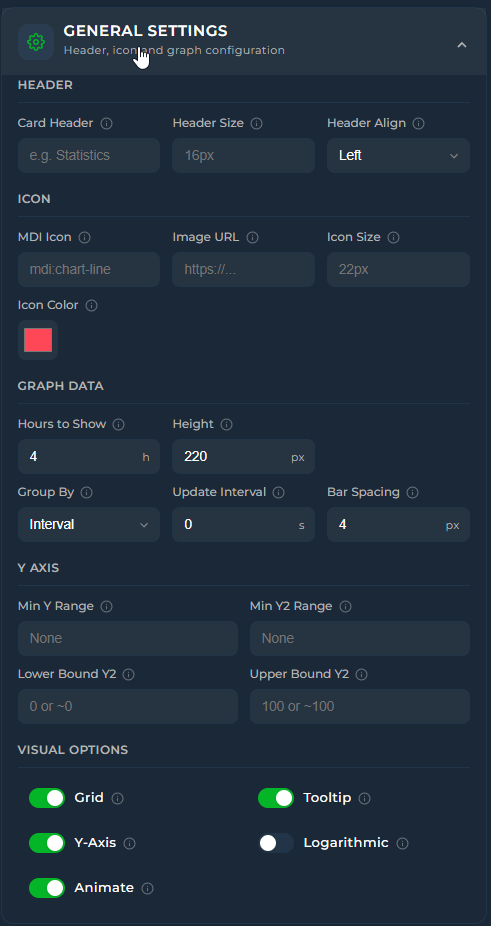

<a href="https://www.buymeacoffee.com/cataseven" target="_blank">
  
</a>


# 📊 Home Assistant - Statistics Graph Chart Card


[](https://github.com/hacs/frontend)
[](https://github.com/cataseven/Statistics-Graph-Chart-Card/releases)
[](LICENSE)


[](https://github.com/cataseven/Statistics-Graph-Chart-Card)
[](https://github.com/cataseven/Statistics-Graph-Chart-Card/issues)

A feature-rich custom card for [Home Assistant](https://www.home-assistant.io/) that combines a time-series graph with live state rows — all in a single card. Built with no external dependencies, fully configurable via the visual editor or YAML.

---

## 🖼️ Preview





---

## ✨ Features

| | |
|---|---|
| 📈 | Line and bar charts with smooth Bezier curves |
| 🔢 | Live state rows with current value, trend icon, and MDI icons |
| ↕️ | Dual Y-axis support (primary + secondary) with per-axis bounds |
| 🎨 | Color thresholds and Rise/Fall colorization |
| 🔺 | Min / Max extrema labels — always on, on click, or never |
| ➖ | Average line — dashed reference at the mean value for the visible window |
| 💬 | Tooltip with crosshair on hover |
| 🌅 | Per-entity gradient fill with same-hue fade |
| ▦ | Grid lines — horizontal + vertical aligned to actual data points |
| 📉 | Logarithmic scale |
| 〰️ | Soft bounds (`~` prefix) — axis expands when data exceeds the bound |
| 🔣 | `state_map` for non-numeric entities (binary sensors, input selects) |
| 🔗 | Attribute reading with dot-notation nested path support |
| ⏩ | Forward-fill for sparse sensors (e.g. weather entities) |
| 🎨 | Adaptive state color — state row inherits entity line color automatically |
| 🖱️ | Drag-to-reorder entities in the editor |
| 🛠️ | Full visual editor with live preview |

---

## 📦 Installation

### HACS (recommended)

1. Open **HACS → Frontend**
2. Click the three-dot menu → **Custom repositories**
3. Add this repository URL and select **Lovelace** as the category
4. Install **Home Assistant - Statistics Graph Chart Card**
5. Hard-refresh your browser

### Manual

1. Download `Home Assistant - Statistics Graph Chart Card.js` from the [latest release](../../releases/latest)
2. Copy it to `/config/www/`
3. Add the resource in **Settings → Dashboards → Resources**:

```yaml
url: /local/Home Assistant - Statistics Graph Chart Card.js
type: module
```

---

## 🚀 Quick Start

```yaml
type: custom:statistics-graph-chart-card
card_header: Living Room
entities:
  - entity: sensor.temperature_living
    name: Temperature
    color: "#ff6b35"
```

---

## ⚙️ Configuration

### 🃏 Card Options

These options apply to the whole card.

| Option | Type | Default | Description |
|--------|------|---------|-------------|
| `card_header` | string | `""` | Title shown at the top. Leave empty to hide. |
| `card_icon` | string | `null` | MDI icon next to the title, e.g. `mdi:thermometer` |
| `card_icon_image` | string | `null` | URL to a custom image. Overrides `card_icon`. |
| `card_icon_color` | string | `null` | Color of the header icon (CSS color). |
| `card_header_size` | string | `null` | Font size of the title, e.g. `16px` |
| `card_icon_size` | string | `null` | Size of the header icon, e.g. `22px` |
| `align_header` | string | `"default"` | Header alignment: `default` / `left` / `center` / `right` |
| `hours_to_show` | number | `24` | Hours of history to load and display |
| `points_per_hour` | number | `2` | Data points fetched per hour (global default) |
| `height` | number | `150` | Graph area height in pixels |
| `group_by` | string | `"interval"` | Bucketing strategy: `interval` / `hour` / `date` |
| `update_interval` | number | `null` | Auto-refresh interval in seconds. Empty = HA events only. |
| `bar_spacing` | number | `4` | Gap between bar columns in pixels |
| `min_bound_range` | number | `null` | Minimum span of the primary Y axis |
| `min_bound_range_secondary` | number | `null` | Minimum span of the secondary Y axis |
| `lower_bound_secondary` | string/number | `null` | Hard or soft minimum for the secondary Y axis. See [Bounds](#-bounds). |
| `upper_bound_secondary` | string/number | `null` | Hard or soft maximum for the secondary Y axis. See [Bounds](#-bounds). |
| `show_grid` | boolean | `true` | Show grid lines (horizontal + vertical aligned to data points) |
| `show_tooltip` | boolean | `true` | Show hover tooltip with crosshair |
| `show_y_axis` | boolean | `true` | Show Y axis value labels |
| `logarithmic` | boolean | `false` | Logarithmic Y axis scale |
| `animate_graph` | boolean | `false` | Draw-in animation on load |

---

### 🔷 Entity Options

Each entry under `entities` supports the following options.

#### 📋 General

| Option | Type | Default | Description |
|--------|------|---------|-------------|
| `entity` | string | **required** | HA entity ID |
| `name` | string | `null` | Custom display name. Defaults to friendly name. |
| `y_axis` | string | `"primary"` | `primary` (left) or `secondary` (right) |
| `aggregate_func` | string | `"avg"` | Aggregation: `avg` / `min` / `max` / `last` / `first` / `median` / `sum` / `delta` / `diff` |
| `decimals` | number | `1` | Decimal places shown in state row and labels |
| `attribute` | string | `null` | Read an attribute instead of state. Supports dot notation: `forecast.0.temperature` |
| `value_factor` | number | `0` | Multiplies value by 10^N. `-3` = ÷1000, `2` = ×100 |
| `points_per_hour` | number | `null` | Per-entity override. Inherits card-level setting if empty. |
| `number_format` | string | `"system"` | `system` / `comma` (1.234,56) / `dot` (1,234.56) |
| `datetime_format` | string | `"system"` | Timestamp format in tooltip/labels. See [Date Formats](#-date-formats). |
| `fixed_value` | boolean | `false` | Draw a flat horizontal reference line at the current value instead of history |
| `state_map` | list | `null` | Map non-numeric states to numbers for graphing. See [State Map](#-state-map). |
| `tap_action` | object | `null` | Action on tapping the state row. See [Tap Actions](#-tap-actions). |

#### 🎛️ Appearance

| Option | Type | Default | Description |
|--------|------|---------|-------------|
| `graph_type` | string | `"line"` | `line` or `bar` |
| `show_graph` | boolean | `true` | Show this entity on the graph |
| `show_line` | boolean | `true` | Show the line edge |
| `show_fill` | boolean | `true` | Show the fill area below the line |
| `gradient` | boolean | `true` | Fade the fill from the entity color to transparent (same hue, no grey). Only applies when `show_fill` is true. |
| `show_points` | boolean | `false` | Show a dot at each data point |
| `smooth` | boolean | `true` | Bezier curve smoothing |
| `line_width` | number | `2.5` | Line thickness in pixels |
| `show_extrema` | string | `"click"` | Min/Max labels: `never` / `click` / `always` |
| `show_average` | boolean | `false` | Draw a dashed horizontal line at the mean value over the visible time window, labeled in the entity's color. |
| `show_state` | boolean | `true` | Show the state row above the graph |
| `show_state_last` | boolean | `false` | Show the last aggregated graph value instead of the live HA state. Useful with heavy aggregation like daily `sum`. |
| `show_trend_icon` | boolean | `true` | Show ▲▼● trend direction icon |
| `trend_period_hours` | number | `1` | Hours over which trend direction is calculated. `0` = full range. |
| `show_in_legend` | boolean | `false` | Show Min / Avg / Max legend below the graph |
| `lower_bound` | string/number | `null` | Y axis minimum. See [Bounds](#-bounds). |
| `upper_bound` | string/number | `null` | Y axis maximum. See [Bounds](#-bounds). |
| `align_state` | string | `"left"` | State row alignment: `left` / `center` / `right` |
| `icon` | string | `null` | MDI icon in the state row, e.g. `mdi:thermometer` |
| `icon_size` | string | `null` | State row icon size, e.g. `18px` |
| `name_size` | string | `null` | State row name font size, e.g. `14px` |
| `state_size` | string | `null` | State row value font size, e.g. `13px` |
| `trend_icon_size` | string | `null` | Trend icon font size, e.g. `12px` |

#### 🎨 Colors

| Option | Type | Default | Description |
|--------|------|---------|-------------|
| `color` | string | `"#ff4757"` | Line and fill color. Use `threshold` to drive from color thresholds. |
| `point_colors` | string | `null` | Color of data point dots. Use `threshold` for per-point threshold color. |
| `icon_color` | string | `null` | State row icon color. Use `threshold` for dynamic color. |
| `state_color` | string | `null` | State row value text color. Use `threshold` for dynamic color. |
| `state_adaptive_color` | boolean | `false` | Automatically tint state value and icon with the entity's line color. Quick alternative to setting `state_color` and `icon_color` manually. |
| `rise_fall_colors` | object | `null` | Color by rise/fall direction. See [Rise/Fall Colors](#-risefall-colors). |
| `color_thresholds` | object | `null` | Color by value. See [Color Thresholds](#-color-thresholds). |

---

## 💡 Examples

### Basic: Single Sensor

```yaml
type: custom:statistics-graph-chart-card
card_header: Bedroom
hours_to_show: 12
entities:
  - entity: sensor.bedroom_temperature
    name: Temperature
    color: "#ff6b35"
    icon: mdi:thermometer
```

---

### 🌡️ Multi-Entity with Dual Axes

Combine temperature and humidity on the same card without the scales conflicting.

<!-- IMAGE 3: Card with temperature line (primary) and humidity line (secondary axis) -->

```yaml
type: custom:statistics-graph-chart-card
card_header: Climate
card_icon: mdi:home-thermometer
hours_to_show: 24
lower_bound_secondary: "~0"
upper_bound_secondary: "~100"
entities:
  - entity: sensor.temperature
    name: Temperature
    color: "#ff6b35"
    y_axis: primary
    icon: mdi:thermometer

  - entity: sensor.humidity
    name: Humidity
    color: "#00bcd4"
    y_axis: secondary
    icon: mdi:water-percent
```

---

### ⚡ Bar Chart with Legend

```yaml
type: custom:statistics-graph-chart-card
card_header: Energy Today
entities:
  - entity: sensor.daily_energy
    name: Consumption
    graph_type: bar
    color: "#2ecc71"
    show_in_legend: true
    aggregate_func: sum
    group_by: hour
```

---

### 🎨 Color Thresholds

Colorize the graph based on value ranges. The `transition` option controls whether color changes smoothly or switches instantly at each threshold.

<!-- IMAGE 4: Temperature graph with gradient color from blue (cold) through green to red (hot) -->

```yaml
type: custom:statistics-graph-chart-card
entities:
  - entity: sensor.outdoor_temperature
    name: Outdoor Temp
    color: threshold
    state_color: threshold
    color_thresholds:
      enabled: true
      transition: smooth   # or: hard
      values:
        - value: 0
          color: "#3498db"
        - value: 15
          color: "#2ecc71"
        - value: 25
          color: "#f39c12"
        - value: 35
          color: "#e74c3c"
```

Setting `color: threshold` propagates threshold colors to the state row dot as well. Setting `state_color: threshold` colors the displayed value text.

---

### 📈 Rise/Fall Colors

Colorize each graph segment based on whether the value is rising, falling, or stable relative to the previous point. Cannot be combined with color thresholds.

```yaml
type: custom:statistics-graph-chart-card
entities:
  - entity: sensor.stock_price
    name: Price
    rise_fall_colors:
      enabled: true
      increase: "#2ecc71"
      decrease: "#e74c3c"
      stable: "#95a5a6"
    trend_period_hours: 2
```

---

### ➖ Average Line

Draw a dashed reference line at the mean value over the visible time window. Useful for spotting trends at a glance.

<!-- IMAGE: Average line shown on a temperature graph as a dashed horizontal line with a value label -->

```yaml
type: custom:statistics-graph-chart-card
hours_to_show: 24
entities:
  - entity: sensor.outdoor_temperature
    name: Temperature
    color: "#ff6b35"
    show_average: true

  # Multiple entities each show their own average in their own color
  - entity: sensor.indoor_temperature
    name: Indoor
    color: "#00bcd4"
    show_average: true
```

---

### 🔗 Attribute Reading

Read a specific attribute instead of the main entity state. Supports dot notation for nested paths.

```yaml
type: custom:statistics-graph-chart-card
entities:
  # Simple attribute
  - entity: weather.home
    name: Humidity
    attribute: humidity
    icon: mdi:water-percent

  # Nested attribute (e.g. first forecast entry)
  - entity: weather.home
    name: Forecast Temp
    attribute: forecast.0.temperature
    icon: mdi:thermometer
```

---

### 🔀 State Map — Non-Numeric Entities

Use `state_map` to graph entities with string states like `input_boolean`, `binary_sensor`, or `input_select`. States are mapped to numbers in the order they are listed, starting at 0.

<!-- IMAGE 5: Binary sensor shown as 0/1 step graph -->

```yaml
type: custom:statistics-graph-chart-card
entities:
  # binary_sensor → 0 (off) / 1 (on)
  - entity: binary_sensor.front_door
    name: Front Door
    color: "#9b59b6"
    state_map:
      - value: "off"
      - value: "on"

  # input_select → 0 / 1 / 2 / 3
  - entity: input_select.heating_mode
    name: Heating Mode
    state_map:
      - value: "off"
      - value: "eco"
      - value: "comfort"
      - value: "boost"
```

> The state row displays the original string (`"on"`, `"eco"`, etc.) — not the numeric graph value.

---

### 📏 Fixed Value Reference Line

Draw a flat horizontal line at the current value of an entity. Useful for showing targets or limits alongside historical data.

```yaml
type: custom:statistics-graph-chart-card
entities:
  - entity: sensor.room_temperature
    name: Temperature
    color: "#ff6b35"

  - entity: input_number.target_temperature
    name: Target
    color: "#2ecc71"
    fixed_value: true
    show_fill: false
    line_width: 1.5
```

---

### 〰️ Soft Bounds

Use a `~` prefix to create a soft bound — the axis will prefer the value but expand if data exceeds it. Hard bounds (no prefix) force the axis edge regardless of data.

```yaml
type: custom:statistics-graph-chart-card
entities:
  - entity: sensor.battery_level
    name: Battery
    lower_bound: "~0"    # prefer 0 as minimum; expands if data goes below
    upper_bound: "~100"  # prefer 100 as max; expands if data exceeds
```

---

### 📡 Dynamic Y Axis Bounds

Bind the Y axis min/max to another sensor for a fully dynamic range.

```yaml
type: custom:statistics-graph-chart-card
entities:
  - entity: sensor.power_output
    name: Power
    lower_bound: 0
    upper_bound: sensor.max_capacity
```

---

### 👆 Tap Actions

Trigger actions when tapping an entity's state row.

```yaml
type: custom:statistics-graph-chart-card
entities:
  # Open entity detail dialog
  - entity: sensor.temperature
    tap_action:
      action: more-info

  # Navigate to another dashboard
  - entity: sensor.energy
    tap_action:
      action: navigate
      navigation_path: /lovelace/energy

  # Call a service
  - entity: binary_sensor.pump
    tap_action:
      action: call-service
      service: switch.toggle
      service_data:
        entity_id: switch.pump
```

---

### ⏩ Sparse Data with Points Per Hour

For sensors that update infrequently (e.g. weather), use a higher `points_per_hour` with forward-fill. Empty buckets inherit the last known value, producing a clean step-line instead of scattered dots.

```yaml
type: custom:statistics-graph-chart-card
points_per_hour: 12
hours_to_show: 24
entities:
  - entity: weather.home
    attribute: humidity
    name: Humidity
    smooth: false  # step-like appearance is more accurate for infrequent updates
```

---

### 🏆 Full Example

A complete card showing most features together.

<!-- IMAGE 6: Full-featured card with header, icon, multiple entities, legend, and grid -->

```yaml
type: custom:statistics-graph-chart-card
card_header: Home Climate
card_icon: mdi:home-thermometer
card_icon_color: "#ff6b35"
align_header: left
hours_to_show: 24
points_per_hour: 6
height: 180
show_grid: true
show_tooltip: true
animate_graph: false
update_interval: 60

entities:
  - entity: sensor.living_temperature
    name: Temperature
    color: "#ff6b35"
    icon: mdi:thermometer
    y_axis: primary
    show_in_legend: true
    show_extrema: click
    show_average: true
    show_trend_icon: true
    trend_period_hours: 2
    decimals: 1
    gradient: true
    state_adaptive_color: true
    color_thresholds:
      enabled: true
      transition: smooth
      values:
        - value: 18
          color: "#3498db"
        - value: 22
          color: "#2ecc71"
        - value: 28
          color: "#e74c3c"

  - entity: sensor.living_humidity
    name: Humidity
    color: "#00bcd4"
    icon: mdi:water-percent
    y_axis: secondary
    show_in_legend: true
    decimals: 0
    lower_bound: "~0"
    upper_bound: "~100"
```

---

## 📖 Reference

### 🧮 Aggregation Functions

| Value | Description |
|-------|-------------|
| `avg` | Mean of all points in the bucket *(default)* |
| `min` | Lowest value |
| `max` | Highest value |
| `last` | Most recent value |
| `first` | Oldest value |
| `median` | Middle value |
| `sum` | Sum of all values (useful for energy) |
| `delta` | Last minus first (net change) |
| `diff` | Max minus min (spread) |

---

### 🕐 Date Formats

| Value | Example output |
|-------|---------------|
| `system` | Follows HA locale |
| `DD/MM` | 24/01 |
| `MM/DD` | 01/24 |
| `DD/MM HH:mm` | 24/01 14:35 |
| `MM/DD HH:mm` | 01/24 14:35 |
| `HH:mm` | 14:35 |
| `DD/MM hh:mm A` | 24/01 02:35 PM |
| `MM/DD hh:mm A` | 01/24 02:35 PM |
| `hh:mm A` | 02:35 PM |

---

### 〰️ Bounds

Both entity-level (`lower_bound`, `upper_bound`) and card-level secondary axis options (`lower_bound_secondary`, `upper_bound_secondary`) support three value types:

| Format | Behavior |
|--------|----------|
| `0` | **Hard bound** — axis edge is fixed at this value regardless of data |
| `"~0"` | **Soft bound** — axis prefers this value but expands if data exceeds it |
| `"sensor.entity_id"` | **Dynamic bound** — tracks the live state of another entity |

---

### 📈 Rise/Fall Colors

Colors each graph segment based on the slope relative to the previous point, using the Trend Period window for smoothing.

```yaml
rise_fall_colors:
  enabled: true
  increase: "#2ecc71"   # color when value is rising
  decrease: "#e74c3c"   # color when value is falling
  stable: "#95a5a6"     # color when value is flat
```

> ⚠️ Cannot be combined with `color_thresholds` on the same entity.

---

### 🎨 Color Thresholds

```yaml
color_thresholds:
  enabled: true
  transition: smooth     # smooth or hard
  values:
    - value: 0           # at or above this value → use this color
      color: "#3498db"
    - value: 20
      color: "#2ecc71"
    - value: 35
      color: "#e74c3c"
```

Thresholds are sorted by value automatically. The color of the lowest threshold applies to everything below it.

Setting `color: threshold`, `state_color: threshold`, `icon_color: threshold`, or `point_colors: threshold` on the entity makes those elements also reflect the threshold color.

**`transition`** controls how color changes between bands:
- `smooth` — gradual interpolation along the line as values pass through thresholds
- `hard` — instant color switch exactly at the threshold value

> ⚠️ Cannot be combined with `rise_fall_colors` on the same entity.

---

### 👆 Tap Actions

| Action | Description |
|--------|-------------|
| `none` | No action *(default)* |
| `more-info` | Open entity detail dialog |
| `navigate` | Navigate to a dashboard path (requires `navigation_path`) |
| `url` | Open an external URL (requires `url`) |
| `call-service` | Call an HA service (requires `service` and optional `service_data`) |

---

### 🔣 State Map

Maps non-numeric state strings to integer values for graphing. Order determines the number (0-based index).

```yaml
state_map:
  - value: "off"       # → 0
  - value: "idle"      # → 1
  - value: "on"        # → 2
```

The state row always displays the original string, not the number.

> ⚠️ State values are case-sensitive and must match exactly what HA reports (always lowercase for `binary_sensor`).

---

## 🛠️ Visual Editor

The card includes a full visual editor accessible from the Lovelace UI. All settings are organized into collapsible panels:

- **Card Settings** — Header, icon, graph data, Y axis bounds, visual options
- **Entities** — Add, remove, and drag-to-reorder entities

Each entity has three tabs:

| Tab | Contents |
|-----|----------|
| **General** | Entity picker, data settings, state map, tap action |
| **Appearance** | Toggle-controlled sections for Graph (type, extrema, **average**), Line, Fill (with Gradient), Data Points, State Row (with Show Last and Adaptive Color), Trend Icon, Y Axis Range, and Legend |
| **Colors** | Base colors, Rise/Fall Colors, Color Thresholds (with Transition) |

Turning a section toggle off disables all its child fields visually and prevents accidental edits.

<!-- IMAGE 7: Editor showing entity Appearance tab with several toggles open -->

---

## 📝 Notes

> 💡 **Attribute state display** — When `attribute` is set, the state row always shows the live attribute value from HA directly, not the last history point.

> ⏩ **Forward-fill** — When `points_per_hour` is set, empty time buckets carry forward the last known value. This prevents sparse sensors from appearing as disconnected dots.

> 📉 **Logarithmic scale** — Cannot handle zero or negative values. A safe minimum (`1e-10`) is applied automatically to prevent rendering errors.

> ⚠️ **rise_fall_colors and color_thresholds** — Mutually exclusive per entity. Enabling one automatically disables the other.

> 🌅 **Gradient** — Configured per entity inside the Fill section. The fill fades from the entity's own color downward using only that hue — no grey or black tones.

> ➖ **Average line** — Uses the same aggregated history data as the graph. The average reflects whatever `aggregate_func` and `hours_to_show` are set for that entity.

---

## 📄 License

MIT

<a href="https://www.buymeacoffee.com/cataseven" target="_blank">
  
</a

[](https://www.star-history.com/#cataseven/Statistics-Graph-Chart-Card&type=date&legend=top-left)
