<a href="https://www.buymeacoffee.com/cataseven" target="_blank">
  
</a>


# 📊 Home Assistant - Statistics Graph Chart Card


[](https://github.com/hacs/frontend)
[](https://github.com/cataseven/Statistics-Graph-Chart-Card/releases)
[](LICENSE)


[](https://github.com/cataseven/Statistics-Graph-Chart-Card)
[](https://github.com/cataseven/Statistics-Graph-Chart-Card/issues)

An awesome feature-rich custom card for [Home Assistant](https://www.home-assistant.io/) that combines a time-series graph with live state rows — all in a single card. Built with no external dependencies, fully configurable via the visual editor or YAML.

---

## 🖼️ Preview

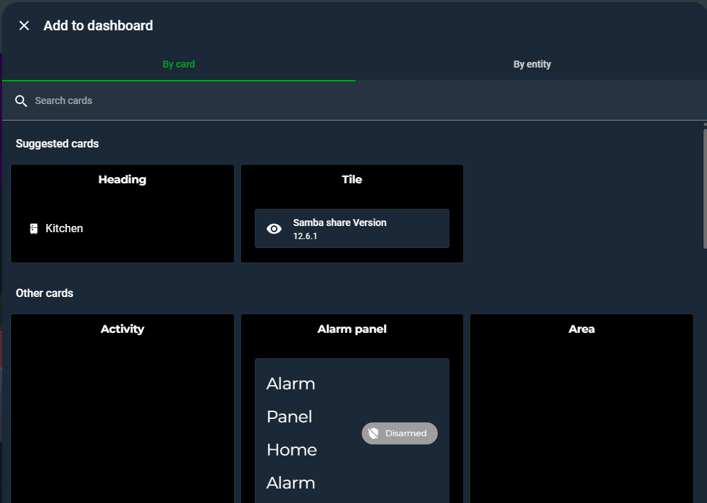


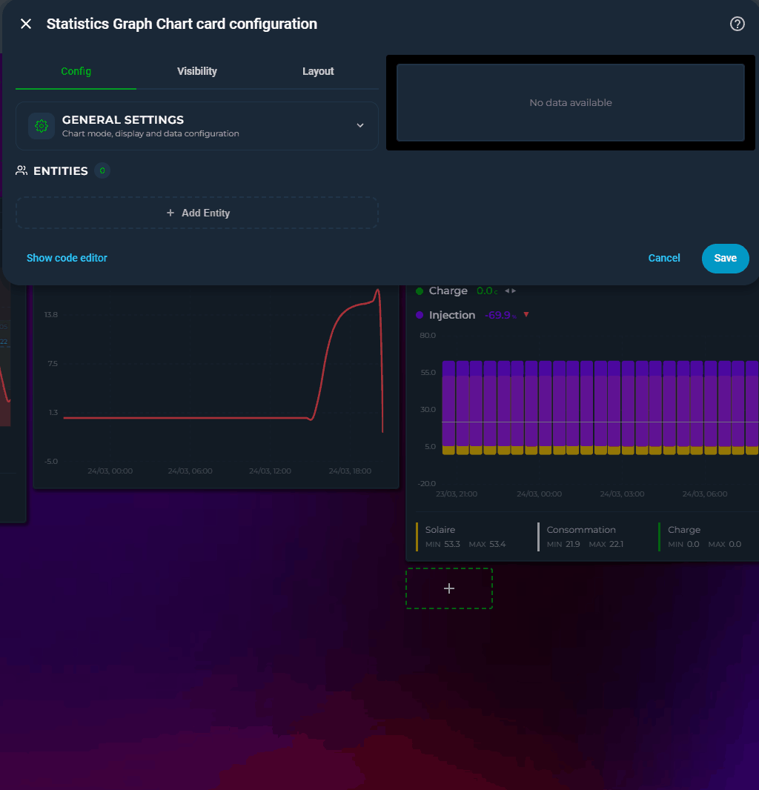


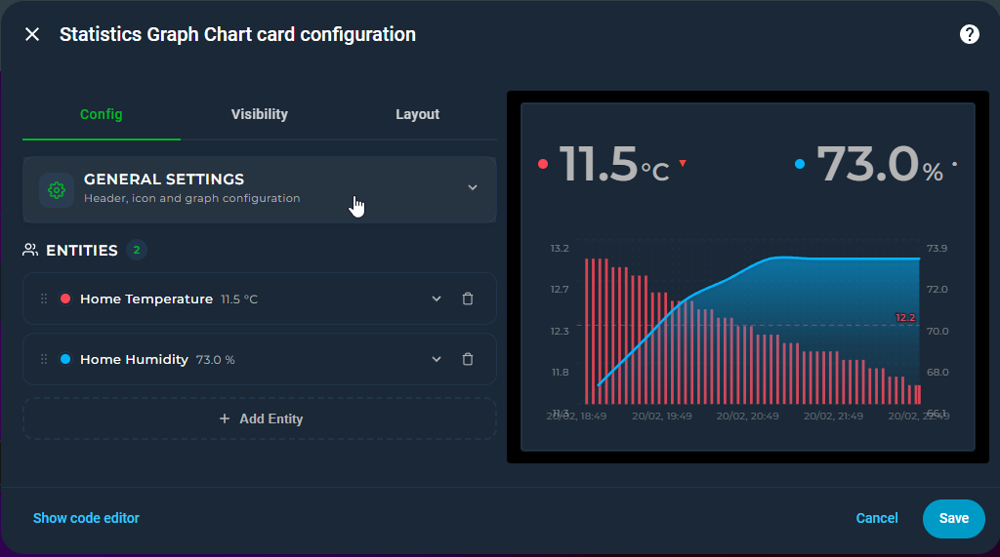

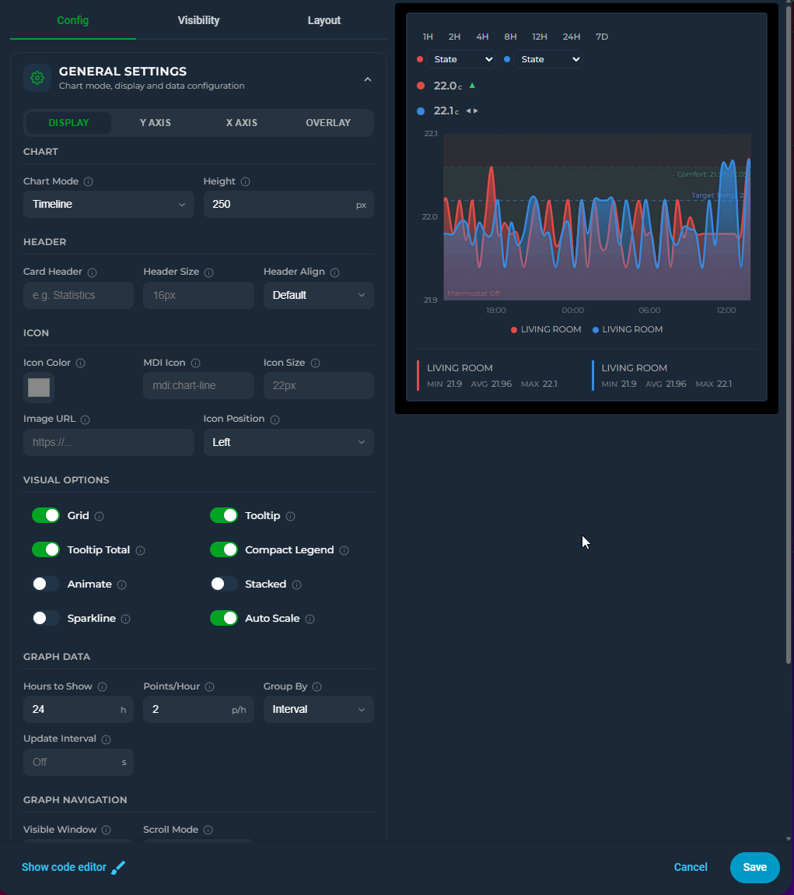

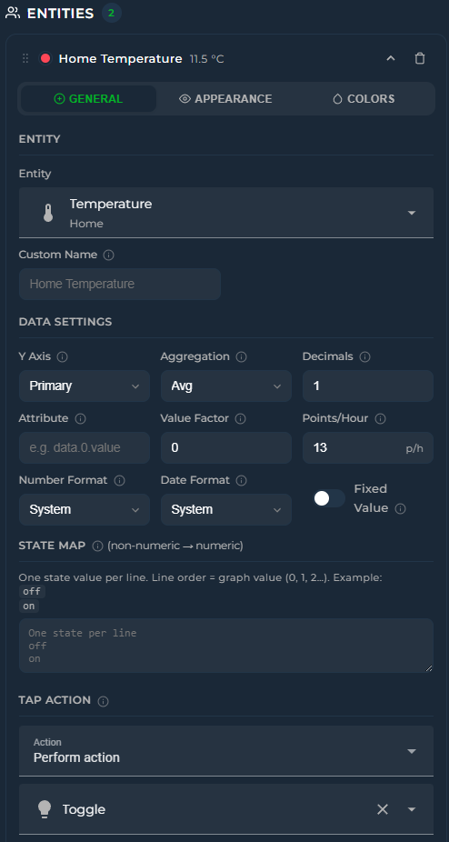

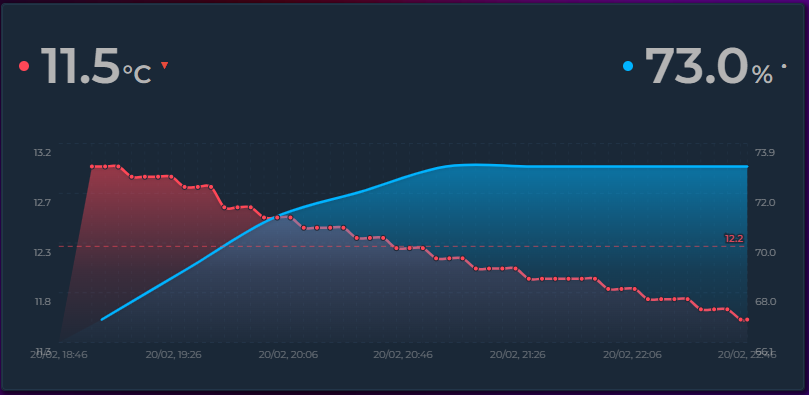

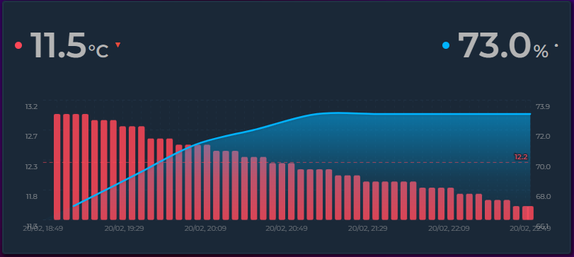

---

## ✨ Features

| | |
|---|---|
| 📈 | Line, step, and bar charts with smooth Bezier curves |
| 🔢 | Live state rows with current value, MDI icons, and configurable font sizes |
| 🎯 | **Nine chart modes** — Timeline, Scatter, Pie (donut), Ranking (horizontal bar), Radial Bar (concentric arcs), Polar Area (variable-radius pie), Radar (spider polygon), Heatmap (days × hours), Calendar (weekly grid) — selectable from a single dropdown |
| 🎛️ | **Gauge display** — replace the state row with a half-circle gauge showing current value against min/max bounds |
| ✨ | **Sparkline mode** — ultra-compact inline graphs with no chrome, ideal for dashboard overview tiles |
| 📊 | **Rise/Fall colorization** — graph segments automatically change color as values climb or drop, with independent colors for rising, falling, and stable periods |
| ⏩ | **Trend icon** — a ▲▼⯇⯈ indicator on each state row shows the current direction of change, calculated over a configurable time window (`trend_period_hours`) |
| 🌐 | **Locale-aware formatting** — control how numbers are displayed per entity (`number_format`) and how timestamps appear card-wide (`datetime_format`), independent of your HA locale |
| 🔡 | **Axis label customization** — adjust font size and opacity of Y-axis and X-axis labels independently for a clean, tailored look |
| 🛠️ | **Full visual editor** — every option is configurable through the Lovelace UI without touching YAML; entities can be reordered by drag-and-drop. The editor adapts dynamically: irrelevant options hide based on the selected chart mode |
| ↕️ | Dual Y-axis support (primary + secondary) with per-axis bounds and configurable tick count |
| 🎨 | Color thresholds with smooth or hard transitions |
| 🔺 | Min / Max extrema labels — always on, on click, or never |
| ➖ | Average line — dashed reference at the mean value for the visible window |
| 💬 | Tooltip with crosshair on hover |
| 🌅 | Per-entity gradient fill with same-hue fade |
| ▦ | Grid lines — horizontal + vertical aligned to actual data points |
| 📉 | Logarithmic scale |
| 🔍 | **Zoom brush** — click and drag on the graph to zoom into a time range; double-click or "Reset zoom" to restore |
| 📌 | **Annotations** — add threshold lines, event markers, time span highlights, and comfort zone bands to the graph |
| 🔄 | **Tooltip sync** — hover one card and see crosshairs on all synced cards, with optional named groups |
| 📊 | **Stacked** mode — stack line/area/bar entities to show composition |
| ↔️ | **Time Offset** — per-entity hour offset to overlay the same sensor from different periods on one graph. Supports helper entities (e.g. `input_number`) for dynamic offset values |
| 〰️ | Soft bounds (`~` prefix) — axis expands when data exceeds the bound |
| 🔣 | `state_map` for non-numeric entities (binary sensors, input selects) |
| 🔗 | Attribute reading with dot-notation nested path support |
| ⏩ | Forward-fill for sparse sensors (e.g. weather entities) |
| 🎨 | Adaptive state color — state row inherits entity line color automatically |
| 🎚️ | **Interval picker** — quick-select time range buttons (1H–1Y) directly on the card, no editor needed |
| ⚡ | **Auto scale points** — automatically reduces data density for longer time ranges, keeping performance smooth |
| 🔀 | **Attribute switcher** — per-entity dropdown on the card to switch between state and any numeric attribute on the fly |
| 🔍 | **Scrollable graph** — set a visible window smaller than the data range and scroll horizontally through history |
| ↔️ | **Configurable icon position** — place the header icon on the left or right side of the title |
| 🏷️ | **Compact Legend** — color-coded entity name key below the graph in a single wrapping row, no values |
| 📊 | **Per-entity legend stats** — choose any combination of Min, Avg, Max, Last for each entity's legend row |
| ↕️ | **Independent Y2 axis toggle** — show or hide the secondary (right) Y axis labels without affecting the primary axis |
| ⬇️ | **Bottom state rows** — place entity state rows below the graph instead of above with `bottom-left`, `bottom-center`, `bottom-right` alignment |
| 📏 | **Grid aligned to tick marks** — horizontal grid lines match Y axis tick values exactly |
| 🔀 | **Value Transform** — apply a JavaScript expression to every data point using `x`, `first`, `min`, `max`, `avg`, `last`, `index` — ideal for normalize-to-zero, splitting sensors, and percentage calculations |
| 📏 | **Range Band** — per-entity min/max shaded band behind the line showing value fluctuation within each data bucket |
| ↔️ | **Dynamic Y-axis width** — axis label areas auto-expand to fit longer numbers without clipping |
| ⚡ | **Energy Date Sync** — sync the card's time range with HA's Energy dashboard date picker or [energy-period-selector-plus](https://github.com/flixlix/energy-period-selector-plus) |
| 🔌 | **External Statistics** — display imported statistics that have no regular entity (e.g. `gazpar:gazpar_consumption`) by setting `statistic_id` |

---

## 📦 Installation

### HACS (recommended)

1. Open **HACS
2. Search from the search bar: Statistics Graph Chart Card
3. Install **Home Assistant - Statistics Graph Chart Card**
4. Hard-refresh your browser

### Manual

1. Download `Home Assistant - Statistics Graph Chart Card.js` from the [latest release](../../releases/latest)
2. Copy it to `/config/www/`
3. Add the resource in **Settings → Dashboards → Resources**:

```yaml
url: /local/Home Assistant - Statistics Graph Chart Card.js
type: module
```

---

## 🚀 Quick Start

```yaml
type: custom:statistics-graph-chart-card
card_header: Living Room
entities:
  - entity: sensor.temperature_living
    name: Temperature
    color: "#ff6b35"
```

> **No YAML needed?** The card has a full visual editor built in. Click the pencil icon on any card in the Lovelace UI to configure everything — including rise/fall colors, trend settings, and number formats — without writing a single line of YAML. See [Visual Editor](#️-visual-editor) for details.

---

## ⚙️ Configuration

### 🃏 Card Options

These options apply to the whole card.

| Option | Type | Default | Description |
|--------|------|---------|-------------|
| `chart_mode` | string | `"timeline"` | Chart visualization mode. See [Chart Modes](#-chart-modes). `timeline` \| `scatter` \| `pie` \| `ranking` \| `radialbar` \| `polararea` \| `radar` \| `heatmap` \| `calendar` |
| `sparkline` | boolean | `false` | Compact mode — strips all chrome (header, axes, grid, toolbar) and renders tiny inline graphs. See [Sparkline Mode](#-sparkline-mode). Only available in Timeline mode. |
| `card_header` | string | `""` | Title shown at the top. Leave empty to hide. |
| `card_icon` | string | `null` | MDI icon next to the title, e.g. `mdi:thermometer` |
| `card_icon_image` | string | `null` | URL to a custom image. Overrides `card_icon`. |
| `card_icon_color` | string | `null` | Color of the header icon (CSS color). Set to `"threshold"` to color dynamically based on the first entity's value and its color threshold rules. |
| `card_header_size` | string | `null` | Font size of the title, e.g. `16px` |
| `card_icon_size` | string | `null` | Size of the header icon, e.g. `22px` |
| `card_icon_position` | string | `"left"` | Header icon position: `left` or `right` |
| `align_header` | string | `"default"` | Header alignment: `default` / `left` / `center` / `right` |
| `hours_to_show` | number | `24` | Hours of history to load and display |
| `points_per_hour` | number | `2` | Data points fetched per hour (global default). Integer only. |
| `auto_scale_points` | boolean | `false` | Automatically scale `points_per_hour` when the interval picker changes the time range. See [Auto Scale Points](#-auto-scale-points). |
| `height` | number | `150` | Graph area height in pixels |
| `group_by` | string | `"interval"` | Bucketing strategy: `interval` / `hour` / `date` |
| `update_interval` | number | `null` | Auto-refresh interval in seconds. Empty = HA events only. |
| `bar_spacing` | number | `4` | Gap between bar columns in pixels. Timeline mode only. |
| `stacked` | boolean | `false` | Stack entities on top of each other. Timeline mode only. See [Stacked Mode](#-stacked-mode). |
| `min_bound_range` | number | `null` | Minimum span of the primary Y axis |
| `min_bound_range_secondary` | number | `null` | Minimum span of the secondary Y axis |
| `lower_bound` | string/number | `null` | Hard or soft minimum for the primary Y axis. See [Bounds](#-bounds). |
| `upper_bound` | string/number | `null` | Hard or soft maximum for the primary Y axis. See [Bounds](#-bounds). |
| `lower_bound_secondary` | string/number | `null` | Hard or soft minimum for the secondary Y axis. See [Bounds](#-bounds). |
| `upper_bound_secondary` | string/number | `null` | Hard or soft maximum for the secondary Y axis. See [Bounds](#-bounds). |
| `y_axis_ticks` | number | `4` | Number of tick marks (grid lines + labels) on the Y axis. |
| `y_axis_font_size` | number | `null` | Font size of Y-axis numeric labels in pixels. Default is 10. |
| `y_axis_font_opacity` | number | `null` | Opacity of Y-axis labels. 0 = invisible, 1 = fully opaque. Default is 0.65. |
| `x_axis_font_size` | number | `null` | Font size of X-axis time labels in pixels. Default is 10. |
| `x_axis_font_opacity` | number | `null` | Opacity of X-axis labels. 0 = invisible, 1 = fully opaque. Default is 0.5. |
| `datetime_format` | string | `"system"` | Controls how timestamps appear on the X-axis, tooltips, and extrema labels. See [Date Formats](#-date-formats). |
| `show_grid` | boolean | `true` | Show grid lines. Available in Timeline and Scatter modes. |
| `show_tooltip` | boolean | `true` | Show hover tooltip with crosshair |
| `show_tooltip_total` | boolean | `true` | Show a Total row at the bottom of the tooltip summing all visible entity values. Only appears when 2+ entities are present. |
| `show_y_axis` | boolean | `true` | Show primary (left) Y axis value labels. Available in Timeline and Scatter modes. |
| `show_y2_axis` | boolean | `true` | Show secondary (right) Y axis value labels independently. Only visible when at least one entity uses `y_axis: secondary`. Disable to hide right-side labels while keeping secondary entities plotted. |
| `show_x_axis` | boolean | `true` | Show X axis labels (time in Timeline, values in Scatter). Available in Timeline and Scatter modes. |
| `show_legend` | boolean | `false` | Show a compact color-coded entity name key below the graph. Just colored dots and names in a wrapping row — no values. For per-entity stats, use the entity-level Legend toggle. |
| `logarithmic` | boolean | `false` | Logarithmic Y axis scale. Timeline mode only. |
| `animate_graph` | boolean | `false` | Draw-in animation on load. Timeline mode only. |
| `max_visible_interval` | number | `null` | Maximum visible time range in hours. Enables horizontal scrolling. Timeline mode only. |
| `scroll_mode` | string | `"scrollbar"` | Scroll behavior: `scrollbar` or `wheel`. Timeline mode only. |
| `show_interval_picker` | boolean | `false` | Show quick-select time range buttons on the card. Default set: 1H, 2H, 4H, 8H, 12H, 24H, 7D. Customize with `interval_options`. |
| `interval_picker_position` | string | `"left"` | Position of the interval picker: `left` / `center` / `right` |
| `interval_options` | list | `null` | Which interval buttons to show. Example: `["2H", "12H", "24H", "7D"]`. When not set, the default compact set (1H–24H + 7D) is used. Available labels: `1H`, `2H`, `4H`, `8H`, `12H`, `24H`, `3D`, `7D`, `14D`, `30D`, `90D`, `6M`, `1Y`. |
| `show_attribute_list` | boolean | `false` | Show per-entity attribute dropdown selectors on the card |
| `attribute_list_position` | string | `"left"` | Position of the attribute list: `left` / `center` / `right` |
| `tooltip_sync` | boolean | `false` | Broadcast hovered timestamp to other synced cards. Timeline mode only. |
| `tooltip_sync_group` | string | `null` | Named group for tooltip sync. Cards with the same name sync only with each other. Leave empty to sync with all. |
| `energy_date_sync` | boolean | `false` | Sync the card's time range with HA's Energy dashboard date picker or the [energy-period-selector-plus](https://github.com/flixlix/energy-period-selector-plus) custom card. When the user selects a date range, this card automatically updates to show the same period. See [Energy Date Sync](#-energy-date-sync). |
| `annotations` | list | `[]` | Reference lines and markers on the graph. Timeline mode only. See [Annotations](#-annotations). |

---

### 🔷 Entity Options

Each entry under `entities` supports the following options.

#### 📋 General

| Option | Type | Default | Description |
|--------|------|---------|-------------|
| `entity` | string | **required** | HA entity ID. Can be left empty when using `statistic_id`. |
| `statistic_id` | string | `null` | For imported/external statistics that have no regular entity (e.g. `gazpar:gazpar_consumption`). These exist only in the statistics database. Leave empty for normal entities. See [External Statistics](#-external-statistics). |
| `name` | string | `null` | Custom display name. Leave empty to hide the name entirely — only shown when explicitly set. |
| `y_axis` | string | `"primary"` | `primary` (left) or `secondary` (right) |
| `aggregate_func` | string | `"avg"` | Aggregation: `avg` / `min` / `max` / `last` / `first` / `median` / `sum` / `delta` / `diff` |
| `decimals` | number | `1` | Decimal places shown in state row and labels |
| `attribute` | string | `null` | Read an attribute instead of state. Supports dot notation: `forecast.0.temperature` |
| `value_factor` | number | `0` | Multiplies value by 10^N. `-3` = ÷1000, `2` = ×100 |
| `value_transform` | string | `null` | JavaScript expression to transform each data value. Available variables: `x` (current value), `first`, `last`, `min`, `max`, `avg` (series stats), `index` (point position). Applied after `value_factor`. Example: `return x - first`. See [Value Transform](#-value-transform). |
| `offset` | string/number | `0` | Shifts this entity backward in time by the given number of hours. Use to overlay the same sensor from different periods. `24` = yesterday, `168` = last week, `720` = last month. Also accepts a helper entity ID (e.g. `input_number.my_offset`) for dynamic offset — the entity's state is read as hours. See [Time Offset](#-time-offset). |
| `points_per_hour` | number | `null` | Per-entity override. Inherits card-level setting if empty. |
| `number_format` | string | `"system"` | Controls how numbers are displayed in the state row and tooltip. `system` follows HA's locale; `comma` forces European style (1.234,56); `dot` forces English style (1,234.56). Useful when mixing sensors from different regional sources. |
| `datetime_format` | string | `"system"` | **Deprecated** — use the card-level `datetime_format` instead. Entity-level values still work for backward compatibility and override the card setting when present. |
| `fixed_value` | boolean | `false` | Draw a flat horizontal reference line at the current value instead of history |
| `state_map` | list | `null` | Map non-numeric states to numbers for graphing. See [State Map](#-state-map). |
| `tap_action` | object | `null` | Action on tapping the state row. See [Tap Actions](#-tap-actions). |

#### 🎛️ Appearance

| Option | Type | Default | Description |
|--------|------|---------|-------------|
| `graph_type` | string | `"line"` | `line` / `step` / `bar`. Only available in Timeline mode — other chart modes ignore this. |
| `show_graph` | boolean | `true` | Show this entity on the graph |
| `show_line` | boolean | `true` | Show the line edge. Timeline mode only. |
| `show_fill` | boolean | `true` | Show the fill area below the line. Timeline mode only. |
| `show_range_band` | boolean | `false` | Draw a min/max shaded band behind the line showing the value range within each aggregation bucket. The line shows the average while the band shows how much the value fluctuated. See [Range Band](#-range-band). Timeline mode only. |
| `gradient` | boolean | `true` | Fade the fill from the entity color to transparent. Only applies when `show_fill` is true. Timeline mode only. |
| `show_points` | boolean | `false` | Show a dot at each data point. Timeline mode only. |
| `smooth` | boolean | `true` | Bezier curve smoothing. Timeline mode only. |
| `line_width` | number | `2.5` | Line thickness in pixels. Timeline mode only. |
| `show_extrema` | string | `"click"` | Min/Max labels: `never` / `click` / `always`. Timeline mode only. |
| `show_average` | boolean | `false` | Draw a dashed horizontal line at the mean value. Timeline mode only. |
| `show_state` | string/boolean | `true` | State row display: `true` (text), `false` (hidden), `"gauge"` (half-circle arc). See [Gauge Display](#-gauge-display). |
| `show_state_last` | boolean | `false` | Show the last aggregated graph value instead of the live HA state. |
| `show_trend_icon` | boolean | `true` | Show ▲▼⯇⯈ trend direction icon next to the state value. |
| `trend_period_hours` | number | `1` | Time window (in hours) for trend direction calculation. Set `0` for full range. |
| `show_in_legend` | boolean | `false` | Show a statistics row below the graph for this entity. Which stats are shown is controlled by `legend_stats`. |
| `legend_stats` | list | `["min","avg","max"]` | Which statistics to display in the legend row. Any combination of `min`, `avg`, `max`, `last`. Requires `show_in_legend: true`. |
| `lower_bound` | string/number | `null` | Y axis minimum / gauge minimum. See [Bounds](#-bounds). |
| `upper_bound` | string/number | `null` | Y axis maximum / gauge maximum. See [Bounds](#-bounds). |
| `align_state` | string | `"left"` | State row position and alignment. Top variants: `left` / `center` / `right` (above the graph). Bottom variants: `bottom-left` / `bottom-center` / `bottom-right` (below the graph). |
| `icon` | string | `null` | MDI icon in the state row, e.g. `mdi:thermometer` |
| `icon_size` | string | `null` | State row icon size, e.g. `18px` |
| `name_size` | string | `null` | State row name font size, e.g. `14px` |
| `state_size` | string | `null` | State row value font size, e.g. `13px` |
| `trend_icon_size` | string | `null` | Trend icon font size, e.g. `12px` |

#### 🎨 Colors

| Option | Type | Default | Description |
|--------|------|---------|-------------|
| `color` | string | `"#ff4757"` | Line and fill color. Use `threshold` to drive from color thresholds. |
| `point_colors` | string | `null` | Color of data point dots. Use `threshold` for per-point threshold color. |
| `icon_color` | string | `null` | State row icon color. Use `threshold` for dynamic color. |
| `state_color` | string | `null` | State row value text color. Use `threshold` for dynamic color. |
| `state_adaptive_color` | boolean | `false` | Automatically tint state value and icon with the entity's line color. Quick alternative to setting `state_color` and `icon_color` manually. |
| `rise_fall_colors` | object | `null` | Color by rise/fall direction. See [Rise/Fall Colors](#-risefall-colors). |
| `color_thresholds` | object | `null` | Color by value. See [Color Thresholds](#-color-thresholds). |

---

## 🔄 Dynamic Editor Behavior

The visual editor adapts in real time based on the current configuration. Options that don't apply are completely removed from the UI — not just disabled, but hidden. This keeps the editor clean regardless of which chart mode or feature combination you choose.

### Chart Mode → General Settings

Changing the Chart Mode dropdown instantly reconfigures the entire editor:

| When Chart Mode is… | Display tab | Data tab | Overlays tab |
|---|---|---|---|
| **Timeline** | All options visible | All options visible | All options visible |
| **Scatter** | Grid ✅, Axes ✅, but Stacked / Sparkline / Animate / Logarithmic hidden | Y Axis ✅, but Scroll / Bar Spacing hidden | Compare / Tooltip Sync / Annotations hidden |
| **Pie / Ranking** | Only Tooltip toggle visible | No Y Axis, no Scroll / Bar Spacing | Only Interval Picker and Attribute List visible |
| **Heatmap / Calendar** | Same as Pie / Ranking | Same as Pie / Ranking | Same as Pie / Ranking |

### Chart Mode → Entity Settings

| When Chart Mode is… | What changes in entity Appearance tab |
|---|---|
| **Timeline** | Graph Type (line / step / bar), Show Extrema, Show Average, Line, Fill, Data Points — all visible |
| **All other modes** | Graph Type row hidden, Line / Fill / Points sections hidden. Only State Row, Trend Icon, Y Axis Range, and Legend remain |


### Sparkline → Entire Card

When `sparkline` is enabled (Timeline mode only):

- **Display tab**: Header and Icon sections disappear
- **Overlays tab**: Shows *"Overlays are hidden in sparkline mode"*
- The card renders with zero chrome — no toolbar, axes, grid, or legend

### Entity-Level Cascading

Within each entity, toggle states cascade downward — disabling a parent hides or disables all its children:

| When this is… | These become hidden / disabled |
|---|---|
| `show_graph: off` | Graph Type, Extrema, Average, Line, Fill, Points — all hidden |
| `show_line: off` | Line Width, Bezier — disabled |
| `show_fill: off` | Gradient — disabled |
| `show_state: off` | Show Last, Adaptive Color, Icon, Align, all Size fields — disabled |
| `show_state: gauge` | Same fields disabled (gauge draws its own layout from `lower_bound` / `upper_bound`) |
| `show_trend_icon: off` | Trend Period, Trend Icon Size — disabled |

### Entity Count Limits

The "Add Entity" button automatically hides when the chart mode's limit is reached:

| Chart Mode | Max Entities | Notes |
|---|---|---|
| Timeline | Unlimited | Mix line, step, bar freely |
| Scatter | 2 | Entities labeled **X** and **Y** in the editor |
| Pie / Ranking | Unlimited | Each entity = one slice / bar |
| Radial Bar | Unlimited | Each entity = one concentric ring |
| Polar Area | Unlimited | Each entity = one equal-angle slice |
| Radar | 3+ minimum | Each entity = one spoke of the polygon |
| Heatmap / Calendar | 1 | Only the first entity is used |

### Option Interactions

Some options depend on or conflict with each other:

| If you set… | Then… |
|---|---|
| `value_transform` set | Runs after `value_factor`. Available variables: `x`, `first`, `last`, `min`, `max`, `avg`, `index`. State row shows the transformed value |
| `offset` set (per entity) | Data is fetched from a shifted time window but displayed aligned with the current window. Same entity with different offsets = period comparison at full graph quality |
| `stacked: true` | Only affects entities with the same `y_axis` and `graph_type` |
| `auto_scale_points: true` | Only scales entities that inherit the card-level `points_per_hour` — entity-level overrides are not affected |
| `color_thresholds` enabled | Cannot combine with `rise_fall_colors` on the same entity |
| `show_state: gauge` | Uses entity `lower_bound` / `upper_bound` as gauge min/max; falls back to stats if not set |
| `chart_mode: heatmap` + `color_thresholds` | Heatmap cells use threshold colors instead of single-color opacity gradient |
| `sparkline: true` | Only works in Timeline mode; ignored in other chart modes |
| `max_visible_interval` set | Enables scroll; `scroll_mode` controls whether scrollbar is visible or mouse-wheel only |
| `show_y_axis: false` | Hides primary (left) axis labels; secondary axis is not affected |
| `show_y2_axis: false` | Hides secondary (right) axis labels; primary axis is not affected. Right padding shrinks. |
| `show_legend: true` | Compact Legend appears below graph. Combine with `show_state: false` on entities for maximum graph space |
| `legend_stats` | Only takes effect when entity `show_in_legend` is `true`. Any combination of `min`, `avg`, `max`, `last` |
| `align_state: bottom-*` | State row renders below the graph instead of above. Can be mixed — some entities top, some bottom |
| `show_range_band: true` | Only visible in Timeline mode with line/step entities. Band is drawn behind the normal line and fill. Tooltip adds a min → max row |
| `chart_mode: radialbar` | Uses `lower_bound` / `upper_bound` per entity to define the 0–100% ring fill. Falls back to stats min/max if not set |
| `chart_mode: radar` | Requires at least 3 entities. Uses `lower_bound` / `upper_bound` per entity for normalization |
| `energy_date_sync: true` | Card time range follows the Energy dashboard date picker. When viewing today, X axis ends at the current time and live updates continue. When viewing a past date, live updates are paused. Overrides `hours_to_show` while active |
| `statistic_id` set (with empty `entity`) | Data is fetched from the statistics database only — no History API call. State row shows last statistics value. WebSocket live updates are skipped for this entity |

---

## 🎯 Chart Modes

The `chart_mode` option at the card level controls the overall visualization. Each mode takes over the entire graph area.

### Timeline *(default)*

Classic time-series chart. Entities can individually be `line`, `step`, or `bar`. All Timeline-specific options (axes, grid, stacked, scroll, annotations, offset, zoom) are available.


### Scatter

Plots the first entity on the X axis and the second on the Y axis to reveal correlations. Exactly 2 entities required.

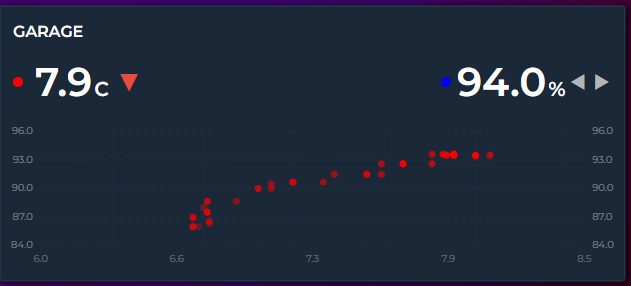

```yaml
chart_mode: scatter
entities:
  - entity: sensor.temperature
    color: "#ff4757"
  - entity: sensor.humidity
    color: "#378ADD"
```

Points are matched by timestamp (5-minute tolerance). Older dots are faded, newer dots are vivid. X/Y axes show entity value ranges, not time.

### Pie Chart

Centered donut showing proportional shares. Percentage labels appear inside slices ≥ 5%. The center shows the total.

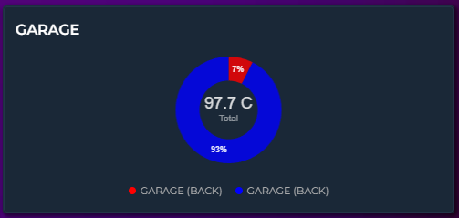

```yaml
chart_mode: pie
height: 200
entities:
  - entity: sensor.hvac_energy
    aggregate_func: sum
    color: "#E24B4A"
  - entity: sensor.lighting_energy
    aggregate_func: sum
    color: "#EF9F27"
  - entity: sensor.kitchen_energy
    aggregate_func: sum
    color: "#1D9E75"
```

### Ranking

Horizontal bars sorted by value (highest first). Each bar shows name, proportional width, value, unit, and share percentage.

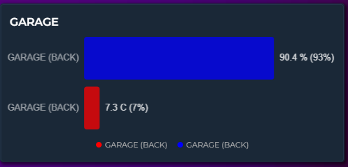

```yaml
chart_mode: ranking
height: 200
entities:
  - entity: sensor.bedroom_temp
    color: "#E24B4A"
  - entity: sensor.living_room_temp
    color: "#378ADD"
  - entity: sensor.kitchen_temp
    color: "#EF9F27"
```

### Heatmap

Days × hours color grid. Each cell represents one hour of one day, colored by intensity. Only the first entity is used.

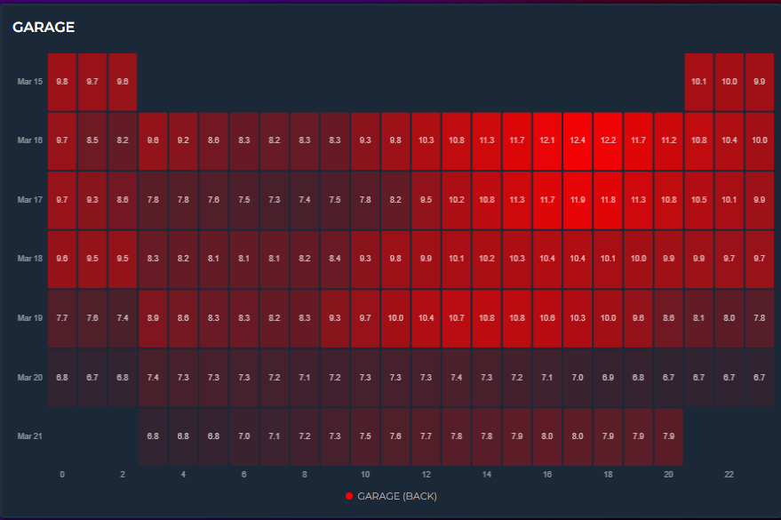

```yaml
chart_mode: heatmap
hours_to_show: 168
height: 250
entities:
  - entity: sensor.temperature
    color: "#ff4757"
```

The color range can be controlled three ways:
- **Automatic** — min/max derived from data
- **Manual bounds** — set entity `lower_bound` / `upper_bound` for a fixed color scale
- **Color thresholds** — enable `color_thresholds` for multi-color heatmaps (e.g., blue → green → red)

### Calendar

GitHub-contribution-style weekly grid. Each cell = one day. Only the first entity is used.

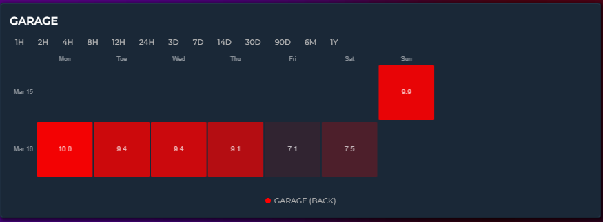

```yaml
chart_mode: calendar
hours_to_show: 720
height: 200
entities:
  - entity: sensor.energy_daily
    aggregate_func: sum
    color: "#1D9E75"
```

### Radial Bar

Concentric progress arcs — each entity is a ring showing its value as a percentage of a defined range. The center displays the average.

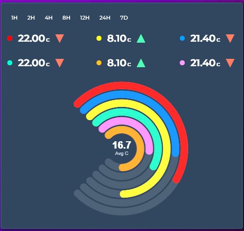

```yaml
chart_mode: radialbar
height: 250
entities:
  - entity: sensor.living_room_temp
    color: "#ff4757"
    lower_bound: 0
    upper_bound: 40
  - entity: sensor.bedroom_temp
    color: "#378ADD"
    lower_bound: 0
    upper_bound: 40
  - entity: sensor.garage_temp
    color: "#2ecc71"
    lower_bound: 0
    upper_bound: 40
```

Set `lower_bound` / `upper_bound` per entity to define the 0–100% range. If not set, the entity's historical min/max from the current time window is used. Supports color thresholds for dynamic ring colors.

### Polar Area

Equal-angle slices with variable radius — larger values produce bigger slices. Like a pie chart but comparing magnitudes instead of shares.

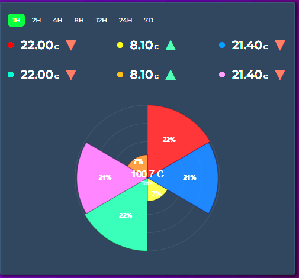

```yaml
chart_mode: polararea
height: 250
entities:
  - entity: sensor.living_room_temp
    color: "#ff4757"
  - entity: sensor.bedroom_temp
    color: "#378ADD"
  - entity: sensor.garage_temp
    color: "#2ecc71"
```

Includes concentric grid circles for reference. Percentage labels appear on slices ≥ 4%. The center shows the total.

### Radar

Spider/polygon chart where each entity forms one spoke. The filled polygon reveals the overall sensor profile at a glance.

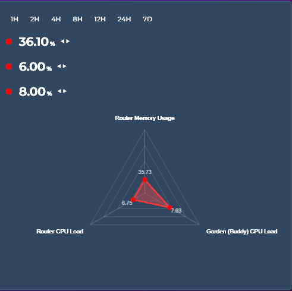

```yaml
chart_mode: radar
height: 300
entities:
  - entity: sensor.temperature
    name: "Temperature"
    lower_bound: 0
    upper_bound: 40
  - entity: sensor.humidity
    name: "Humidity"
    lower_bound: 0
    upper_bound: 100
  - entity: sensor.co2
    name: "CO₂"
    lower_bound: 400
    upper_bound: 2000
  - entity: sensor.pm25
    name: "PM2.5"
    lower_bound: 0
    upper_bound: 50
```

Requires at least 3 entities. Each entity's value is normalized to its `lower_bound` / `upper_bound` range. Polygon grid rings provide reference levels. Colored dots at each vertex show the exact position, with value labels nearby. Supports color thresholds for per-dot colors.

### Chart Mode Compatibility

Not all card options apply to every mode. The visual editor hides irrelevant options automatically.

| Feature | Timeline | Scatter | Pie | Ranking | Radial Bar | Polar Area | Radar | Heatmap | Calendar |
|---------|----------|---------|-----|---------|------------|------------|-------|---------|----------|
| Y / X axes | ✅ | ✅ | — | — | — | — | — | Own axes | Own axes |
| Grid | ✅ | ✅ | — | — | — | Grid circles | Polygon grid | — | — |
| Stacked | ✅ | — | — | — | — | — | — | — | — |
| Offset | ✅ | — | — | — | — | — | — | — | — |
| Annotations | ✅ | — | — | — | — | — | — | — | — |
| Zoom brush | ✅ | — | — | — | — | — | — | — | — |
| Scroll | ✅ | — | — | — | — | — | — | — | — |
| Sparkline | ✅ | — | — | — | — | — | — | — | — |
| Range Band | ✅ | — | — | — | — | — | — | — | — |
| Entity limit | ∞ | 2 | ∞ | ∞ | ∞ | ∞ | 3+ | 1 | 1 |
| Entity graph_type | line/step/bar | — | — | — | — | — | — | — | — |
| lower/upper_bound | Y axis range | — | — | — | 0–100% range | — | Normalization | Color scale | Color scale |

---

## 🎛️ Gauge Display

Replace the numeric state row with a half-circle gauge arc. Set `show_state: gauge` on any entity.

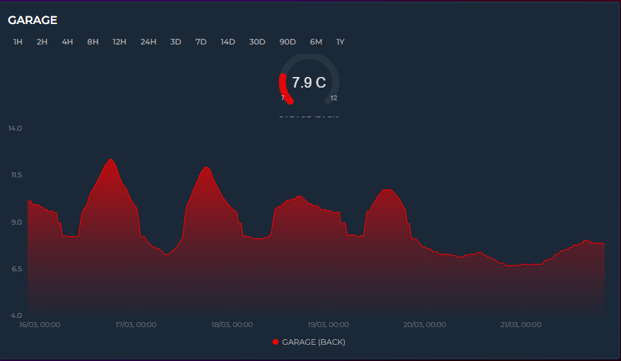

```yaml
entities:
  - entity: sensor.temperature
    show_state: gauge
    color: "#ff4757"
    lower_bound: 15    # gauge minimum
    upper_bound: 30    # gauge maximum
```

The gauge arc sweeps 270° from `lower_bound` to `upper_bound`. The center shows the current value + unit, bottom edges show min/max labels. Multiple gauge entities display side-by-side: 1 entity = large gauge, 2+ = compact.

`color_thresholds` work with gauge — the arc color changes dynamically based on value.

The graph below the gauge continues to show the historical trend as usual.

---

## 🔍 Brush Zoom

Click and drag on any Timeline mode graph to zoom into a specific time range. No configuration needed — it's always available.

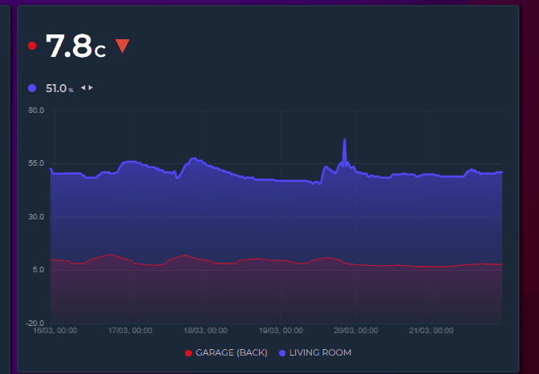

### How it works

1. **Click and drag** horizontally — a blue selection overlay appears with formatted timestamps at both edges
2. **Release** — the graph zooms into the selected range, recalculating Y axis, grid, statistics (Min/Avg/Max), extrema labels, and legend values
3. **Reset** — double-click the graph, or click the **"Reset zoom"** button in the top-right corner

**Key details:**

- **No API calls on zoom** — the full dataset is preserved in memory; zooming only filters and re-renders existing data. Reset is instant.
- **Progressive zoom** — zoom again within an already-zoomed view to drill deeper into spikes or anomalies
- **Touch support** — works on mobile: touch and drag to select
- **Minimum 15px selection** — prevents accidental zoom from regular clicks or taps
- **Time formatting** — selection labels show time only for ranges under 24H, date + time for longer ranges
- **Interval picker aware** — changing the time range via the interval picker resets any active zoom and fetches fresh data

Timeline mode only.

---

## ✨ Sparkline Mode

Card-level `sparkline: true` strips all chrome and renders ultra-compact inline graphs. Only available in Timeline mode.

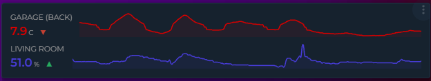

```yaml
sparkline: true
entities:
  - entity: sensor.temperature
    color: "#ff4757"
  - entity: sensor.humidity
    color: "#378ADD"
grid_options:
  columns: 12
  rows: 2
```

Each entity becomes one row: name + value + trend icon on the left, tiny graph on the right. Removed: header, icon, toolbar, axes, grid, tooltip, legend, annotations. Preserved: entity colors, line smoothing, fill, trend icons, live streaming, color thresholds.

---

## 🏷️ Compact Legend

Card-level `show_legend: true` adds a compact color-coded entity name key below the graph. Just colored dots and names — no values, no stats. Wraps to multiple lines on narrow cards.

```yaml
show_legend: true
entities:
  - entity: sensor.memory
    name: "Memory"
    color: "#f39c12"
    show_state: false
  - entity: sensor.disk
    name: "Disk"
    color: "#85b7eb"
    show_state: false
  - entity: sensor.cpu
    name: "CPU"
    color: "#00bcd4"
    show_state: false
```

This produces: `● Memory  ● Disk  ● CPU` in a centered wrapping row below the graph. Combine with `show_state: false` on entities to maximize graph area while still identifying colors.

For per-entity statistics (Min, Avg, Max, Last), use the entity-level **Legend** toggle instead — see [Entity Legend Stats](#per-entity-legend-stats).

---

## 📊 Per-Entity Legend Stats

Each entity's Legend toggle (`show_in_legend: true`) now lets you choose which statistics to display. Select any combination of Min, Avg, Max, and Last.

```yaml
entities:
  - entity: sensor.temperature
    show_in_legend: true
    legend_stats:
      - avg
      - last
  - entity: sensor.humidity
    show_in_legend: true
    legend_stats:
      - min
      - max
```

The editor shows four checkboxes (Min, Avg, Max, Last) inside the Legend section. Default is `[min, avg, max]` for backward compatibility.

---

## ⬇️ State Row Position

Entity state rows can now be placed **below** the graph instead of above. The `align_state` option accepts six positions:

| Value | Position |
|---|---|
| `left` *(default)* | Above graph, left-aligned |
| `center` | Above graph, centered |
| `right` | Above graph, right-aligned |
| `bottom-left` | Below graph, left-aligned |
| `bottom-center` | Below graph, centered |
| `bottom-right` | Below graph, right-aligned |

```yaml
entities:
  - entity: sensor.temperature
    align_state: bottom-left
  - entity: sensor.humidity
    align_state: left         # stays above the graph
```

Mix and match — some entities above, some below. Useful when you want the graph to be the first thing visible, with values underneath.

---

## ↕️ Independent Y2 Axis

The primary (left) and secondary (right) Y axis labels can be toggled independently:

```yaml
show_y_axis: true       # primary — left side
show_y2_axis: false     # secondary — right side hidden
entities:
  - entity: sensor.temperature
    y_axis: primary
  - entity: sensor.humidity
    y_axis: secondary     # still plotted, just no labels on right
```

Useful when the secondary axis labels are distracting or when you want to maximize horizontal graph space. Both entities continue to be plotted against their respective axes — only the labels are hidden.

---

## 🔀 Value Transform

Apply a JavaScript expression to every data point before graphing. The transform has access to the current value and series-level statistics, making it possible to normalize, compare, and reshape data in ways that weren't possible before.

### Available variables

| Variable | Description |
|---|---|
| `x` | Current data point value |
| `first` | First value in the visible time window |
| `last` | Last value in the visible time window |
| `min` | Minimum value across the series |
| `max` | Maximum value across the series |
| `avg` | Average value across the series |
| `index` | Position of the current point (0, 1, 2…) |

All variables are computed after `value_factor` is applied, before the transform runs.

### Normalize to zero

Display cumulative meter readings as relative consumption starting from zero:

```yaml
entities:
  - entity: sensor.gas_meter
    value_transform: "return x - first;"
```

A gas meter reading `2200, 2210, 2225, 2240` becomes `0, 10, 25, 40`.

### Splitting a sensor into export/import

A common use case: a single power sensor reports positive values for export and negative values for import. Use two entity entries with different transforms to separate them:

```yaml
entities:
  - entity: sensor.grid_power
    name: "Grid Export"
    color: "#2ecc71"
    value_transform: "return x > 0 ? x : 0"

  - entity: sensor.grid_power
    name: "Grid Import"
    color: "#e74c3c"
    value_transform: "return x < 0 ? -x : 0"
```

### Common expressions

| Expression | What it does |
|---|---|
| `return x - first` | Normalize to zero (cumulative → relative) |
| `return ((x - first) / first) * 100` | Percentage change from start |
| `return (x - min) / (max - min)` | Min-max normalization (scale to 0–1) |
| `return x - avg` | Deviation from average |
| `return x > 0 ? x : 0` | Keep only positive values (zero out negatives) |
| `return x < 0 ? -x : 0` | Keep only negative values, flip to positive |
| `return Math.abs(x)` | Absolute value |
| `return x * 1.1` | Add 10% markup |
| `return x - 273.15` | Convert Kelvin to Celsius |
| `return (x * 9/5) + 32` | Convert Celsius to Fahrenheit |
| `return Math.round(x / 100) * 100` | Round to nearest hundred |

### Editor

Entity → General → **Value Transform** — a monospace text input field. Enter the expression directly (e.g., `return x - first`).

### Notes

- The expression must be valid JavaScript and include a `return` statement
- If the expression errors or returns a non-number, the original value is used unchanged
- Applied to every data point individually — both historical and live values
- Works with all chart modes, aggregation functions, and other entity options
- Context variables (`first`, `min`, etc.) are only available when processing a full data series — in the state row live value display, all context variables equal `x`

---

## 📏 Range Band

The Range Band feature draws a shaded min/max area behind each line entity, showing how much the value fluctuated within each aggregation bucket.

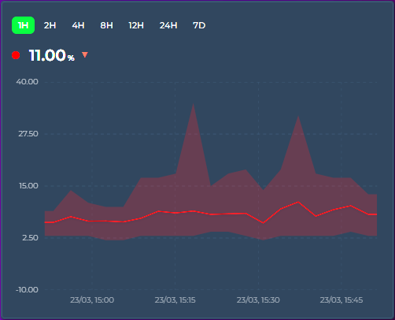

### How it works

When `points_per_hour` aggregates multiple raw data points into a single graph point, the displayed value is typically the average (or whichever `aggregate_func` you've chosen). The range band shows the **full min → max spread** of raw values that were combined — so you can see both the trend and the volatility.

```yaml
entities:
  - entity: sensor.outdoor_temperature
    show_range_band: true
    color: "#ff4757"
  - entity: sensor.indoor_temperature
    show_range_band: false
    color: "#378ADD"
```

### Use cases

- **Temperature**: narrow band = stable climate, wide band = fluctuating (e.g. HVAC cycling)
- **Energy**: see consumption spikes vs steady draw within each time bucket
- **Sensor noise**: distinguish real signal changes from noisy sensor readings

### Editor

Entity → General → **Range Band** toggle (next to Show Average).

### Tooltip

When hovering, an additional row shows the range: `Range: 21.2 → 22.8 °C`.

---

## 📊 Stacked Mode

Card-level `stacked: true` stacks entities on top of each other (Timeline mode only). Bar entities stack vertically. Line/area entities stack as bands. Entities on the same Y axis and graph type are stacked together. The tooltip shows a "Total" row.

```yaml
stacked: true
entities:
  - entity: sensor.solar_production
    color: "#f39c12"
  - entity: sensor.grid_import
    color: "#e74c3c"
  - entity: sensor.battery_discharge
    color: "#3498db"
```

---

## ↔️ Time Offset

Compare the same sensor across different time periods by adding multiple entity entries with different `offset` values. Each offset shifts that entity's data backward in time while keeping it aligned on the same graph.

```yaml
hours_to_show: 168
entities:
  - entity: sensor.energy_consumption
    name: "This week"
    offset: 0
    color: "#ff4757"
  - entity: sensor.energy_consumption
    name: "Last week"
    offset: 168
    color: "#378ADD"
  - entity: sensor.energy_consumption
    name: "2 weeks ago"
    offset: 336
    color: "#2ecc71"
```

### How it works

- `offset: 168` means "fetch data from 168 hours (7 days) before the current display window"
- The fetched data is time-shifted forward to align with the current window on the X axis
- All rendering features work at full quality — line, bar, step, fill, gradient, points, tooltips, stacking, zoom
- Each entity with an offset gets its own API call with the correct time range

### Common offset values

| Offset | Period |
|---|---|
| `24` | Yesterday |
| `168` | Last week |
| `336` | 2 weeks ago |
| `720` | Last month (~30 days) |
| `8760` | Last year |

### Dynamic Offset via Helper Entity

Instead of a fixed number, you can point `offset` to any HA entity whose state is a number (in hours). The card reads the entity's current state and re-fetches history automatically when it changes.

```yaml
entities:
  - entity: sensor.energy_consumption
    name: "Current"
  - entity: sensor.energy_consumption
    name: "Comparison"
    offset: input_number.comparison_offset
    color: "#378ADD"
```

This works with any entity type — `input_number`, template sensors, or any sensor that outputs a numeric state. Combine with HA template sensors for fully dynamic comparisons:

```yaml
# In HA configuration.yaml
template:
  - sensor:
      - name: "Dynamic Offset"
        state: "{{ 24 if now().weekday() < 5 else 168 }}"
        unit_of_measurement: "h"
```

### Editor

Entity → General → Data Settings → **Offset** (in hours).

### Notes

- Offset entities do not receive live WebSocket updates (they show historical data)
- The state row, sparkline, and gauge correctly display the last value from the offset time window — not the live entity state
- Works with all chart modes that support multiple entities
- Can be combined with `value_transform`, `value_factor`, and all other entity options
- Each offset generates a separate cache entry, so switching between views is fast

---

## 📌 Annotations

Add reference lines, event markers, and highlight bands to the graph (Timeline mode only). Configure via the editor (General Settings → Overlays → Annotations) or YAML.

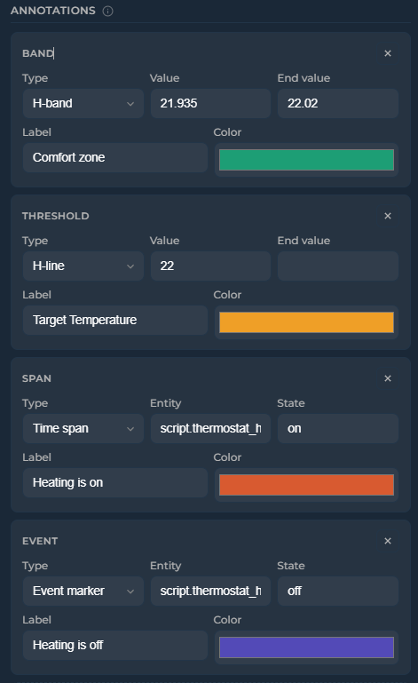
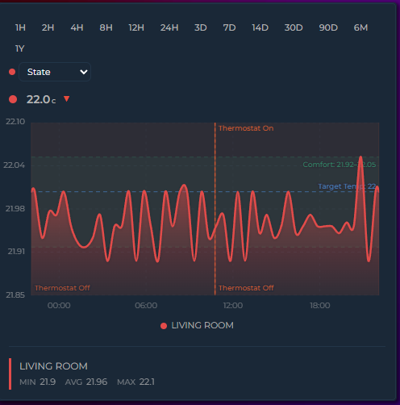

```yaml
annotations:
  - type: threshold       # horizontal dashed line
    value: 22.5
    label: "Target"
    color: "#1D9E75"
  - type: band            # horizontal shaded band
    value: 20
    value_end: 23
    label: "Comfort zone"
    color: "#1D9E75"
  - type: event           # vertical marker at state transitions
    entity: binary_sensor.heating
    state: "on"
    label: "Heating on"
    color: "#D85A30"
  - type: span            # vertical band for active periods
    entity: binary_sensor.heating
    state: "on"
    color: "#D85A30"
```

| Type | Description |
|------|-------------|
| `threshold` | Horizontal dashed line at a fixed value |
| `band` | Horizontal shaded band between `value` and `value_end` |
| `event` | Vertical marker at each state transition of a binary entity |
| `span` | Vertical shaded band for the duration a binary entity is in a specific state |

---

## 🔗 Tooltip Sync

Synchronize hover crosshairs across multiple cards on the same dashboard page. When you hover over one card, all synced cards show their tooltip and crosshair at the **same timestamp** — even if they display different entities or different time ranges.

This is a **card-level** feature (not entity-level), because what's shared is a timestamp, not an entity value. All entities on a synced card show their values at that moment simultaneously.

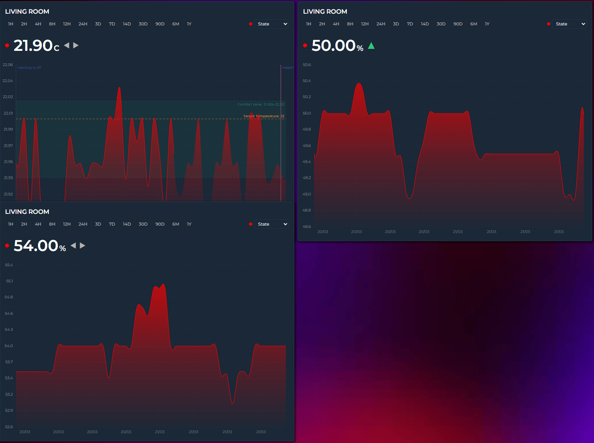

### Setup

Enable Tooltip Sync on each card you want to participate, and give related cards the same Sync Group name:

```yaml
# Card 1 — Bedroom Temperature
type: custom:statistics-graph-chart-card
tooltip_sync: true
tooltip_sync_group: "bedroom"
entities:
  - entity: sensor.bedroom_temperature

# Card 2 — Bedroom Humidity (syncs with Card 1)
type: custom:statistics-graph-chart-card
tooltip_sync: true
tooltip_sync_group: "bedroom"
entities:
  - entity: sensor.bedroom_humidity

# Card 3 — Kitchen Temperature (independent)
type: custom:statistics-graph-chart-card
tooltip_sync: true
tooltip_sync_group: "kitchen"
entities:
  - entity: sensor.kitchen_temperature

# Card 4 — Energy (no sync at all)
type: custom:statistics-graph-chart-card
entities:
  - entity: sensor.energy
```

In this setup:
- Cards 1 and 2 sync with each other (both in "bedroom" group)
- Card 3 syncs only with other "kitchen" cards
- Card 4 has no sync — hovering over it broadcasts nothing, and it ignores broadcasts from others

### Sync Group Rules

| Sync Group value | Behavior |
|---|---|
| `"bedroom"` | Syncs only with other cards that have `tooltip_sync_group: "bedroom"` |
| `"kitchen"` | Syncs only with "kitchen" cards |
| *(empty / not set)* | Syncs with **all** tooltip-synced cards on the page, regardless of their group |
| `tooltip_sync: false` | Card does not participate in sync at all |

> **Tip:** The group name is completely arbitrary — use room names, floor numbers, or any string you like. It just needs to match across the cards you want to link.

### How It Works

1. You hover over Card A → a `sgc-tooltip-sync` event is dispatched on `window` containing the hovered timestamp, the sync group name, and the card's unique instance ID
2. All other cards with Tooltip Sync enabled listen for this event
3. If the group matches (or either card has no group), the receiving card calls `_showTooltipAtTime(timestamp)` — which positions its crosshair and tooltip at the matching time position
4. When you move the mouse away, a hide event clears all synced tooltips

Cards with different `hours_to_show` ranges still sync correctly — the shared language is the **timestamp**, not the pixel position. A card showing 24H and a card showing 7D will both jump to 2:35 PM if that's where your mouse is.

Timeline mode only.

---

## 🔌 External Statistics

Display data from imported statistics that don't have a regular entity in Home Assistant. This covers energy data from integrations like Gazpar, Linky, Tibber, and others that import directly into HA's statistics database.


### Background

Some HA integrations don't create `sensor.*` entities. Instead, they write data directly into the `statistics` and `statistics_meta` database tables using HA's `async_import_statistics()` API. These statistics have IDs with a colon separator (e.g. `gazpar:gazpar_consumption`) and are visible on the Energy dashboard and the built-in Statistics Graph card, but not in the entity registry.

### Setup

Use `statistic_id` instead of (or alongside) `entity`:

```yaml
entities:
  - entity: ""
    statistic_id: "gazpar:gazpar_consumption"
    name: "Gas Consumption"
    color: "#f39c12"
    aggregate_func: sum
  - entity: ""
    statistic_id: "linky:linky_consumption"
    name: "Electricity"
    color: "#378ADD"
    aggregate_func: sum
  - entity: sensor.indoor_temperature
    name: "Temperature"
    color: "#ff4757"
```

You can mix external statistics with regular entities on the same card.

### How it works

- The card detects external statistics by checking for a `:` in the `statistic_id`
- Data is fetched via HA's `recorder/statistics_during_period` WebSocket API — the same API the Energy dashboard uses
- Since there is no live state, the state row displays the last known value from the statistics data
- All card features work: tooltip, legend, axes, stacking, offset, zoom, color thresholds, etc.

### Editor

Entity → General → **Statistic ID** input field (monospace, below the entity picker). Set the entity picker to empty and fill in the statistic ID.

### Finding your statistic IDs

1. Go to **Developer Tools → Statistics** in HA
2. Search for the integration name (e.g. "gazpar")
3. The statistic ID is shown in the list (e.g. `gazpar:gazpar_consumption`)

---

## ⚡ Energy Date Sync

Syncs the card's time range with Home Assistant's Energy dashboard date picker or the [energy-period-selector-plus](https://github.com/flixlix/energy-period-selector-plus) custom card.

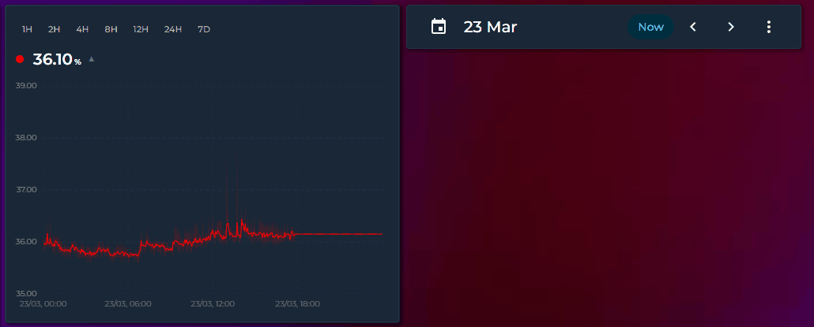

### Setup

```yaml
type: custom:statistics-graph-chart-card
energy_date_sync: true
entities:
  - entity: sensor.energy_consumption
    color: "#ff4757"
    aggregate_func: sum
  - entity: sensor.solar_production
    color: "#2ecc71"
    aggregate_func: sum
```

Place the card on the same dashboard as an Energy date picker. When the user selects a day, week, month, or custom range, this card automatically updates to show the same period.

### Behavior

| Date selection | X-axis range | Live updates |
|---|---|---|
| **Today** | 00:00 → current time | ✅ Active — graph updates in real time |
| **Yesterday** | 00:00 → 23:59 | ❌ Paused — historical data is frozen |
| **This week** | Monday 00:00 → current time | ✅ Active |
| **Last week** | Monday 00:00 → Sunday 23:59 | ❌ Paused |
| **This month** | 1st 00:00 → current time | ✅ Active |
| **Custom range** | Start → End (clamped to now if end is in the future) | Depends on whether end is today |

### Compatible with

- HA's built-in Energy dashboard date picker (DAY / WEEK / MONTH / YEAR)
- [energy-period-selector-plus](https://github.com/flixlix/energy-period-selector-plus) custom card
- Any card that uses HA's energy data collection system

### Editor

General Settings → Overlays → **Energy Date Sync** toggle.

### Notes

- When `energy_date_sync` is active, it overrides `hours_to_show` and the interval picker selection
- The card subscribes to HA's energy data collection on the WebSocket connection — no polling needed
- If the Energy panel hasn't loaded yet, the card retries every 2 seconds for up to 60 seconds

---

## 💡 Examples

### Basic: Single Sensor

```yaml
type: custom:statistics-graph-chart-card
card_header: Bedroom
hours_to_show: 12
entities:
  - entity: sensor.bedroom_temperature
    name: Temperature
    color: "#ff6b35"
    icon: mdi:thermometer
```

---

### 🌡️ Multi-Entity with Dual Axes

Combine temperature and humidity on the same card without the scales conflicting.

<!-- IMAGE 3: Card with temperature line (primary) and humidity line (secondary axis) -->

```yaml
type: custom:statistics-graph-chart-card
card_header: Climate
card_icon: mdi:home-thermometer
hours_to_show: 24
lower_bound_secondary: "~0"
upper_bound_secondary: "~100"
entities:
  - entity: sensor.temperature
    name: Temperature
    color: "#ff6b35"
    y_axis: primary
    icon: mdi:thermometer

  - entity: sensor.humidity
    name: Humidity
    color: "#00bcd4"
    y_axis: secondary
    icon: mdi:water-percent
```

---

### ⚡ Bar Chart with Legend

```yaml
type: custom:statistics-graph-chart-card
card_header: Energy Today
entities:
  - entity: sensor.daily_energy
    name: Consumption
    graph_type: bar
    color: "#2ecc71"
    show_in_legend: true
    aggregate_func: sum
    group_by: hour
```

---

### 🎨 Color Thresholds

Colorize the graph based on value ranges. The `transition` option controls whether color changes smoothly or switches instantly at each threshold.

<!-- IMAGE 4: Temperature graph with gradient color from blue (cold) through green to red (hot) -->

```yaml
type: custom:statistics-graph-chart-card
entities:
  - entity: sensor.outdoor_temperature
    name: Outdoor Temp
    color: threshold
    state_color: threshold
    color_thresholds:
      enabled: true
      transition: smooth   # or: hard
      values:
        - value: 0
          color: "#3498db"
        - value: 15
          color: "#2ecc71"
        - value: 25
          color: "#f39c12"
        - value: 35
          color: "#e74c3c"
```

Setting `color: threshold` propagates threshold colors to the state row dot as well. Setting `state_color: threshold` colors the displayed value text.

---

### 📈 Rise/Fall Colors

Color each graph segment green when rising and red when falling — without needing to define any value thresholds. The trend icon on the state row reflects the same direction. `trend_period_hours` controls how sensitive the detection is.

```yaml
type: custom:statistics-graph-chart-card
entities:
  - entity: sensor.stock_price
    name: Price
    rise_fall_colors:
      enabled: true
      increase: "#2ecc71"
      decrease: "#e74c3c"
      stable: "#95a5a6"
    show_trend_icon: true
    trend_period_hours: 2
```

---

### ➖ Average Line

Draw a dashed reference line at the mean value over the visible time window. Useful for spotting trends at a glance.

<!-- IMAGE: Average line shown on a temperature graph as a dashed horizontal line with a value label -->

```yaml
type: custom:statistics-graph-chart-card
hours_to_show: 24
entities:
  - entity: sensor.outdoor_temperature
    name: Temperature
    color: "#ff6b35"
    show_average: true

  # Multiple entities each show their own average in their own color
  - entity: sensor.indoor_temperature
    name: Indoor
    color: "#00bcd4"
    show_average: true
```

---

### 🔗 Attribute Reading

Read a specific attribute instead of the main entity state. Supports dot notation for nested paths.

```yaml
type: custom:statistics-graph-chart-card
entities:
  # Simple attribute
  - entity: weather.home
    name: Humidity
    attribute: humidity
    icon: mdi:water-percent

  # Nested attribute (e.g. first forecast entry)
  - entity: weather.home
    name: Forecast Temp
    attribute: forecast.0.temperature
    icon: mdi:thermometer
```

---

### 🔀 State Map — Non-Numeric Entities

Use `state_map` to graph entities with string states like `input_boolean`, `binary_sensor`, or `input_select`. States are mapped to numbers in the order they are listed, starting at 0.

<!-- IMAGE 5: Binary sensor shown as 0/1 step graph -->

```yaml
type: custom:statistics-graph-chart-card
entities:
  # binary_sensor → 0 (off) / 1 (on)
  - entity: binary_sensor.front_door
    name: Front Door
    color: "#9b59b6"
    state_map:
      - value: "off"
      - value: "on"

  # input_select → 0 / 1 / 2 / 3
  - entity: input_select.heating_mode
    name: Heating Mode
    state_map:
      - value: "off"
      - value: "eco"
      - value: "comfort"
      - value: "boost"
```

> The state row displays the original string (`"on"`, `"eco"`, etc.) — not the numeric graph value.

---

### 📏 Fixed Value Reference Line

Draw a flat horizontal line at the current value of an entity. Useful for showing targets or limits alongside historical data.

```yaml
type: custom:statistics-graph-chart-card
entities:
  - entity: sensor.room_temperature
    name: Temperature
    color: "#ff6b35"

  - entity: input_number.target_temperature
    name: Target
    color: "#2ecc71"
    fixed_value: true
    show_fill: false
    line_width: 1.5
```

---

### 〰️ Soft Bounds

Use a `~` prefix to create a soft bound — the axis will prefer the value but expand if data exceeds it. Hard bounds (no prefix) force the axis edge regardless of data.

```yaml
type: custom:statistics-graph-chart-card
entities:
  - entity: sensor.battery_level
    name: Battery
    lower_bound: "~0"    # prefer 0 as minimum; expands if data goes below
    upper_bound: "~100"  # prefer 100 as max; expands if data exceeds
```

---

### 📡 Dynamic Y Axis Bounds

Bind the Y axis min/max to another sensor for a fully dynamic range.

```yaml
type: custom:statistics-graph-chart-card
entities:
  - entity: sensor.power_output
    name: Power
    lower_bound: 0
    upper_bound: sensor.max_capacity
```

---

### 👆 Tap Actions

Trigger actions when tapping an entity's state row.

```yaml
type: custom:statistics-graph-chart-card
entities:
  # Open entity detail dialog
  - entity: sensor.temperature
    tap_action:
      action: more-info

  # Navigate to another dashboard
  - entity: sensor.energy
    tap_action:
      action: navigate
      navigation_path: /lovelace/energy

  # Call a service
  - entity: binary_sensor.pump
    tap_action:
      action: call-service
      service: switch.toggle
      service_data:
        entity_id: switch.pump
```

---

### ⏩ Sparse Data with Points Per Hour

For sensors that update infrequently (e.g. weather), use a higher `points_per_hour` with forward-fill. Empty buckets inherit the last known value, producing a clean step-line instead of scattered dots.

```yaml
type: custom:statistics-graph-chart-card
points_per_hour: 12
hours_to_show: 24
entities:
  - entity: weather.home
    attribute: humidity
    name: Humidity
    smooth: false  # step-like appearance is more accurate for infrequent updates
```

---

### 🎚️ Interval Picker & Attribute Switcher

Add on-card controls for quick time range switching and live attribute exploration — no need to open the editor.

```yaml
type: custom:statistics-graph-chart-card
card_header: Weather Station
hours_to_show: 24
show_interval_picker: true
interval_picker_position: left
show_attribute_list: true
attribute_list_position: right
entities:
  - entity: weather.home
    name: Temperature
    attribute: temperature
    color: "#ff6b35"

  - entity: weather.home
    name: Humidity
    attribute: humidity
    color: "#00bcd4"
```

The interval picker displays buttons for the default set: 1H, 2H, 4H, 8H, 12H, 24H, and 7D. Clicking a button temporarily overrides `hours_to_show`; clicking again deselects it and returns to the original range.

To customize which buttons appear, use `interval_options`:

```yaml
# Show only the intervals you need — fits on one row on mobile
show_interval_picker: true
interval_options:
  - "2H"
  - "12H"
  - "24H"
  - "7D"
  - "30D"
```

Available labels: `1H`, `2H`, `4H`, `8H`, `12H`, `24H`, `3D`, `7D`, `14D`, `30D`, `90D`, `6M`, `1Y`. The editor also provides a **Visible Intervals** checkbox grid under the Interval Picker toggle (General Settings → Overlays).

The attribute list shows a dropdown per entity with a color-coded dot. Select any numeric attribute to instantly re-graph with that data — the graph, state row, and tooltip all update live.

Both controls share a single toolbar row and wrap automatically on narrow cards.

---

### 🔍 Scrollable Graph

Load a wide time range but show only a portion at a time — scroll to explore.

```yaml
type: custom:statistics-graph-chart-card
card_header: Weekly Overview
hours_to_show: 168        # 7 days of data
max_visible_interval: 24  # show 24h at a time
scroll_mode: wheel         # or: scrollbar
entities:
  - entity: sensor.temperature
    color: "#ff6b35"
```

The graph starts scrolled to the right (most recent data). Y-axis labels stay fixed while the graph content scrolls underneath. Scroll position is preserved across HA state updates.

| `scroll_mode` | Behavior |
|---------------|----------|
| `scrollbar` | Thin visible scrollbar *(default)* |
| `wheel` | Mouse wheel scrolls horizontally, no visible scrollbar |

On mobile/touch devices, swipe always works regardless of the scroll mode setting.

> 💡 Combines well with the **Interval Picker** — select "7D" to get a wide range, then scroll through it with a 6-hour visible window.

---

### ↔️ Icon Position

Place the header icon on the right side for a different layout feel.

```yaml
type: custom:statistics-graph-chart-card
card_header: Living Room
card_icon: mdi:thermometer
card_icon_position: right   # default: left
entities:
  - entity: sensor.temperature
    color: "#ff6b35"
```

---

### 🏆 Full Example

A complete card showing most features together.

<!-- IMAGE 6: Full-featured card with header, icon, multiple entities, legend, and grid -->

```yaml
type: custom:statistics-graph-chart-card
card_header: Home Climate
card_icon: mdi:home-thermometer
card_icon_color: "#ff6b35"
align_header: left
hours_to_show: 24
points_per_hour: 6
height: 180
show_grid: true
show_tooltip: true
animate_graph: false
update_interval: 60

entities:
  - entity: sensor.living_temperature
    name: Temperature
    color: "#ff6b35"
    icon: mdi:thermometer
    y_axis: primary
    show_in_legend: true
    show_extrema: click
    show_average: true
    show_trend_icon: true
    trend_period_hours: 2
    decimals: 1
    gradient: true
    state_adaptive_color: true
    color_thresholds:
      enabled: true
      transition: smooth
      values:
        - value: 18
          color: "#3498db"
        - value: 22
          color: "#2ecc71"
        - value: 28
          color: "#e74c3c"

  - entity: sensor.living_humidity
    name: Humidity
    color: "#00bcd4"
    icon: mdi:water-percent
    y_axis: secondary
    show_in_legend: true
    decimals: 0
    lower_bound: "~0"
    upper_bound: "~100"
```

---

## 📖 Reference

### 🧮 Aggregation Functions

| Value | Description |
|-------|-------------|
| `avg` | Mean of all points in the bucket *(default)* |
| `min` | Lowest value |
| `max` | Highest value |
| `last` | Most recent value |
| `first` | Oldest value |
| `median` | Middle value |
| `sum` | Sum of all values (useful for energy) |
| `delta` | Last minus first (net change) |
| `diff` | Max minus min (spread) |

---

### 🕐 Date Formats

Set `datetime_format` at the card level to control how timestamps appear on the X-axis, tooltips, and extrema labels. `system` follows HA's locale setting. All other formats are applied regardless of locale — useful when your dashboard is shared across regions or when you need a more compact display.

> **Note:** In earlier versions, `datetime_format` was an entity-level option. It has been promoted to a card-level setting. Entity-level values still work for backward compatibility and override the card setting when present.

| Value | Example output |
|-------|---------------|
| `system` | Follows HA locale |
| `DD/MM` | 24/01 |
| `MM/DD` | 01/24 |
| `DD/MM HH:mm` | 24/01 14:35 |
| `MM/DD HH:mm` | 01/24 14:35 |
| `HH:mm` | 14:35 |
| `DD/MM hh:mm A` | 24/01 02:35 PM |
| `MM/DD hh:mm A` | 01/24 02:35 PM |
| `hh:mm A` | 02:35 PM |

---

### 〰️ Bounds

Both entity-level (`lower_bound`, `upper_bound`) and card-level axis options (`lower_bound`, `upper_bound` for primary; `lower_bound_secondary`, `upper_bound_secondary` for secondary) support three value types:

| Format | Behavior |
|--------|----------|
| `0` | **Hard bound** — axis edge is fixed at this value regardless of data |
| `"~0"` | **Soft bound** — axis prefers this value but expands if data exceeds it |
| `"sensor.entity_id"` | **Dynamic bound** — tracks the live state of another entity |

Card-level bounds set the baseline for the axis; entity-level bounds can further tighten or extend the range. When both are present, the most restrictive hard bound or the widest soft bound wins.

#### Y Axis Tick Control

Use `y_axis_ticks` to control how many divisions appear on the Y axis. The axis range is automatically snapped to clean round numbers so labels always look tidy.

```yaml
type: custom:statistics-graph-chart-card
lower_bound: 40
upper_bound: 100
y_axis_ticks: 6
entities:
  - entity: sensor.cpu_temperature
```

This produces labels at **40, 50, 60, 70, 80, 90, 100** — similar to setting `tickAmount: 6` in Apex Charts or an interval of 10 in Excel.

---

### ⚡ Auto Scale Points

When using the interval picker to switch between time ranges (1H → 7D), the default `points_per_hour` can be too dense for long periods or too sparse for short ones. Enable `auto_scale_points` to let the card adjust automatically.

The configured `points_per_hour` is treated as the baseline for the configured `hours_to_show`. When a different interval is selected, the value is scaled proportionally and snapped to the nearest power of 2 (…0.5, 1, 2, 4, 8, 16…).

```yaml
type: custom:statistics-graph-chart-card
points_per_hour: 2
auto_scale_points: true
show_interval_picker: true
entities:
  - entity: sensor.power_consumption
  - entity: sensor.solar_production
  - entity: sensor.grid_export
```

With `hours_to_show: 24` and `points_per_hour: 2` as the baseline:

| Interval | Scaled pph | ≈ One point every |
|----------|-----------|-------------------|
| 1H | 64 | ~1 min |
| 2H | 32 | ~2 min |
| 4H | 16 | ~4 min |
| 8H | 8 | 7.5 min |
| 12H | 4 | 15 min |
| 24H | 2 | 30 min *(baseline)* |
| 3D | 1 | 1 hour |
| 7D | 0.5 | 2 hours |

> **Note:** Entity-level `points_per_hour` overrides are not affected by auto scaling — only entities inheriting the card-level value are scaled.

---

### 📈 Rise/Fall Colors

Colors each graph segment based on its slope relative to the previous point. Unlike color thresholds (which react to absolute values), rise/fall coloring reacts to *direction of change* — making it easy to spot momentum shifts at a glance. The `trend_period_hours` setting on the entity controls the smoothing window used to determine whether a segment counts as rising, falling, or stable.

```yaml
rise_fall_colors:
  enabled: true
  increase: "#2ecc71"   # color when value is rising
  decrease: "#e74c3c"   # color when value is falling
  stable: "#95a5a6"     # color when value is flat
```

The same direction logic drives the trend icon (▲▼⯇⯈) on the state row — so the icon and the graph always agree.

> ⚠️ Cannot be combined with `color_thresholds` on the same entity.

---

### 🎨 Color Thresholds

```yaml
color_thresholds:
  enabled: true
  transition: smooth     # smooth or hard
  values:
    - value: 0           # at or above this value → use this color
      color: "#3498db"
    - value: 20
      color: "#2ecc71"
    - value: 35
      color: "#e74c3c"
```

Thresholds are sorted by value automatically. The color of the lowest threshold applies to everything below it.

Setting `color: threshold`, `state_color: threshold`, `icon_color: threshold`, or `point_colors: threshold` on the entity makes those elements also reflect the threshold color.

**`transition`** controls how color changes between bands:
- `smooth` — gradual interpolation along the line as values pass through thresholds
- `hard` — instant color switch exactly at the threshold value

> ⚠️ Cannot be combined with `rise_fall_colors` on the same entity.

---

### 👆 Tap Actions

| Action | Description |
|--------|-------------|
| `none` | No action *(default)* |
| `more-info` | Open entity detail dialog |
| `navigate` | Navigate to a dashboard path (requires `navigation_path`) |
| `url` | Open an external URL (requires `url`) |
| `call-service` | Call an HA service (requires `service` and optional `service_data`) |

---

### 🔣 State Map

Maps non-numeric state strings to integer values for graphing. Order determines the number (0-based index).

```yaml
state_map:
  - value: "off"       # → 0
  - value: "idle"      # → 1
  - value: "on"        # → 2
```

The state row always displays the original string, not the number.

> ⚠️ State values are case-sensitive and must match exactly what HA reports (always lowercase for `binary_sensor`).

---

## 🛠️ Visual Editor

The card ships with a full visual editor — no YAML required. Every option in this documentation is reachable from the Lovelace UI. Changes apply immediately without a page reload.


### General Settings — Four Tabs

The General Settings panel is divided into four tabs to reduce clutter:

| Tab | Contents |
|-----|----------|
| **Display** | Chart mode, height, header, icon, visual toggles (grid, tooltip, stacked, sparkline, auto scale…), graph data (hours, points/hour, group by, update interval), graph navigation (visible window, scroll mode) |
| **Y Axis** | Visibility (Y-axis, Y2-axis, logarithmic), labels (ticks, font size, opacity), bounds (min range, lower/upper bounds) |
| **X Axis** | Visibility (X-axis), labels (date format, bar spacing, font size, opacity) |
| **Overlay** | Interval Picker, Attribute List, Tooltip Sync, Energy Date Sync, Annotations |

Settings that depend on a toggle are automatically dimmed when the parent is off — for example, Sync Group is disabled when Tooltip Sync is off, and Interval Position is disabled when Interval Picker is off.

### Entity Configuration — Three Tabs

Each entity panel has three tabs:

| Tab | Contents |
|-----|----------|
| **General** | Entity picker, custom name, data settings (aggregate, decimals, attribute, value factor, points per hour, number format, offset), state map, tap action |
| **Appearance** | Graph toggle, graph type, extrema, average, line, fill, data points, state row (on / gauge / off), trend icon, Y axis range, legend |
| **Colors** | Base colors (line, icon, state), rise/fall colors, color thresholds with transition mode |

Entity options also adapt dynamically based on Chart Mode — see [Dynamic Editor Behavior](#-dynamic-editor-behavior).

### Drag and Drop

Entities can be reordered by dragging the grip handle (⠿) on the left side of each entity row. The order determines drawing order on the graph and row order in the state display.

### Info Tooltips

Every configuration field has an info tooltip (ⓘ) with a detailed explanation. Hover or tap the icon next to any label to learn what the option does, see practical examples, and understand how it interacts with other settings.

--- 

## 📄 License

MIT

<a href="https://www.buymeacoffee.com/cataseven" target="_blank">
  
</a>


[](https://www.star-history.com/#cataseven/Statistics-Graph-Chart-Card&type=date&legend=top-left)
