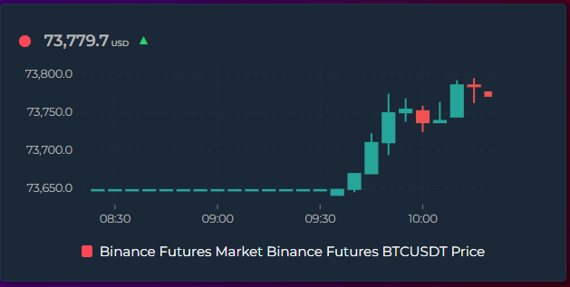
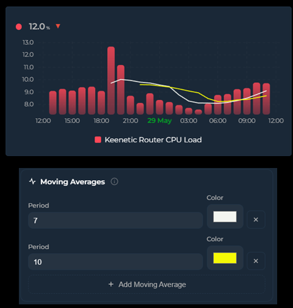
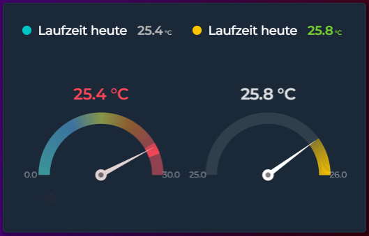
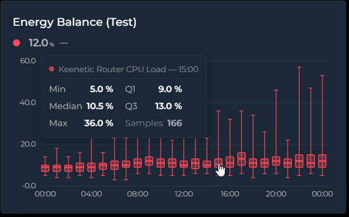
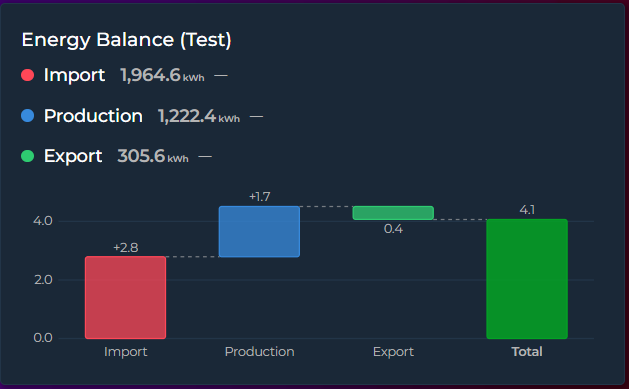
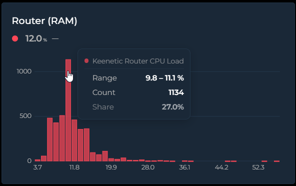
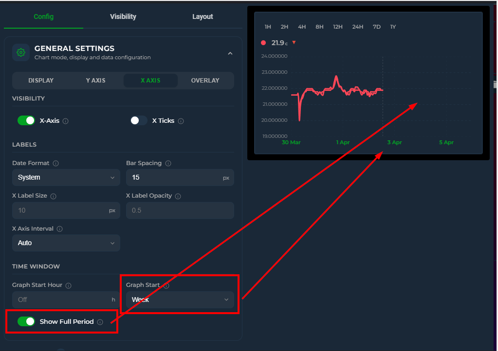
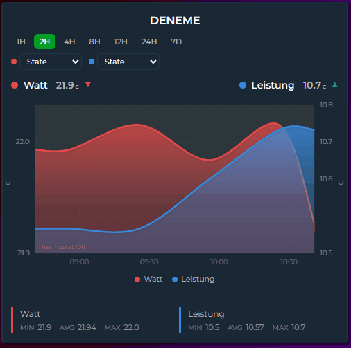
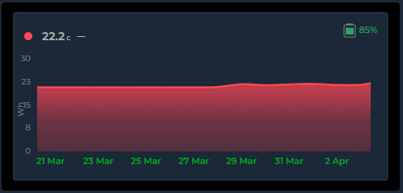

## ⭐ Support

If you like this card, feel free to ⭐ star the project on GitHub and share it with the Home Assistant community or

<a href="https://www.buymeacoffee.com/cataseven" target="_blank">
  
</a>

# 📊 Home Assistant - Statistics Graph Chart Card


[](https://github.com/hacs/frontend)
[](https://github.com/cataseven/Statistics-Graph-Chart-Card/releases)


[](https://github.com/cataseven/Statistics-Graph-Chart-Card)
[](https://github.com/cataseven/Statistics-Graph-Chart-Card/issues)

An awesome feature-rich custom card for [Home Assistant](https://www.home-assistant.io/) that combines a time-series graph with live state rows — all in a single card. Built with no external dependencies, fully configurable via the visual editor or YAML.

---

## 🖼️ Preview










---

## ✨ Features

| | |
|---|---|
| 📈 | Line, step, and bar charts with smooth Bezier curves |
| 🕯️ | **Candlestick (OHLC) charts** — render any entity as trading-style candles showing the open, high, low, and close of each time bucket. Green/red up/down bodies with high–low wicks and an O/H/L/C tooltip; recolor with the Rise/Fall Colors feature. Candles snap to clean clock intervals and sit centered on the X-axis ticks |
| 📅 | **Built-in Date Picker** — navigate Day, Week, Month, Year views with arrow buttons, calendar popup, and preset ranges (Last 7/30 Days, Last 12 Months). Or open on a rolling window that ends now — **Last 24H … Last 12M** — set as the default mode or shown as extra picker buttons. Sync multiple cards with `date_picker_group` — even cards without a visible picker can follow the group. Customize visible modes with `date_picker_modes` — lock to a single mode for a minimal nav bar |
| 🪟 | **Card styling without card-mod** — set border radius, border color & width, padding, background image (with smart `/local/` path resolution), background blur (image-only — chart and header stay sharp), header color, weight, and letter-spacing directly from the editor. Combine with `rgba(...)` background colors for translucent cards over images |
| 🔢 | Live state rows with current value, MDI icons, and configurable font sizes |
| 🎯 | **Fourteen chart modes** — Timeline, State Timeline, Scatter, Pie (donut), Ranking (horizontal bar), Radial Bar (concentric arcs), Polar Area (variable-radius pie), Radar (spider polygon), Heatmap (days × hours), Calendar (weekly grid), Gauge (needle dial), Box Plot (distribution boxes), Waterfall (running-total bridge), Histogram (value-frequency bars) — selectable from a single dropdown |
| 📦 | **Box Plot mode** — `chart_mode: box` draws min / Q1 / median / Q3 / max boxes per time bucket, straight from the dense source samples. Answer "what is this room's daily temperature spread?" at a glance. Bucket width follows `group_by` or is picked automatically from the window |
| 🪜 | **Waterfall mode** — `chart_mode: waterfall` turns each entity into a +/− step of a running total with an automatic **Total** bar — the classic bridge chart for energy balances and budgets. Steps default to `sum`; use `aggregate_func: diff` for cumulative kWh counters and `invert: true` for subtractions |
| 📊 | **Histogram mode** — `chart_mode: histogram` shows the value-frequency distribution over the visible window. Bin count is automatic (Freedman–Diaconis) or fixed via `histogram_bins`; multiple entities share the same bins side by side |
| 🎛️ | **Gauge display** — replace the state row with a half-circle gauge showing current value against min/max bounds |
| 🧭 | **Gauge chart mode** — `chart_mode: gauge` draws a needle dial per entity in a column grid. The arc fills the value range seen in the period (min → max), the needle marks the live value, and `color_thresholds` paint the dial. Configurable span, columns, value position/size, and per-entity `needle_color` |
| ✨ | **Sparkline mode** — ultra-compact inline graphs with no chrome, ideal for dashboard overview tiles |
| 📊 | **Rise/Fall colorization** — graph segments automatically change color as values climb or drop, with independent colors for rising, falling, and stable periods |
| ⏩ | **Trend icon** — a ▲▼⯇⯈ indicator on each state row shows the current direction of change, calculated over a configurable time window (`trend_period_hours`) |
| 🌐 | **Locale-aware formatting** — control how numbers are displayed per entity (`number_format`) and how timestamps appear card-wide (`datetime_format`), independent of your HA locale |
| 🏷️ | **Custom unit per entity** — override auto-detected units with `unit: kWh` on any entity. Essential for attributes and unitless sensors |
| 🔡 | **Axis label customization** — adjust font size and opacity of Y-axis and X-axis labels independently for a clean, tailored look |
| 📌 | **Axis tick marks** — optional small tick lines at each label position, controllable independently for X and Y axes |
| 🕐 | **Dynamic Graph Hours** — filter data to specific hours each day with `graph_start_hour` and `graph_end_hour`. Accepts fixed numbers or sensor entities (e.g. `sensor.sunrise_hour`) for sunrise-to-sunset views that adapt throughout the year |
| 🛠️ | **Full visual editor** — every option is configurable through the Lovelace UI without touching YAML; entities can be reordered by drag-and-drop. The editor adapts dynamically: irrelevant options hide based on the selected chart mode |
| ↕️ | Dual Y-axis support (primary + secondary) with per-axis bounds and configurable tick count |
| ↕️ | **Independent Y2 axis toggle** — show or hide the secondary (right) Y axis labels without affecting the primary axis. Hidden by default; enable it when you want right-side labels |
| ↕️ | **Independent Y-axis** — `y_axis: independent` gives each entity its own hidden scale based on its min/max, enabling trend comparison across sensors with wildly different units (°C, %, lux, hPa) on a single graph |
| 🎨 | Color thresholds with **direction** (vertical gradient or horizontal per-segment) and **transition** (smooth blend or hard switch). Threshold values and colors can also reference live entities (`sensor.x` / `sensor.x.attribute`) |
| 🔺 | Min / Max extrema labels — always on, on click, or never |
| ➖ | Average line — dashed reference at the mean value for the visible window |
| 〽️ | **Moving averages** — overlay one or more simple moving-average (SMA) lines per entity, each with its own period (in buckets), color, and width, plus an optional on-line `MA7`/`MA26` label. The card extends the look-back beyond the visible window automatically, so a long period (e.g. MA26) draws fully even when `hours_to_show` is short. Averages the close for candlesticks, otherwise the bucket value; drawn on the entity's own Y axis |
| 💬 | Tooltip with crosshair on hover |
| 🌅 | Per-entity gradient fill with same-hue fade — applies to both area charts and bar charts (with rounded corners) |
| ▦ | Grid lines — horizontal + vertical aligned to actual data points |
| 📉 | Logarithmic scale |
| 🔍 | **Zoom brush** — click and drag on the graph to zoom into a time range; double-click steps back one zoom level, "Reset zoom" restores the full window |
| 📌 | **Annotations** — add threshold lines, event markers, time span highlights, and comfort zone bands to the graph. Entity-driven or manual timestamps, with per-annotation opacity and Jinja2 template support |
| 🔄 | **Tooltip sync** — hover one card and see crosshairs on all synced cards, with optional named groups |
| 🔍 | **Zoom sync** — brush-zoom on one card and every other card in the group jumps to the same time window (double-click anywhere to reset them all) |
| ↔️ | **Scroll sync** — horizontal scrolling stays in lock-step across all cards in the same group, even when their `hours_to_show` differ |
| 📊 | **Stacked** mode — stack line/area/bar entities to show composition |
| ↔️ | **Time Offset** — per-entity hour offset to overlay the same sensor from different periods on one graph. Supports helper entities (e.g. `input_number`) for dynamic offset values |
| 〰️ | Soft bounds (`~` prefix) — axis expands when data exceeds the bound |
| 🔣 | `state_map` for non-numeric entities (binary sensors, input selects) |
| 🔗 | Attribute reading with dot-notation nested path support |
| ⏩ | Forward-fill for sparse sensors (e.g. weather entities) |
| 🎨 | Adaptive state color — state row inherits entity line color automatically |
| 🎚️ | **Interval picker** — quick-select time range buttons (1H–1Y) directly on the card, no editor needed |
| ⚡ | **Auto scale points** — automatically reduces data density for longer time ranges, keeping performance smooth |
| 🔀 | **Attribute switcher** — per-entity dropdown on the card to switch between state and any numeric attribute on the fly |
| 🔍 | **Scrollable graph** — set a visible window smaller than the data range and scroll horizontally through history |
| ↔️ | **Configurable icon position** — place the header icon on the left or right side of the title |
| 🏷️ | **Compact Legend** — color-coded entity name key below the graph with configurable position (left, center, right). Click any legend item to temporarily hide that entity from the graph |
| 📊 | **Per-entity legend stats** — choose any combination of Min, Avg, Max, Last for each entity's legend row. Click to toggle entity visibility |
| 🏷️ | **Vertical axis labels** — optional vertical unit labels on the left and right edges of the graph. Defaults to the entity's unit of measurement, with custom text override |
| 🕐 | **Smart X-axis labels** — when the time range spans multiple days, midnight ticks automatically show the date (e.g. "28 Mar") while other ticks show `HH:mm`. Tick density adapts to label width and font size |
| ⬇️ | **Bottom state rows** — place entity state rows below the graph instead of above with `bottom-left`, `bottom-center`, `bottom-right` alignment |
| 📏 | **Grid aligned to tick marks** — horizontal grid lines match Y axis tick values exactly |
| 🔀 | **Value Transform** — apply a JavaScript expression to every data point using `x`, `first`, `min`, `max`, `avg`, `last`, `index` — ideal for normalize-to-zero, splitting sensors, and percentage calculations |
| 📏 | **Range Band** — per-entity min/max shaded band behind the line showing value fluctuation within each data bucket |
| 🏷️ | **Data Labels** — print the numeric value of every visible data point right above the bar / line / point, ApexCharts-style. Font size adapts automatically to bar width; text renders in the entity color with a card-background halo for readability. Per-entity opt-in via `show_data_labels` |
| 🕳️ | **Break on Gaps** — per-entity toggle to break the line at long `unavailable` / `unknown` outages instead of carrying the last known value across the gap |
| ↔️ | **Dynamic Y-axis width** — axis label areas auto-expand to fit longer numbers without clipping |
| ⚡ | **Energy Date Sync** — sync the card's time range with HA's Energy dashboard date picker or [energy-period-selector-plus](https://github.com/flixlix/energy-period-selector-plus) |
| 🔌 | **External Statistics** — display imported statistics that have no regular entity (e.g. `gazpar:gazpar_consumption`) by setting `statistic_id` |
| 📅 | **Long-range views** — `group_by: week` and `month` with native HA statistics periods, `graph_start` anchoring to calendar boundaries, and smart X-axis labels that adapt to the grouping mode |
| ⚡ | **Change aggregation** — `aggregate_func: change` uses HA's native `change` field for energy, gas, and water meters. Combine with `group_by: date/week/month` for accurate consumption charts |
| 🔀 | **Stacked Groups** — per-entity `stack_group` names let you create multiple side-by-side stacked bar groups on a single chart |
| 🏷️ | **Template names** — use `{{ state_attr('sensor.x', 'attr') }}` with Jinja2 filters (`capitalize`, `upper`, `replace()`, `round()`, etc.) for dynamic entity names |
| ↔️ | **Horizontal state layout** — `state_layout: horizontal` flows entity values side by side instead of stacking vertically |
| 🔢 | **Y-axis decimals** — card-level `y_axis_decimals` overrides per-entity decimals for axis labels only, keeping state row precision separate |
| ⏱️ | **X-axis interval** — `x_axis_interval` for manual tick spacing (1h–3M) with clean boundary snapping |
| 📅 | **Show Full Period** — extend the X-axis to cover a complete calendar period (day, week, month, year) with a "now" indicator line, leaving empty space after the current time. Ideal for imported data or comparing today vs yesterday |
| 🔋 | **Battery icon** — `battery_entity` displays a color-coded battery level indicator in the header or state row, with configurable low threshold |
| 📡 | **Attribute Data Source** — read chart data from an entity attribute array (forecast, spot prices) instead of history. Supports future timestamps for EPEX, Nordpool, Tibber, solar forecasts, and weather predictions. Also accepts numeric/categorical time fields (`month_of_year`, `day_of_year`, `hour_of_day`, epoch seconds/ms) so monthly summaries and hourly profiles work without artificial timestamps. Per-point values can also be **computed** from element fields plus other entities via `data_value_expression` + `data_vars` |
| 📅 | **Group by Year** — `group_by: year` for multi-year trend views with automatic bar width and X-axis labels |
| 🔄 | **Invert bars** — per-entity `invert: true` draws bars downward from zero. Combine with `stacked: true` for butterfly charts (energy import/export, network in/out) |
| 🔁 | **Rolling date picker window** — `date_picker_step` turns the picker into an N-unit rolling window. `step: 4` + `mode: week` shows the last 4 weeks and prev/next jumps a full 4 weeks at a time |
| 💾 | **Long-term statistics auto-routing** — entities with `state_class` declared automatically use HA's long-term statistics for ranges beyond recorder retention. Set `statistic_id` explicitly or use `hours_to_show > 240` to opt in for short ranges. A console warning lists entities lacking `state_class` when the range exceeds retention |
| 📈 | **Static data carry-forward** — when a sensor stops emitting state changes, the last known value is carried forward to "now" instead of leaving the chart blank. Matches the behavior of HA's built-in statistics card |
| ⚠️ | **Offline sensor gaps** — when HA reports a sensor as `unavailable`, the line breaks at that point and resumes when the sensor recovers. Makes it instantly obvious when a sensor was offline versus when its value was simply steady |
| 🎚️ | **On-card Points/Hour & Group By pickers** — change data resolution and bucketing right on the card; selections persist, take priority over Auto Scale, and "Auto" returns to the configured value |
| 🕐 | **Multi-hour buckets** — `group_by: 2h / 3h / 4h / 6h / 12h` (any `Nh`) for clean multi-hour bars between `hour` and `date` |
| 🕒 | **Y-axis label formats** — show durations (`h:mm`, `mm:ss`, `d h:mm`) or custom `{expression}` labels per axis; tooltips, data labels, state row and the average label follow automatically |
| 🔗 | **Picker group sync** — `interval_picker_group`, `pph_picker_group`, `group_by_picker_group`: one visible picker drives every card sharing the group; receivers don't need a picker at all |
| 🙈 | **Auto Hide Entities** — start with every series hidden and reveal only what you need from the legend |
| 📍 | **Date picker layout** — place the ‹ date › navigator and the D/W/M/Y shortcuts left / center / right, independently |
| 🥧 | **Pie chart styles** — `pie_style` presets (Classic, Thick, Donut, Thin) with optional `pie_3d` depth effect, `pie_spacing` for gaps between slices, and automatic rounded slice corners. Slice labels show the actual value with unit. Customize slice and center label fonts/colors with `pie_label_font_size`, `pie_label_color`, `pie_center_font_size`, and `pie_center_color` — all accept theme variables |
| 🎯 | **Snap-to-data tooltips** — hovering over a line graph snaps the tooltip and dot to the nearest real data point instead of interpolating fake values between samples. The crosshair line aligns with the snapped point too, so what you see is exactly what your sensor recorded |
| 🔤 | **Theme-aware fonts** — every canvas-rendered chart (Pie, Heatmap, Calendar, Ranking, Radial Bar, Polar Area, Radar, Gauge, axis labels) uses your active HA font (`--primary-font-family`) instead of generic sans-serif |
| 🧹 | **Clean YAML output** — the visual editor only writes fields you've actually customized. New cards start with 5 lines, not 80. Toggle a setting and it appears in YAML; revert to default and it disappears. Explicit overrides are always preserved |
| 🏷️ | **Y-axis state names** — when graphing entities with `state_map` (washing machines, alarm panels, media players), the Y-axis automatically shows the original state names (`idle`, `running`, `done`) instead of `0`, `1`, `2`. Optional friendly labels supported via `value, label` in the editor |
| 🎨 | **Custom axis colors** — `y_axis_color`, `x_axis_color`, and `x_axis_date_color` let you color-match the axis labels and tick marks to your dashboard theme |
| ✨ | **Bar hover highlight** — bars brighten on mouse hover so it's obvious which bar a tooltip refers to, especially in stacked or multi-entity charts. On mobile, the highlight persists while the finger is held down via a JS-managed class (CSS `:hover` is unreliable on touch devices) |
| ✨ | **Period highlight** — on bar charts, hovering a bar shades the background band of that whole period so it's clear where each period starts and ends, even with several entities side by side. Toggle with `period_highlight` and recolor with `period_highlight_color`; works with or without the tooltip |
| 🎨 | **Color templates** — all color fields (`color`, `icon_color`, `state_color`, `point_colors`, axis/grid colors) accept Jinja2 `{{ }}` templates evaluated server-side by HA via `render_template` WebSocket subscriptions. Use a central `sensor.entity_colors` to manage all entity colors from one place. In the editor, the color picker automatically dims when a template is detected |
| 📅 | **`graph_start: tomorrow`** — sets the graph window to tomorrow 00:00 → end of day, perfect for displaying next-day spot prices (Nord Pool, EPEX, Tibber) via `data_attribute`. The window extends into the future automatically without requiring `show_full_period` |
| 📏 | **Grid customization** — per-axis control over grid line appearance: `y_grid_style` / `x_grid_style` (dashed, solid, dotted, long-dash), `y_grid_width` / `x_grid_width` (thickness in px), `y_grid_color` / `x_grid_color` (any CSS color or template), and `y_grid_opacity` / `x_grid_opacity` to dial the grid up or down without retyping rgba colors. All configurable from the editor's Y Axis and X Axis tabs |
| 📱 | **Mobile touch improvements** — tooltip appears instantly on first tap (no finger movement needed). Long-press (600ms) + drag activates brush zoom; a quick slide shows the tooltip. Bar highlights persist while the finger is held down |
| 🥧 | **Pie/Radial decimals** — entity `decimals` setting now controls the precision of percentage labels in slice labels, tooltips, and radial bar overlays — not just the value display |
| 🔮 | **Forecast Horizon** — per-entity `forecast_horizon: N` shifts each recorded data point along the X-axis. **Positive values** (e.g. `1`) shift forward — for sensors whose current state predicts T+N hours ahead (e.g. Solcast PV forecast in 1 hour); the X-axis is extended automatically to keep the shifted line visible. **Negative values** (e.g. `-24`) shift backward — useful with attribute-based forecasts to overlay tomorrow's data onto today's chart. Independent from `offset` — both can be combined |
| ⏱️ | **Now Line** — a vertical marker showing the current moment, enabled by default. Customize `now_line_color`, `now_line_opacity`, `now_line_width`, and `now_line_style` (solid, dashed, dotted, long-dash) or disable with `show_now_line: false` |
| 🗂️ | **Z-Index layering** — per-entity `z_index` sets which curve is drawn in front (higher = on top, lower or negative = behind). Independent of the legend / state-row order, so you can layer overlapping lines, bars or bands without reordering your entities |
| 📆 | **Weekday on the X-axis** — `datetime_format` understands `ddd` / `dddd`, so multi-day and "last N days" views can label day boundaries with the day name (Mon / Mo / Pzt …, localized). Use `dddd` alone for just the day name; the intraday clock keeps showing the time |
| 📐 | **Round Y-axis ticks** — the Y axis picks clean round numbers (0, 500, 1000, 1500) that fit within your data range without expanding it. Enabled by default; disable with `y_axis_round_ticks: false` |
| 🎯 | **Primary Value dropdown** — `primary_state_as` controls what the big value in the state row shows: live state (default), last aggregated point, or Sum / Avg / Min / Max / First over the visible window. Ideal for clean header-only entities |
| 📊 | **Show Range** — `show_range_values: true` displays the visible window's min and max as a subdued `(min → max)` suffix next to the primary value. Perfect for compact "records" cards (`show_graph: false` + `primary_state_as: min`/`max`) where the range previously was only reachable via the graph tooltip |
| 📑 | **Stacked name layout** — `name_position: below` places the entity name centered below the primary value (ApexCharts-style), great for mobile and header-only entities |
| 🎨 | **Card shadow & border toggles** — `card_shadow: false` and `card_border: false` allow a flat borderless look or blending with decorated backgrounds |
| 👥 | **Period Comparison** — per-entity `compare` overlays a faded, dashed ghost of the same sensor from a previous period (yesterday, last week, last month, last year, or any number of hours) underneath the main series. Also accepts a **list** of comparisons — one ghost per entry, each reaching further back via `periods_back` (previous period, two periods ago, …). Calendar-aware shifting in the date picker's Month/Year modes, a Δ% delta in the tooltip, and legend clicks that toggle main + ghosts together |
| 🧩 | **Boolean template toggles** — display toggles like `show_legend`, `stacked`, `show_points`, or `show_state` accept Jinja2 `{{ }}` templates as well as plain booleans, resolved live server-side — drive card chrome from an `input_boolean` without editing YAML |
| 🏷️ | **State timeline labels toggle** — `state_timeline_show_labels: false` hides the state labels drawn inside state_timeline segments for clean, label-free color bands |
| 🧲 | **Raw grouping** — `group_by: raw` skips bucketing entirely and draws every recorded sample at its exact timestamp — ideal for step charts of binary/state sensors |
| 🤏 | **Pinch zoom & zoom history** — two-finger pinch on touch devices zooms the timeline live around the gesture midpoint; any pinch angle works (the gesture measures the true 2D finger distance) and zoom responds on an amplified curve, so small real-world pinches zoom meaningfully — pinching inward zooms out just as strongly, all the way back to the full window. Every committed zoom (brush or pinch) is pushed onto a history stack (up to 20 levels) — double-click / double-tap steps **back one level** at a time instead of resetting fully. Works with cross-card `zoom_sync` |
| 📥 | **PNG / CSV export** — `show_export: true` overlays a small download icon on the card with a three-item menu: a 2× PNG of the chart, a 2× PNG of the whole card (header, chart, state row and legend), or a wide-format CSV (ISO 8601 UTC `time` column, one column per visible series, Excel-friendly UTF-8 BOM). A zoomed chart exports exactly the zoomed range — export what you see |
| 💶 | **Cost view** — per-entity `price_entity` multiplies a series by the value of another entity **over time** (spot price, tariff sensor). The price is read as a step function from the price entity's own history and applied per consumption slice *before* bucketing, so every bucket is an exact Σ(value × price). Ideal with `aggregate_func: change` on energy counters — set `unit` to your currency and the kWh chart becomes a cost chart |
| ⚡ | **Custom auto-scale rules** — card-level `auto_scale_rules` teaches Auto Scale *your* thresholds: each rule maps a visible period ("up to N hours") to a Group By and optionally a Points/Hour. The smallest matching threshold wins; periods beyond every threshold fall back to the built-in auto scale |

---

## 📑 Table of Contents

| Section | Description |
|---|---|
| [Installation](#-installation) | HACS and manual setup |
| [Quick Start](#-quick-start) | Minimal YAML to get started |
| [Configuration](#%EF%B8%8F-configuration) | Card-level and entity-level options |
| [Chart Modes](#-chart-modes) | Timeline, Scatter, Pie, Ranking, Heatmap, Calendar, Radial Bar, Polar Area, Radar, Gauge, Box Plot, Waterfall, Histogram |
| [Feature Guides](#-feature-guides) | Date Picker, Energy Sync, Zoom, Sparkline, Annotations, and more |
| [Examples](#-examples) | Ready-to-use YAML configurations |
| [CSS Styling](#-css-styling-with-card_mod) | `card-mod` recipes and class reference |
| [Reference](#-reference) | Aggregation functions, date formats, bounds, tap actions |
| [Visual Editor](#%EF%B8%8F-visual-editor) | Editor tabs, drag-and-drop, dynamic behavior |

---

## 📦 Installation

### HACS (recommended)

1. Open **HACS
2. Search from the search bar: Statistics Graph Chart Card
3. Install **Home Assistant - Statistics Graph Chart Card**
4. Hard-refresh your browser

### Manual

1. Download `Home Assistant - Statistics Graph Chart Card.js` from the [latest release](../../releases/latest)
2. Copy it to `/config/www/`
3. Add the resource in **Settings → Dashboards → Resources**:

```yaml
url: /local/Home Assistant - Statistics Graph Chart Card.js
type: module
```

---

## 🚀 Quick Start

```yaml
type: custom:statistics-graph-chart-card
card_header: Living Room
entities:
  - entity: sensor.temperature_living
    name: Temperature
    color: "#ff6b35"
```

> **No YAML needed?** The card has a full visual editor built in. Click the pencil icon on any card in the Lovelace UI to configure everything — including rise/fall colors, trend settings, and number formats — without writing a single line of YAML. See [Visual Editor](#️-visual-editor) for details.

---

## ⚙️ Configuration

<details>
<summary>Show card-level and entity-level option tables</summary>

### 🃏 Card Options

These options apply to the whole card.

| Option | Type | Default | Description |
|--------|------|---------|-------------|
| `chart_mode` | string | `"timeline"` | Chart visualization mode. See [Chart Modes](#-chart-modes). `timeline` \| `scatter` \| `pie` \| `ranking` \| `radialbar` \| `polararea` \| `radar` \| `heatmap` \| `calendar` \| `gauge` \| `box` \| `waterfall` \| `histogram` |
| `sparkline` | boolean | `false` | Compact mode — strips all chrome (header, axes, grid, toolbar) and renders tiny inline graphs. See [Sparkline Mode](#-sparkline-mode). Only available in Timeline mode. |
| `waterfall_total` | boolean | `true` | Waterfall mode only — append the automatic **Total** bar (running total from zero) at the end. Set `false` to hide it. |
| `histogram_bins` | number | auto | Histogram mode only — fixed number of bins (2–80). Leave empty for automatic bin sizing via Freedman–Diaconis (clamped to 5–40). |
| `card_header` | string | `""` | Title shown at the top. Leave empty to hide. |
| `card_icon` | string | `null` | MDI icon next to the title, e.g. `mdi:thermometer` |
| `card_icon_image` | string | `null` | URL to a custom image. Overrides `card_icon`. |
| `card_icon_color` | string | `null` | Color of the header icon (CSS color). Set to `"threshold"` to color dynamically based on the first entity's value and its color threshold rules. |
| `card_header_size` | string | `null` | Font size of the title and battery icon. The battery indicator scales proportionally with this value. Accepts CSS values like `16px` or `1.2em`. |
| `card_icon_size` | string | `null` | Size of the header icon, e.g. `22px` |
| `card_icon_position` | string | `"left"` | Header icon position: `left` or `right` |
| `card_shadow` | boolean | `true` | Show the default HA card drop shadow. Disable for a flat look or when the card sits on a decorated background. |
| `card_border` | boolean | `true` | Show the default HA card border. Disable for a cleaner borderless appearance. |
| `battery_entity` | string | `null` | Entity ID reporting battery level (0–100%). Shows a color-coded battery icon with percentage in the header (when header exists) or state row (when no header). See [Battery Icon](#-battery-icon). |
| `battery_low_threshold` | string/number | `20` | Battery percentage below which the icon turns red. Accepts a number, entity ID (`sensor.x`), or entity attribute (`sensor.x.attribute`). |
| `align_header` | string | `"default"` | Header alignment: `default` / `left` / `center` / `right` |
| `state_layout` | string | `"default"` | State row layout: `default` (vertical stack) / `horizontal` / `horizontal-center` / `horizontal-right`. Horizontal modes flow entities side by side in a single row. |
| `chart_align` | string | `"center"` | Horizontal alignment for the non-scrolling chart modes. `center` (default) keeps the chart centered in the card. `left` pins it to the left edge — for Ranking, the name-label strip shrinks so bars start closer to the left. `right` mirrors the layout to the right edge — for Ranking, bars grow from right to left with name labels on the right. Applies to Pie, Radial Bar, Polar Area, Radar, and Ranking modes. |
| `hours_to_show` | number | `24` | Hours of history to load and display. Ignored when `graph_start` is set to `week`, `month`, or `year` — the calendar period defines the range instead. |
| `points_per_hour` | number | `2` | Data points fetched per hour (global default). Integer only. The editor offers the common divisors of 60 (1, 2, 3, 4, 5, 6, 10, 12, 15, 20, 30, 60) so buckets tile an hour cleanly; YAML still accepts any integer. |
| `auto_scale_points` | boolean | `false` | Automatically pick bucket size and `group_by` based on the visible time window. Falls back to the configured values when any entity uses `offset`, `forecast_horizon`, or `data_attribute`. See [Auto Scale Points](#-auto-scale-points). |
| `auto_scale_rules` | list | `null` | Custom thresholds for Auto Scale — only active when `auto_scale_points: true`. Each rule maps a visible period to a bucketing: `up_to_hours` (number, required), `group_by` (same values as the main `group_by` — `interval`, `hour`, any `Nh` like `2h`, `date` [`day` is accepted as an alias], `week`, `month`, `year`, `raw`), and an optional `points_per_hour` (only meaningful for `group_by: interval`). The smallest matching threshold wins; periods beyond every threshold fall back to the built-in auto scale. See [Auto Scale Points](#-auto-scale-points). |
| `height` | number / `auto` | `150` | Graph area height in pixels. Set to `auto` (or leave the editor's Height field empty) to fill the grid cell instead — the card then participates in Home Assistant's **Sections** layout sizing. See [Sections Auto-height](#-sections-auto-height). |
| `group_by` | string | `"interval"` | Bucketing strategy: `interval` / `hour` / `2h` / `3h` / `4h` / `6h` / `12h` (any `Nh` works) / `date` / `week` / `month` / `year` / `raw`. Multi-hour values create fixed-width buckets aligned like `hour`. When set to `week`, `month`, or `year`, data is fetched using native HA statistics periods for accuracy and performance. See [Long-Range Views](#-long-range-views). `raw` skips bucketing entirely — every recorded sample is drawn at its exact timestamp and `points_per_hour` is ignored — ideal for step charts of binary/state sensors. See [Raw Grouping](#-raw-grouping-group_by-raw). |
| `update_interval` | number | `null` | Auto-refresh interval in seconds. Empty = HA events only. |
| `bar_spacing` | number | `4` | Gap between bar columns in pixels. Timeline mode only. |
| `stacked` | boolean | `false` | Stack entities on top of each other. Timeline mode only. See [Stacked Mode](#-stacked-mode). |
| `min_bound_range` | number | `null` | Minimum span of the primary Y axis |
| `min_bound_range_secondary` | number | `null` | Minimum span of the secondary Y axis. When combined with a locked `lower_bound_secondary` / `upper_bound_secondary`, the range grows only away from the locked edge — it won't push a locked bound past zero. |
| `lower_bound` | string/number | `null` | Hard or soft minimum for the primary Y axis. See [Bounds](#-bounds). |
| `upper_bound` | string/number | `null` | Hard or soft maximum for the primary Y axis. See [Bounds](#-bounds). |
| `lower_bound_secondary` | string/number | `null` | Hard or soft minimum for the secondary Y axis. See [Bounds](#-bounds). |
| `upper_bound_secondary` | string/number | `null` | Hard or soft maximum for the secondary Y axis. See [Bounds](#-bounds). |
| `y_axis_ticks` | number | `4` | Number of tick marks (grid lines + labels) on the Y axis. |
| `y_axis_decimals` | number | `null` | Number of decimal places for Y-axis labels. Overrides per-entity `decimals` for axis labels only — state row values are not affected. Leave empty for auto. |
| `y_axis_number_format` | string | `"system"` | Controls how Y-axis tick numbers are formatted. `system` follows HA's locale (default); `comma` forces European style (1.234,56); `dot` forces American style (1,234.56). Independent from per-entity `number_format`, which still drives state row, tooltip and data label formatting. Pick the one that matches the audience of the dashboard. |
| `y_axis_round_ticks` | boolean | `true` | Snap Y-axis tick values to clean round numbers (e.g. 0, 500, 1000, 1500) that fit within the data range without expanding it. Produces tidy, evenly-spaced labels similar to Excel's default. Disable to let tick values follow the exact data range. |
| `show_y_axis_label` | boolean | `false` | Show vertical unit labels on the left and/or right edge of the graph. When enabled, defaults to the unit of measurement of the first entity on each axis. |
| `y_axis_label` | string | `null` | Custom text for the left (primary) vertical axis label. Overrides the auto-detected unit. Requires `show_y_axis_label: true`. |
| `y2_axis_label` | string | `null` | Custom text for the right (secondary) vertical axis label. Overrides the auto-detected unit. Requires `show_y_axis_label: true`. |
| `y_axis_format` | string | `null` | Custom label format for the primary axis: a duration shorthand (`h:mm`, `h:mm:ss`, `mm:ss`, `d h:mm`) or a safe `{expression}` template (e.g. `{fixed(value/1000,1)} kW`). Also drives tooltips, data labels, the state row and the average-line label for entities on this axis. See [Y-Axis Label Formats](#-y-axis-label-formats). |
| `y2_axis_format` | string | `null` | Same as `y_axis_format`, for the secondary (right) axis and the entities plotted on it. |
| `duration_unit` | string | `"s"` | Unit of the raw sensor value when a duration shorthand is used: `s` / `ms` / `min` / `h` — e.g. `5400` with `h:mm` shows `1:30`. Ignored by `{expression}` templates. |
| `y_axis_font_size` | number | `null` | Font size of Y-axis numeric labels in pixels. Default is 10. |
| `y_axis_font_opacity` | number | `null` | Opacity of Y-axis labels. 0 = invisible, 1 = fully opaque. Default is 0.65. |
| `y_axis_color` | string | `null` | Custom color for Y-axis labels and tick marks. Accepts any CSS color (hex, rgba, color name) or a CSS variable like `var(--my-color)`. Leave empty for theme default. |
| `x_axis_font_size` | number | `null` | Font size of X-axis time labels in pixels. Default is 10. Applies in Timeline and State Timeline. |
| `x_axis_font_opacity` | number | `null` | Opacity of X-axis labels. 0 = invisible, 1 = fully opaque. Default is 0.5. Applies in Timeline and State Timeline. |
| `x_axis_color` | string | `null` | Custom color for X-axis time labels and tick marks. Accepts any CSS color or CSS variable. Leave empty for theme default. Applies in Timeline and State Timeline. |
| `x_axis_date_color` | string | `null` | Custom color for X-axis date markers (the bold date dividers shown in 12+ hour views). Defaults to `--primary-color` so dates stand out. Set to match `x_axis_color` for a uniform axis. In State Timeline it colors the labels when the visible range spans more than a day, and defaults to the X label color there. |
| `pie_style` | string | `"donut"` | Pie chart visual preset: `classic` (full pie), `thick` (wide donut), `donut` (default), or `thin` (narrow ring). Pie mode only. |
| `pie_spacing` | number | `0` | Gap between pie slices in degrees (0–15). Spaced slices automatically get rounded corners. Pie mode only, donut styles only. |
| `pie_3d` | boolean | `false` | Adds depth and a perspective effect to the pie chart with subtle shadows and a glossy highlight on top. Works with any `pie_style`. Pie mode only. |
| `pie_label_font_size` | number | `null` | Font size in pixels of slice value labels (the per-slice numbers like *"21.1 kWh"*). Leave empty for auto-size based on chart radius. Pie mode only. |
| `pie_label_color` | string | `null` | Color for slice value labels. Accepts any CSS color (hex, rgba, name) or CSS variable like `var(--accent-color)`. Leave empty for auto white (high contrast against any slice color). Pie mode only. |
| `pie_label_format` | string | `"value"` | What to show inside each pie slice: `value` (number with unit, e.g. *"42.0 kWh"*), `percentage` (share of the total, e.g. *"23%"*), or `both` (value followed by percentage). Precision is controlled by the entity's `decimals` setting — affects both value and percentage display. Pie mode only. |
| `pie_center_font_size` | number | `null` | Font size in pixels of the center total value shown in the donut hole. Requires `show_tooltip_total: true`. Leave empty for auto-size. Pie mode only. |
| `pie_center_color` | string | `null` | Color of the center total value and its sub-label (which inherits the same color with reduced opacity). Accepts any CSS color or variable. Leave empty for the theme default. Pie mode only. |
| `x_axis_interval` | string | `null` | Manual X-axis tick spacing. Values: `1h`–`12h`, `1d`, `2d`, `7d`, `1w`, `2w`, `1M`, `3M`. Ticks snap to clean boundaries (hour starts, midnight, Mondays, 1st of month). Leave empty for auto. |
| `datetime_format` | string | `"system"` | Controls how timestamps appear on the X-axis, tooltips, and extrema labels. See [Date Formats](#-date-formats). |
| `show_grid` | boolean | `true` | Show grid lines. Available in Timeline and Scatter modes. |
| `y_grid_style` | string | `"dashed"` | Line pattern for horizontal (Y-axis) grid lines: `dashed`, `solid`, `dotted`, or `long-dash`. Also accepts a custom SVG stroke-dasharray like `6 2 2 2`. |
| `y_grid_width` | number | `1` | Thickness of horizontal grid lines in pixels. Accepts decimals like `0.5`. |
| `y_grid_color` | string | `null` | Color of horizontal grid lines. Accepts any CSS color, variable, or `{{ }}` template. Leave empty for theme default. |
| `y_grid_opacity` | number | `0.15` | Opacity of horizontal grid lines, from `0` (invisible) to `1` (fully opaque). Lower values keep the grid subtle without competing with the data. |
| `x_grid_style` | string | `"dashed"` | Line pattern for vertical (X-axis) grid lines: `dashed`, `solid`, `dotted`, or `long-dash`. |
| `x_grid_width` | number | `1` | Thickness of vertical grid lines in pixels. |
| `x_grid_color` | string | `null` | Color of vertical grid lines. Accepts any CSS color, variable, or `{{ }}` template. |
| `x_grid_opacity` | number | `0.15` | Opacity of vertical grid lines, from `0` (invisible) to `1` (fully opaque). |
| `show_tooltip` | boolean | `true` | Show hover tooltip with crosshair |
| `show_tooltip_total` | boolean | `true` | Controls total/summary displays across chart modes. Timeline/Scatter: Total row in tooltip — the unit is appended when every visible entity shares it (e.g. *"6.20 kWh"*). Pie/Polar Area: total in donut center (off = full pie). Radial Bar: average in center. Ranking: percentage labels on bars and Share row in tooltip. |
| `tooltip_stacked_total` | boolean | `true` | When the chart is `stacked` with 2+ stack groups, adds a per-group total row to the tooltip — labelled with the group name (e.g. *"Apples Total"*) — for each named group. Independent of `show_tooltip_total`: with both on, the tooltip shows the per-group totals **and** the grand Total of all entities. Timeline mode. See [Stacked Groups](#-stacked-groups). |
| `tooltip_match_axis` | boolean | `false` | Format the tooltip's date header exactly like the X-axis labels. On long-range views shows e.g. *"May 26"* instead of a full timestamp (ignoring `datetime_format`, just as the axis does). It never appends a time to a date: Month / Year / day views show the date only, intraday (hour) views show the clock only. Timeline mode. |
| `tooltip_order` | string | `"default"` | Order of the entity rows inside the tooltip: `default` (configuration order, first entity on top), `reverse` (bottom-to-top — matches a stacked chart's visual order so the topmost stacked segment is listed first), or `alphabetic` (A→Z by display name). The Total row, when shown, always stays at the bottom. Timeline mode. |
| `period_highlight` | boolean | `false` | Highlight the period under the cursor on bar charts. Hovering a bar shades a background band spanning that whole period, making it easy to see where each period begins and ends — especially with multiple entities drawn side by side. Works whether or not `show_tooltip` is enabled. Timeline mode, bar charts. See [Period Highlight](#-period-highlight). |
| `period_highlight_color` | string | `null` | Color of the period-highlight band. Accepts any CSS color (hex, rgba, name) or variable; you can also theme it globally with the `--sgc-period-highlight-color` CSS variable. Leave empty for a subtle theme grey. Requires `period_highlight: true`. |
| `show_y_axis` | boolean | `true` | Show primary (left) Y axis value labels. Available in Timeline and Scatter modes. |
| `show_y2_axis` | boolean | `false` | Show secondary (right) Y axis value labels independently. **Hidden by default** — enable it to show right-side labels. Only relevant when at least one entity uses `y_axis: secondary`; those entities stay plotted even while the axis labels are hidden. |
| `show_x_axis` | boolean | `true` | Show X axis labels (time in Timeline, values in Scatter). Available in Timeline and Scatter modes. |
| `show_x_ticks` | boolean | `false` | Draw small tick marks at each X-axis label position. |
| `show_y_ticks` | boolean | `false` | Draw small tick marks at each Y-axis label position. |
| `graph_start_hour` | number / entity | `null` | Daily start hour filter. Points before this hour each day are hidden, creating natural line breaks between days. Accepts a fixed number (`6` = 06:00, `6.5` = 06:30) or a sensor entity ID (`sensor.sunrise_hour`) for dynamic values. Works with Date Picker: in Day mode trims the X-axis, in Week/Month/Year modes filters per day. See [Dynamic Graph Hours](#-dynamic-graph-hours). |
| `graph_end_hour` | number / entity | `null` | Daily end hour filter. Points after this hour each day are hidden. Same format as `graph_start_hour`. Use with `sensor.sunset_hour` for sunrise-to-sunset views. |
| `graph_start` | string | `null` | Snaps the graph start to a calendar boundary: `tomorrow` (tomorrow 00:00 — ideal for next-day spot prices via `data_attribute`), `week` (Monday 00:00), `month` (1st of month), `year` (Jan 1st). When set to `tomorrow`, the window automatically extends to cover the full next day even without `show_full_period`. Ignored when the interval picker is active. See [Long-Range Views](#-long-range-views). |
| `show_full_period` | boolean | `false` | Extends the X-axis to cover the full calendar period instead of stopping at "now". A dashed vertical line marks the current time. Works with `graph_start` (week/month/year) and `energy_date_sync`. Not required for `graph_start: tomorrow` — that extends automatically. See [Show Full Period](#-show-full-period). |
| `card_background_color` | color | `null` | Custom background color for the card. Accepts any CSS color (hex, rgba, name). Use `rgba(R, G, B, A)` for translucent cards. Replaces `card_mod` workarounds — this value persists across re-renders. |
| `card_padding` | string/number | `null` | Inner spacing of the card. Accepts a single number (treated as px) or any CSS shorthand like `8px 16px` or `0`. Leave empty for theme default. |
| `card_border_radius` | string/number | `null` | Roundness of the card corners. Accepts a number (px) or any CSS value like `12px`, `1rem`, `0`. Leave empty for theme default. |
| `card_border_color` | color | `null` | Custom color for the card border. Only effective when `card_border` is `true`. Accepts any CSS color or variable. |
| `card_border_width` | string/number | `null` | Border thickness. Accepts a number (px) or any CSS value like `2px`. Only effective when `card_border` is `true`. |
| `card_background_image` | string | `null` | URL of an image to use as the card background. Local files in `/config/www/` resolve via friendly paths — `local/photos/sunset.jpg`, `photos/sunset.jpg`, and `/local/photos/sunset.jpg` all work, as do external URLs (`https://...`). The image overlays the background color (use `rgba(...)` colors for translucent overlays that show the image through). |
| `card_background_blur` | number | `null` | Blur amount in pixels applied to `card_background_image` only. The chart, header, and other content stay sharp. `0` or empty = no blur. Useful for soft, atmospheric backgrounds (try `4`–`12`). |
| `card_header_color` | color | `null` | Custom color for the header title text. Accepts any CSS color or variable. Leave empty for theme default. |
| `card_header_weight` | string/number | `null` | Header text font weight. Accepts CSS keywords (`light`, `normal`, `bold`) or numbers (`300`, `400`, `600`, `700`). Leave empty for theme default. |
| `card_header_letter_spacing` | string/number | `null` | Header letter spacing. Accepts a number (treated as px) or any CSS value like `0.5px`, `normal`, `-0.02em`. Leave empty for theme default. |
| `show_legend` | boolean | `false` | Show a compact color-coded entity name key below the graph. Click any item to temporarily toggle that entity's visibility on the graph. For per-entity stats, use the entity-level Legend toggle. |
| `auto_hide_entities` | boolean | `false` | Start every entity hidden — the plot begins empty and you reveal series by clicking them in the legend. Reveals stick for the session; entities added later also start hidden. Best paired with `show_legend: true`. |
| `legend_position` | string | `"center"` | Position of the compact legend: `left` / `center` / `right`. The legend flows inline at the chosen alignment. |
| `logarithmic` | boolean | `false` | Logarithmic Y axis scale. Timeline mode only. |
| `animate_graph` | boolean | `false` | Draw-in animation on load (Timeline mode): lines sweep in along their length and bars grow up from the baseline. Also enables a slice-grow animation on every data refresh for Pie, Radial Bar, Polar Area, and Gauge modes — slices/arcs sweep out from zero whenever the underlying values change. |
| `max_visible_interval` | number | `null` | Maximum visible time range in hours. Enables horizontal scrolling. Works in Timeline and State Timeline modes. |
| `scroll_mode` | string | `"scrollbar"` | How the scroll works when `max_visible_interval` is active. `scrollbar` (default) shows a bottom scrollbar; `wheel` hides it and lets the mouse wheel scroll horizontally. |
| `state_timeline_corner_radius` | number | `3` | Roundness of state_timeline segment corners, in pixels. `0` = sharp edges. Larger values produce rounder / pill-shaped segments (capped at half the row height). State Timeline mode only. Advanced users can also target the `sgc-stl-cell` CSS class from `card_mod` for per-state styling. |
| `state_timeline_show_labels` | boolean | `true` | Show the state labels drawn inside state_timeline segments. Set to `false` for clean, label-free color bands — the tooltip still names each state on hover. Labels only render in segments wide enough to fit them anyway. Accepts `{{ }}` templates — see [Template Toggles](#-template-toggles-boolean-templates). State Timeline mode only. |
| `ranking_min_value` | number | `null` | Hide entities whose absolute value falls below this threshold. Ranking mode only. Useful for energy / power rankings where idle or standby devices would otherwise crowd the chart — set to e.g. `5` to drop appliances reading under 5 W. Leave empty for no filter. |
| `gauge_columns` | number | `null` | Number of gauge columns in the grid (Gauge mode). Empty / `0` = auto (fits as many dials as the width allows). |
| `gauge_span` | number | `270` | Arc sweep of each gauge in degrees, `90`–`360`. `180` = top semicircle; `270` = classic open-bottom dial. Gauge mode only. |
| `gauge_value_position` | string | `"below"` | Where the value is drawn relative to the dial: `below` (default) or `above`. The value sits just outside the arc, clear of the needle. Gauge mode only. |
| `gauge_value_size` | number | `null` | Font size of the gauge value in pixels. Empty = auto-size from the gauge. Gauge mode only. |
| `gauge_show_minmax` | boolean | `false` | Show the dial's lower/upper bound labels at the two arc ends (e.g. `0` and `30`). Gauge mode only. |
| `show_interval_picker` | boolean | `false` | Show quick-select time range buttons on the card. Default set: 1H, 2H, 4H, 8H, 12H, 24H, 7D. Customize with `interval_options`. |
| `interval_picker_position` | string | `"left"` | Position of the interval picker: `left` / `center` / `right` |
| `interval_picker_group` | string | `null` | Named group for interval picker sync — works exactly like `date_picker_group`: cards sharing the name follow the selected interval together, and receivers don't need `show_interval_picker`. |
| `interval_options` | list | `null` | Which interval buttons to show. Example: `["2H", "12H", "24H", "7D"]`. When not set, the default compact set (1H–24H + 7D) is used. Available labels: `1H`, `2H`, `4H`, `8H`, `12H`, `24H`, `3D`, `7D`, `14D`, `30D`, `90D`, `6M`, `1Y`. |
| `show_attribute_list` | boolean | `false` | Show per-entity attribute dropdown selectors on the card |
| `attribute_list_position` | string | `"left"` | Position of the attribute list: `left` / `center` / `right` |
| `show_pph_picker` | boolean | `false` | Show a Points/Hour dropdown on the card itself. The pick persists per card, takes priority over Auto Scale, and **Auto** returns to the configured value. |
| `pph_picker_position` | string | `"left"` | Position of the Points/Hour picker: `left` / `center` / `right` |
| `pph_picker_group` | string | `null` | Named group syncing the Points/Hour selection across cards — receivers don't need the picker visible. Independent from `group_by_picker_group`. |
| `show_group_by_picker` | boolean | `false` | Show a Group By dropdown on the card (Interval, Hour, 2H–12H, Date, Week, Month, Year). Persists per card; **Auto** returns to the configured value. |
| `group_by_picker_position` | string | `"left"` | Position of the Group By picker: `left` / `center` / `right` |
| `group_by_picker_group` | string | `null` | Named group syncing the Group By selection across cards. Independent from `pph_picker_group`. |
| `show_export` | boolean | `false` | Show a small download icon overlaying the top-right corner of the card. Clicking it opens a menu — **Download PNG (Chart)** / **Download PNG (Card)** / **Download CSV** — exporting the current view ("export what you see": a zoomed chart exports the zoomed range). The Card variant captures the entire card — header, chart, state row, and legend. Hidden in sparkline mode. Accepts `{{ }}` templates — see [Template Toggles](#-template-toggles-boolean-templates). See [PNG / CSV Export](#-png--csv-export). |
| `tooltip_sync` | boolean | `false` | Broadcast hovered timestamp to other synced cards. Timeline mode only. |
| `tooltip_sync_group` | string | `null` | Named group for tooltip sync. Cards with the same name sync only with each other. Leave empty to sync with all. |
| `zoom_sync` | boolean | `false` | When you brush-zoom (or double-click to reset) on this card, the same time window is applied to all other cards sharing the group. Timeline mode only; requires Brush Zooming enabled. See [Zoom Sync](#-zoom-sync). |
| `zoom_sync_group` | string | `null` | Named group for zoom sync. Cards with the same name sync only with each other. Leave empty to sync with all. |
| `scroll_sync` | boolean | `false` | Mirror horizontal scrolling across all other cards in the same group. Most useful when `max_visible_interval` is set so the chart is actually scrollable. Timeline mode only. See [Scroll Sync](#-scroll-sync). |
| `scroll_sync_group` | string | `null` | Named group for scroll sync. Cards with the same name sync only with each other. Leave empty to sync with all. |
| `energy_date_sync` | boolean | `false` | Sync the card's time range with HA's Energy dashboard date picker or the [energy-period-selector-plus](https://github.com/flixlix/energy-period-selector-plus) custom card. When the user selects a date range, this card automatically updates to show the same period. See [Energy Date Sync](#-energy-date-sync). |
| `show_date_picker` | boolean | `false` | Show a built-in date navigation bar with Day/Week/Month/Year buttons, arrow navigation, calendar popup, and preset ranges. Cannot be used together with `energy_date_sync`. See [Date Picker](#-date-picker). |
| `date_picker_position` | string | `top` | Position of the date picker bar. `top` or `bottom`. |
| `date_picker_nav_position` | string | `"left"` | Horizontal position of the ‹ period › navigator inside the picker bar: `left` / `center` / `right`. |
| `date_picker_shortcuts_position` | string | `"right"` | Position of the D/W/M/Y shortcuts and the calendar icon: `left` / `center` / `right`. Sharing a zone with the navigator places the navigator first. |
| `date_picker_group` | string | `null` | Named group for date picker sync. Cards with the same group name share date selection — change the date on one card and all cards in the group update together. Works even on cards without `show_date_picker` — a single card with a visible picker can control all other cards in the group. |
| `date_picker_modes` | list | `null` | Which period buttons to show: `day`, `week`, `month`, `year`. Also accepts rolling modes (`last_24h`, `last_3d`, `last_7d`, `last_15d`, `last_30d`, `last_90d`, `last_180d`, `last_12m`) to show them as extra buttons (`24H` … `12M`) next to D/W/M/Y. Example: `[month, year]` or `[day, last_7d, last_30d]`. When only one mode is listed, the buttons are hidden and the navigation is centered. Default (null) = the four calendar modes (rolling ones off). |
| `date_picker_default_mode` | string | `null` | Forces the date picker to always open in a specific mode regardless of the last-used state. Calendar modes: `day`, `week`, `month`, `year`. Rolling windows that end at *now*: `last_24h`, `last_3d`, `last_7d`, `last_15d`, `last_30d`, `last_90d`, `last_180d`, `last_12m` (e.g. `last_7d` = the last 7 days; prev/next jumps a full period). Leave empty (default) for *Auto* — the picker remembers the last mode you selected. Useful on shared dashboards where you always want the picker to start on, say, Month or the last 30 days. |
| `date_picker_step` | number | `1` | Window width in units of the selected mode. `1` = single-unit window (legacy behavior — one day, one month, etc.). `>1` turns the picker into a rolling N-unit window: prev/next buttons jump a full N units at a time. Example: `4` with `week` mode shows the last 4 weeks and navigates back/forward 4 weeks per click. See [Date Picker → Window Step](#-date-picker). |
| `annotations` | list | `[]` | Reference lines and markers on the graph. Timeline mode only. See [Annotations](#-annotations). |
| `show_now_line` | boolean | `true` | Show a vertical line marking the current moment on the graph. Timeline mode only. |
| `now_line_color` | string | `null` | Color of the now line. Accepts any CSS color or variable. Leave empty for theme default. |
| `now_line_opacity` | number | `null` | Opacity of the now line (0–1). Leave empty for default. |
| `now_line_width` | number | `null` | Thickness of the now line in pixels. Leave empty for default. |
| `now_line_style` | string | `null` | Line pattern for the now line: `solid`, `dashed`, `dotted`, or `long-dash`. Leave empty for default. |

---

### 🔷 Entity Options

Each entry under `entities` supports the following options.

#### 📋 General

| Option | Type | Default | Description |
|--------|------|---------|-------------|
| `entity` | string | **required** | HA entity ID. Can be left empty when using `statistic_id`. |
| `statistic_id` | string | `null` | For imported/external statistics that have no regular entity (e.g. `gazpar:gazpar_consumption`). These exist only in the statistics database. Leave empty for normal entities. See [External Statistics](#-external-statistics). |
| `name` | string | `null` | Custom display name. Leave empty to hide the name entirely — only shown when explicitly set. Supports HA-style templates: `{{ states('sensor.x') }}`, `{{ state_attr('sensor.x', 'attr') }}` with Jinja2 filters like `capitalize`, `upper`, `replace()`. See [Template Names](#-template-names). |
| `tooltip_name` | string | `null` | Override the name shown in the hover tooltip independently from `name`. Useful when you want a long, descriptive label in the state row but a short label — or no label at all — in the tooltip. Set to an empty string (`tooltip_name: ""`) to hide the name in the tooltip while keeping the swatch and value visible. When unset, the tooltip falls back to `name` → `friendly_name` → entity id. |
| `unit` | string | `null` | Custom unit label (e.g. `kWh`, `°C`, `%`). Overrides the auto-detected `unit_of_measurement`. Useful for attributes, unitless sensors, or when you want a different label. Appears in state row, tooltip, chart center, and axis labels. |
| `y_axis` | string | `"primary"` | `primary` (left), `secondary` (right), or `independent` (hidden, own scale). Independent entities are scaled to their own min/max — ideal for overlaying sensors with different units for trend comparison. See [Independent Y-Axis](#-independent-y-axis). |
| `aggregate_func` | string | `"avg"` | Aggregation: `avg` / `min` / `max` / `last` / `first` / `median` / `sum` / `change` / `delta` / `diff`. The `change` option uses HA's native statistics `change` field — ideal for energy, gas, and water meters with `group_by: date/week/month`. |
| `damp_reset_boundary` | boolean | `true` | Expert. The card automatically repairs the midnight carry-over artifact that daily-reset counters (e.g. `*_today` energy sensors) show when displayed with `aggregate_func: max` + `group_by: date` — without it, the first bucket of each day would inherit the previous day's peak. Set to `false` to disable the heuristic if it damps legitimate peaks near midnight. |
| `price_entity` | string | `null` | Multiply every value of this series by the state of another entity **over time** — the cost view. The price is read as a **step function** from the price entity's own history (long-term statistics with hourly mean on long windows), and the multiplication happens per consumption slice **before** bucketing, so each bucket is an exact Σ(valueᵢ × priceᵢ). Intended for `aggregate_func: change` on energy counters — set `unit` to the currency. State changes of the price entity auto-refresh the card. Not applied to `fixed_value` / `data_attribute` entities. See [Cost View](#-cost-view-price_entity). |
| `price_attribute` | string | `null` | Read the price from an attribute of `price_entity` instead of its state. Supports dot notation for nested paths (e.g. `raw_today.0.value`). Only used when `price_entity` is set. |
| `decimals` | number | `1` | Decimal places shown in state row and labels |
| `attribute` | string | `null` | Read an attribute instead of state. Supports dot notation: `forecast.0.temperature`. In `state_timeline` mode, pair with `state_map` to plot the attribute's history ([#219](https://github.com/cataseven/Statistics-Graph-Chart-Card/issues/219)). |
| `value_factor` | number | `0` | Multiplies value by 10^N. `-3` = ÷1000, `2` = ×100 |
| `value_transform` | string | `null` | JavaScript expression to transform each data value. Available variables: `x` (current value), `first`, `last`, `min`, `max`, `avg` (series stats), `index` (point position). Applied after `value_factor`. Example: `return x - first`. See [Value Transform](#-value-transform). |
| `data_attribute` | string | `null` | Read chart data from an entity attribute array instead of history. The attribute must contain an array of objects with time and value fields. Ideal for forecast/price data (EPEX, Nordpool, weather). See [Attribute Data Source](#-attribute-data-source). |
| `data_time_field` | string | `"start_time"` | Name of the time field in each array item when using `data_attribute`. |
| `data_value_field` | string | `"price_per_kwh"` | Name of the value field in each array item when using `data_attribute`. |
| `data_value_expression` | string | `null` | Compute each point's value with a safe arithmetic expression instead of reading a single `data_value_field`. The array element's own fields and any `data_vars` are in scope. Operators `+ - * / %`, parentheses, and the functions `min`, `max`, `abs`, `round`, `floor`, `ceil`, `sqrt`, `pow`. **Not JavaScript** — no other variables, property access, or calls. Falls back to `data_value_field` when empty or invalid. See [Attribute Data Source → Computed Values](#-attribute-data-source). |
| `data_vars` | map | `null` | Maps names used in `data_value_expression` to entity IDs (`name: entity_id`). Each resolves to the entity's numeric state and is re-evaluated **live** when that entity changes. |
| `data_time_unit` | string | `"iso"` | How to interpret the time field. `iso` = string or epoch ms (default — existing behavior). `epoch_seconds` / `epoch_ms` = Unix timestamp. `month_of_year` (1–12), `day_of_year` (1–366), `week_of_year` (1–53), `hour_of_day` (0–23) = numeric category — perfect for monthly summaries, day-of-year datasets, and hourly profiles without generating artificial timestamps. See [Attribute Data Source → Time Unit](#-attribute-data-source). |
| `data_time_year` | number | `null` | Reference year used to anchor categorical time units (`month_of_year`, `day_of_year`, `week_of_year`). Empty = current year. Has no effect for `iso` or `epoch_*` units. |
| `offset` | string/number | `0` | Shifts this entity backward in time by the given number of hours. Use to overlay the same sensor from different periods. `24` = yesterday, `168` = last week, `720` = last month. Also accepts a helper entity ID (e.g. `input_number.my_offset`) for dynamic offset — the entity's state is read as hours. See [Time Offset](#-time-offset). |
| `compare` | string/number/object/list | `null` | Overlay a faded, dashed **ghost series** of the same entity from a previous period underneath the main line. Short forms: `previous_period`, `yesterday`, `last_week`, `last_month`, `last_year`, a number of hours, or `true` (= `previous_period`). Also accepts an object for full styling control (period, color, opacity, line style/width, fill, points, legend, tooltip delta) — or a **list** of comparison objects, one ghost per entry, each reaching further back via `periods_back` (`1` = previous period, `2` = two periods ago). Timeline charts only — ignored for `candlestick`, `fixed_value`, and `data_attribute` entities and in sparkline mode. See [Period Comparison](#-period-comparison). |
| `forecast_horizon` | number | `null` | For forecast sensors whose current state predicts T+N hours ahead (e.g. "Solar forecast in 1 hour"). Shifts each recorded data point forward by N hours so the value lands at its target future time on the X axis. The X axis is extended automatically to keep the shifted points visible. Independent from `offset` — both can be combined. See [Forecast Horizon](#-forecast-horizon). |
| `points_per_hour` | number | `null` | Per-entity override. Inherits card-level setting if empty. The editor offers the same divisor-of-60 presets as the card-level setting; YAML accepts any integer. |
| `number_format` | string | `"system"` | Controls how numbers are displayed in the state row and tooltip. `system` follows HA's locale; `comma` forces European style (1.234,56); `dot` forces English style (1,234.56). Useful when mixing sensors from different regional sources. |
| `datetime_format` | string | `"system"` | **Deprecated** — use the card-level `datetime_format` instead. Entity-level values still work for backward compatibility and override the card setting when present. |
| `fixed_value` | boolean | `false` | Draw a flat horizontal reference line at the current value instead of history |
| `invert` | boolean | `false` | Draws bars downward from the zero line. Tooltip, state row, and extrema labels show positive values. Use with `stacked: true` for butterfly charts. See [Invert Bars](#-invert-bars-butterfly-charts). |
| `state_map` | list | `null` | Map non-numeric states to numbers for graphing. Each entry takes a `value` plus optional `label` and `color`. See [State Map](#-state-map). |
| `auto_hide` | boolean | `false` | Start this single entity hidden — the series is invisible until you reveal it from the legend (the reveal sticks for the session). Per-entity alternative to the card-wide `auto_hide_entities`. When `auto_hide_entities` is set, it takes precedence over per-entity values. |
| `tap_action` | object | `null` | Action on tapping the state row. See [Tap Actions](#-tap-actions). When left unset (or set to `none`), tapping the state row instead toggles that entity's visibility on the graph — same as clicking its legend item. Hidden entities dim visually so you can tell what's off at a glance. |

#### 🎛️ Appearance

| Option | Type | Default | Description |
|--------|------|---------|-------------|
| `graph_type` | string | `"line"` | `line` / `step` / `bar` / `candlestick`. Only available in Timeline mode — other chart modes ignore this. See [Candlestick (OHLC)](#candlestick-ohlc). |
| `show_graph` | boolean | `true` | Show this entity on the graph |
| `show_line` | boolean | `true` | Show the line edge. Timeline mode only. |
| `show_fill` | boolean | `true` | Show the fill area below the line. Timeline mode only. |
| `show_range_band` | boolean | `false` | Draw a min/max shaded band behind the line showing the value range within each aggregation bucket. The line shows the average while the band shows how much the value fluctuated. See [Range Band](#-range-band). Timeline mode only. |
| `gradient` | boolean | `true` | Fade the fill from the entity color to transparent. Only applies when `show_fill` is true. Timeline mode only. |
| `show_points` | boolean | `false` | Show a dot at each data point. Timeline mode only. |
| `smooth` | boolean | `true` | Bezier curve smoothing. Timeline mode only. |
| `line_width` | number | `2.5` | Line thickness in pixels. Timeline mode only. |
| `line_style` | string | `solid` | Line type: `solid`, `dashed`, `dotted`. |
| `z_index` | number | `0` | Draw order / layering. Higher = drawn in front (on top of lower-numbered entities); lower or negative = behind. Default `0` keeps configuration order. **Independent of the legend / state-row order**, so you can bring a curve to the front or send it behind another without reordering your entities. Timeline mode. |
| `show_extrema` | string | `"click"` | Min/Max labels: `never` / `click` / `always`. Timeline mode only. |
| `show_extrema_min` | boolean | `true` | Show the Min value label. Disable to show only the Max — useful for sensors where the minimum is always zero (solar power, rain, etc.). Timeline mode only. |
| `show_extrema_max` | boolean | `true` | Show the Max value label. Timeline mode only. |
| `show_data_labels` | boolean | `false` | Print the numeric value of every visible data point right above its bar / line / point — ApexCharts-style. Uses the entity's `decimals` and `number_format` settings. Text renders in the entity color with a card-background halo so it stays readable over busy charts. For bars, font size adapts to bar width and labels shrink down to a minimum of 7 px before being skipped. Best paired with reasonable point counts; dense charts produce overlapping labels. Timeline mode only. |
| `data_labels_font_size` | number | `null` | Override the auto-picked font size for data labels in pixels. Leave empty to inherit the default (10 px for lines, dynamic per-bar for bars). Has no effect when `show_data_labels: false`. Timeline mode only. |
| `extrema_show_timestamp` | boolean | `true` | Show the time the extreme value was recorded below each label. Disable for compact display showing only the value. Timeline mode only. |
| `extrema_color` | string | `null` | Custom font color for extrema labels. Accepts any CSS color or variable. Leave empty for theme default. Timeline mode only. |
| `extrema_font_size` | number | `13` | Font size of the extrema value in pixels. Timestamp text scales proportionally. Timeline mode only. |
| `extrema_bg_color` | string | `null` | Background color of the extrema label box. Combined with `extrema_bg_opacity`. Leave empty for theme default. Timeline mode only. |
| `extrema_bg_opacity` | number | `1` | Opacity of the extrema label background (`0` = transparent, `1` = solid). Set to `0` for floating text without a visible box. Timeline mode only. |
| `show_average` | boolean | `false` | Draw a dashed horizontal line at the mean value. Timeline mode only. |
| `moving_averages` | list | `null` | One or more simple moving-average (SMA) lines drawn over this entity. Each item takes `period` (length in buckets, **required**), `color`, and an optional `width`. The bucket size comes from `points_per_hour` / `group_by`, so a `period` of `26` means *"average of the last 26 buckets"*. The card extends the history look-back beyond the visible window automatically, so a long period draws fully even when `hours_to_show` is short. Averages the close for candlesticks, otherwise the bucket value. Plotted on the entity's own Y axis. Set `show_label: true` on an item to print a small `MA7`/`MA26` label at the end of its line. Timeline mode only. See [Moving Averages](#-moving-averages). |
| `break_on_null` | boolean | `false` | Break the line at long sensor outages instead of carrying the last known value across the gap. When `false` (default), the previous known value is carried forward indefinitely — the line stays continuous even during long `unavailable` / `unknown` periods. When `true`, short blips stay connected but outages longer than a threshold (default `min(3 × bucket, 30 minutes)`) appear as visible breaks in the line. Timeline mode only. Does **not** affect `value_transform` scripts that return `null` (those already drop their buckets before this logic runs). See [Break on Gaps](#-break-on-gaps). |
| `carry_forward_ms` | number | `null` | Advanced override for the carry-forward threshold in milliseconds. Takes effect regardless of `break_on_null`. Use this when you want a specific time window instead of the default auto threshold. Timeline mode only. |
| `show_state` | string/boolean | `true` | State row display: `true` (text), `false` (hidden), `"gauge"` (half-circle arc). See [Gauge Display](#-gauge-display). |
| `show_color_dot` | boolean | `true` | Show the colored marker next to this entity in the state row, compact legend, detail legend, timeline tooltip and all chart-mode tooltips. Set to `false` to hide the marker while keeping the surrounding text in place (text does not shift). Useful when you only have one entity and don't need a color marker, or when `color_thresholds` causes the static dot color to no longer match the dynamically-colored line / bar / value. |
| `show_state_last` | boolean | `false` | **Legacy** — equivalent to `primary_state_as: last`. Still honored for backward compatibility. |
| `primary_state_as` | string | `null` | What appears as the big primary value in the state row. `null` (default) = live HA state. `last` = last aggregated graph point. `sum` / `avg` / `min` / `max` / `first` = the chosen aggregate over the visible window, shown as a clean number with no *"SUM"/"AVG"* label prefix. Useful for header-only entities (`show_graph: false`) that just display a computed number. |
| `show_timestamp` | boolean | `false` | When `primary_state_as` is `min`, `max`, `first`, or `last`, also show the time the value was recorded as a subdued suffix next to the main number. Useful for record-tracking cards (coldest day, peak solar, strongest wind, etc.). Format follows the card's `datetime_format` (or HA locale when set to `system`). Has no effect for `sum` / `avg` (no single timestamp applies). |
| `show_range_values` | boolean | `false` | Show the visible window's min and max as a subdued `(min → max)` suffix next to the primary value. Best paired with `show_graph: false` + `primary_state_as: min`/`max` for compact "records" cards (coldest day, peak solar, etc.) where the range otherwise lives only in a tooltip the user can't reach. Available for any aggregate (Last, First, Min, Max, Sum, Avg). When `show_range_band: true` is enabled on the entity, it uses the more accurate per-bucket band data; otherwise it falls back to the aggregate min/max over the visible window. Has no effect for live State (`primary_state_as: null`). |
| `name_position` | string | `null` | Controls how the entity name and primary value are arranged in the state row. `null` (default) = name to the left of the value (inline). `below` = value shown larger with the name centered underneath (ApexCharts-style, great for header-only entities and mobile layouts). |
| `show_second_state_as` | string | `null` | Show a secondary stat value next to the primary state. Options: `min`, `max`, `avg`, `sum`, `first`, `last`. Displays with the same styling as the primary value, with a small label prefix. |
| `show_trend_icon` | boolean | `true` | Show ▲▼⯇⯈ trend direction icon next to the state value. The icon indicates direction only — its color is fixed and is **not** affected by `color_thresholds` or `rise_fall_colors`. |
| `trend_period_hours` | number | `1` | Time window (in hours) for trend direction calculation. Set `0` for full range. |
| `show_in_legend` | boolean | `false` | Show a statistics row below the graph for this entity. Which stats are shown is controlled by `legend_stats`. |
| `legend_stats` | list | `["min","avg","max"]` | Which statistics to display in the legend row. Any combination of `min`, `avg`, `max`, `last`, `sum`. Requires `show_in_legend: true`. |
| `lower_bound` | string/number | `null` | Y axis minimum / gauge minimum. See [Bounds](#-bounds). |
| `upper_bound` | string/number | `null` | Y axis maximum / gauge maximum. See [Bounds](#-bounds). |
| `align_state` | string | `"left"` | State row position and alignment. Top variants: `left` / `center` / `right` (above the graph). Bottom variants: `bottom-left` / `bottom-center` / `bottom-right` (below the graph). |
| `stack_group` | string | `null` | Named group for stacked bars/lines. Entities with the same group name stack on top of each other; different groups sit side by side. Leave empty to stack all entities together (default). Requires `stacked: true`. See [Stacked Groups](#-stacked-groups). |
| `icon` | string | `null` | MDI icon in the state row, e.g. `mdi:thermometer` |
| `icon_size` | string | `null` | State row icon size, e.g. `18px` |
| `name_size` | string | `null` | State row name font size, e.g. `14px` |
| `state_size` | string | `null` | State row value font size, e.g. `13px` |
| `trend_icon_size` | string | `null` | Trend icon font size, e.g. `12px` |

#### 🎨 Colors

| Option | Type | Default | Description |
|--------|------|---------|-------------|
| `color` | string | `"#ff4757"` | Line and fill color. Use `threshold` to drive from color thresholds. Accepts `{{ }}` Jinja2 templates for dynamic server-side color resolution (e.g. `{{ state_attr('sensor.entity_colors','entities')['Temperature'] }}`). See [Color Templates](#-color-templates). |
| `point_colors` | string | `null` | Color of data point dots. Use `threshold` for per-point threshold color. Accepts `{{ }}` templates. |
| `icon_color` | string | `null` | State row icon color. Use `threshold` for dynamic color. Accepts `{{ }}` templates. |
| `state_color` | string | `null` | State row value text color. Use `threshold` for dynamic color. Accepts `{{ }}` templates. |
| `state_adaptive_color` | boolean | `false` | Automatically tint the state value, icon, **and the colored dot** with the entity's line color. When `color_thresholds` are defined, all three follow the threshold-resolved color as the value crosses each band — they stay in sync. Quick alternative to setting `state_color` and `icon_color` manually. |
| `rise_fall_colors` | object | `null` | Color by rise/fall direction. See [Rise/Fall Colors](#-risefall-colors). |
| `color_thresholds` | object | `null` | Color by value. See [Color Thresholds](#-color-thresholds). |
| `needle_color` | string | `null` | **Gauge mode** — color of the needle. Use `threshold` to color it from `color_thresholds` at the current value, or any CSS color / `{{ }}` template. Leave empty to follow the value color (threshold-resolved, or the entity `color`). |

</details>

---

## 🎯 Chart Modes

<details>
<summary>Timeline, Scatter, Pie, Ranking, Heatmap, Calendar, Radial Bar, Polar Area, Radar, Plot Box, Waterfall, Histogram</summary>

The `chart_mode` option at the card level controls the overall visualization. Each mode takes over the entire graph area.

### Timeline *(default)*

Classic time-series chart. Entities can individually be `line`, `step`, `bar`, or `candlestick`. Interval bars and candles align to clean clock boundaries and sit centered on the X-axis ticks. All Timeline-specific options (axes, grid, stacked, scroll, annotations, offset, zoom) are available.


### Candlestick (OHLC)

Set `graph_type: candlestick` on any entity to draw it as trading-style candles instead of a line or bar. Each candle summarizes one time bucket:

- **Body** — spans the bucket's open (first value) and close (last value)
- **Wick** — the thin line spanning the bucket's high (max) and low (min)
- **Color** — green when the value rose over the bucket (close ≥ open), red when it fell

Hovering a candle shows its Open / High / Low / Close in the tooltip. Candles align to clean clock intervals (e.g. :00 / :15 / :30) and stay centered on the matching X-axis tick, so they don't drift as time advances.

**Custom colors:** the green/red defaults can be overridden with the entity's existing [Rise/Fall Colors](#-risefall-colors) feature — turn it on and the **Rising** color paints up candles while the **Falling** color paints down candles. No separate candlestick color options are needed.


```yaml
type: custom:statistics-graph-chart-card
entities:
  - entity: sensor.btc_price
    graph_type: candlestick
    # Optional — recolor up/down candles via the Rise/Fall Colors feature:
    rise_fall_colors:
      enabled: true
      increase: "#26a69a"   # up candle (close ≥ open)
      decrease: "#ef5350"   # down candle (close < open)
hours_to_show: 2
points_per_hour: 12   # 12 → one candle every 5 minutes
```

**Tip:** each candle covers exactly one data bucket. Use `points_per_hour` (history) or `group_by: date` / `week` / `month` (long-range statistics) to choose how much time a candle spans. Fewer, wider candles give clearer wicks; very high point counts produce thin single-sample candles with little or no wick.

### Scatter

Plots the first entity on the X axis and the second on the Y axis to reveal correlations. Exactly 2 entities required.


```yaml
chart_mode: scatter
entities:
  - entity: sensor.temperature
    color: "#ff4757"
  - entity: sensor.humidity
    color: "#378ADD"
```

Points are matched by timestamp (5-minute tolerance). Older dots are faded, newer dots are vivid. X/Y axes show entity value ranges, not time.

### Pie Chart

Centered chart showing proportional shares. Slice labels show the actual value with the unit (or percentage in Ranking mode).

**Style presets** — choose how the pie ring looks:

- **Classic** — full pie with no center hole
- **Thick** — wide donut ring, plenty of fill
- **Donut** *(default)* — standard donut with a center hole
- **Thin** — narrow ring, modern minimal look

**3D effect** — set `pie_3d: true` to add depth, perspective and a subtle highlight on top. Works with any preset.

**Slice spacing** — set `pie_spacing` (in degrees, 0–15) for visible gaps between slices. Spaced slices automatically get rounded corners. Only applies to donut styles, not Classic.

**Center total** — when `show_tooltip_total: true`, the total value appears in the donut hole. Disable to make Classic a true full pie.

**Label and color customization** — fine-tune the look of slice labels and the center total to match your theme:

- `pie_label_font_size` — slice value label size in pixels (leave empty for auto)
- `pie_label_color` — slice value label color (CSS color or `var(--…)`; auto = white)
- `pie_center_font_size` — center total size in pixels (leave empty for auto)
- `pie_center_color` — center total color; the small "Total" sub-label inherits this with reduced opacity

All four accept theme variables, so `pie_label_color: var(--accent-color)` updates with your active theme.

**Past dates** — using a date picker to scroll back to a period with no data shows an empty ring with a friendly "No data" message instead of returning today's value.


```yaml
chart_mode: pie
height: 200
pie_style: donut       # classic | thick | donut | thin
pie_spacing: 4         # 0-15 degrees, gap between slices
pie_3d: true           # depth/perspective effect
pie_label_font_size: 14
pie_label_color: var(--primary-text-color)
pie_center_font_size: 32
pie_center_color: var(--accent-color)
show_tooltip_total: true  # center total
entities:
  - entity: sensor.hvac_energy
    aggregate_func: sum
    color: "#E24B4A"
  - entity: sensor.lighting_energy
    aggregate_func: sum
    color: "#EF9F27"
  - entity: sensor.kitchen_energy
    aggregate_func: sum
    color: "#1D9E75"
```

### Ranking

Horizontal bars sorted by value (highest first). Each bar shows name, proportional width, value, unit, and share percentage.


```yaml
chart_mode: ranking
height: 200
entities:
  - entity: sensor.bedroom_temp
    color: "#E24B4A"
  - entity: sensor.living_room_temp
    color: "#378ADD"
  - entity: sensor.kitchen_temp
    color: "#EF9F27"
```

### Heatmap

Days × hours color grid. Each cell represents one hour of one day, colored by intensity. Only the first entity is used.


```yaml
chart_mode: heatmap
hours_to_show: 168
height: 250
entities:
  - entity: sensor.temperature
    color: "#ff4757"
```

The color range can be controlled three ways:
- **Automatic** — min/max derived from data
- **Manual bounds** — set entity `lower_bound` / `upper_bound` for a fixed color scale
- **Color thresholds** — enable `color_thresholds` for multi-color heatmaps (e.g., blue → green → red)

### Calendar

GitHub-contribution-style weekly grid. Each cell = one day. Only the first entity is used.


```yaml
chart_mode: calendar
hours_to_show: 720
height: 200
entities:
  - entity: sensor.energy_daily
    aggregate_func: sum
    color: "#1D9E75"
```

### Radial Bar

Concentric progress arcs — each entity is a ring showing its value as a percentage of a defined range. The center displays the average.


```yaml
chart_mode: radialbar
height: 250
entities:
  - entity: sensor.living_room_temp
    color: "#ff4757"
    lower_bound: 0
    upper_bound: 40
  - entity: sensor.bedroom_temp
    color: "#378ADD"
    lower_bound: 0
    upper_bound: 40
  - entity: sensor.garage_temp
    color: "#2ecc71"
    lower_bound: 0
    upper_bound: 40
```

Set `lower_bound` / `upper_bound` per entity to define the 0–100% range. If not set, the entity's historical min/max from the current time window is used. Supports color thresholds for dynamic ring colors.

### Gauge

A needle dial per entity, arranged in a column grid. Unlike the [Gauge **display**](#-gauge-display) (which replaces a single state row), `chart_mode: gauge` is a full chart mode — every entity becomes its own dial.


```yaml
chart_mode: gauge
height: 240
gauge_columns: 2              # grid columns (empty = auto)
gauge_span: 180               # arc sweep in degrees (90-360)
gauge_value_position: below   # below | above
gauge_value_size: 18          # px (empty = auto)
gauge_show_minmax: true       # show the 0 / max labels at the arc ends
entities:
  - entity: sensor.living_room_temp
    name: Living Room
    lower_bound: 0            # dial start (Min)
    upper_bound: 30           # dial end (Max)
    needle_color: "#e2d4d4"
    color_thresholds:
      enabled: true
      values:
        - { value: 0,  color: "#47fff3" }
        - { value: 15, color: "#eaff47" }
        - { value: 25, color: "#ff4757" }
  - entity: sensor.bedroom_temp
    name: Bedroom
    color: "#378ADD"
```

How it reads:
- **Dial scale** comes from each entity's `lower_bound` / `upper_bound` (default `0`-`100`), relabeled **Gauge Range -> Min / Max** in the editor.
- **The arc fills the value range seen in the period** — from the period **minimum** to the period **maximum**, not from the dial start. With `lower_bound: 0`, `upper_bound: 30` and a day that ranged 24-30, the arc spans 24 -> 30.
- **The needle marks the live value** — the entity's current `hass` state (falls back to the last data point when there is no live state).
- **Color thresholds paint the dial** — the bright band and the faint background zones follow `color_thresholds`. With **Last Color** enabled, the whole dial uses a single color taken from the current value instead of a per-step gradient.
- **`needle_color`** sets the needle color independently (see [Entity Colors](#-colors)) — `threshold`, a CSS color, or empty to follow the value color.
- **`gauge_show_minmax`** prints the bound labels at the two arc ends; the hover tooltip shows the current value plus the period **Peak** and **Low**.

Each gauge is independent, so you can mix ranges, colors, and thresholds across entities in the same card. Columns wrap automatically (`gauge_columns`) and the value sits above or below each dial (`gauge_value_position`) so it never overlaps the needle.

### Polar Area

Equal-angle slices with variable radius — larger values produce bigger slices. Like a pie chart but comparing magnitudes instead of shares.


```yaml
chart_mode: polararea
height: 250
entities:
  - entity: sensor.living_room_temp
    color: "#ff4757"
  - entity: sensor.bedroom_temp
    color: "#378ADD"
  - entity: sensor.garage_temp
    color: "#2ecc71"
```

Includes concentric grid circles for reference. Percentage labels appear on slices ≥ 4%. The center shows the total.

### Radar

Spider/polygon chart where each entity forms one spoke. The filled polygon reveals the overall sensor profile at a glance.


```yaml
chart_mode: radar
height: 300
entities:
  - entity: sensor.temperature
    name: "Temperature"
    lower_bound: 0
    upper_bound: 40
  - entity: sensor.humidity
    name: "Humidity"
    lower_bound: 0
    upper_bound: 100
  - entity: sensor.co2
    name: "CO₂"
    lower_bound: 400
    upper_bound: 2000
  - entity: sensor.pm25
    name: "PM2.5"
    lower_bound: 0
    upper_bound: 50
```

Requires at least 3 entities. Each entity's value is normalized to its `lower_bound` / `upper_bound` range. Polygon grid rings provide reference levels. Colored dots at each vertex show the exact position, with value labels nearby. Supports color thresholds for per-dot colors.

### State Timeline

```yaml
type: custom:statistics-graph-chart-card
chart_mode: state_timeline
hours_to_show: 24
state_timeline_corner_radius: 3       # 0 = sharp, higher = rounder
entities:
  - entity: binary_sensor.window_living_room
    name: Living Room
    tap_action:                        # tap a row to open more-info or run an action
      action: more-info
    state_map:
      - value: "off"
        label: "Closed"
        color: "#e74c3c"
      - value: "on"
        label: "Open"
        color: "#5dade2"
```

Displays horizontal colored bars showing state changes over time — one row per entity. Entity names appear on the left, state labels inside each segment when wide enough. Hover for a tooltip showing state name, duration, and time range. Works with `binary_sensor`, `input_boolean`, `input_select`, and any entity with a `state_map`.

**v2.28 additions:**
- **Corner radius** is configurable via `state_timeline_corner_radius` (0–20 px, default 3). Set to `0` for sharp edges or use higher values for pill-shaped segments.
- **Horizontal scroll** works via `max_visible_interval` + `scroll_mode`, just like in regular Timeline. Load a week of history (`hours_to_show: 168`) but only show 24 hours on screen at once (`max_visible_interval: 24`) — the chart scrolls to reveal the rest.
- **Tap action** is supported on each row. Because every row in state_timeline corresponds to exactly one entity and its segments fill the row, tapping a row naturally means "do something with this entity". If the entity has a `tap_action` set it fires; otherwise a standard more-info dialog opens.
- **Attribute history** ([#219](https://github.com/cataseven/Statistics-Graph-Chart-Card/issues/219)) — set an entity's `attribute` together with a `state_map` to plot the recorded history of a categorical **attribute** instead of its main state. Ideal for values HA already records as attributes — a Wi-Fi band, a media remote's `current_activity`, an HVAC action, a router/AP name — without creating a template sensor. The attribute's values are mapped through `state_map`, so the same `label` and `color` fields apply. Numeric attributes with no `state_map` are unaffected.

```yaml
# Plot a TV remote's current activity instead of the remote's on/off state
- entity: remote.living_room_tv
  name: Activity
  attribute: current_activity
  state_map:
    - value: "Youtube"
      label: YouTube
      color: red
    - value: "Netflix"
      label: Netflix
      color: "#E50914"
```

**v3.25 addition:**
- **Segment labels toggle** — card-level `state_timeline_show_labels: false` hides the state labels drawn inside the segments for clean, label-free color bands; the hover tooltip still names each state. Default `true` — and labels only render in segments wide enough to fit them anyway. In the editor the checkbox sits next to *Corner Radius* in state_timeline mode. Accepts `{{ }}` templates — see [Template Toggles](#-template-toggles-boolean-templates).

### Box Plot *(new in v3.21)*



Set `chart_mode: box` to draw the **value distribution per time bucket** as classic
box-and-whisker plots. Each box summarizes every source sample that fell into its bucket:

- **Whiskers** — the thin line and caps spanning the bucket's minimum and maximum
- **Box** — spans Q1 → Q3, the middle 50% of the samples
- **Median line** — the thick line inside the box

Samples come straight from the dense source data, independent of `points_per_hour`, and pass
through the same per-entity transforms as every other mode (`value_factor`, `invert`,
`value_transform`, `state_map`, `aggregate_func: diff`). Hovering a box shows Min / Q1 / Median /
Q3 / Max and the sample count in a compact two-column tooltip.

> **Box Plot vs Candlestick** — they look like cousins, but the body means something different. A
> candlestick body is **open → close** of the bucket: direction matters, color tells you up/down,
> and the *order* of values is essential — it's a momentum chart. A box plot body is **Q1 → Q3**
> with the median inside: order is irrelevant, there is no open/close and no direction. "Where did
> it go?" → candlestick. "What was typical, and how much did it spread?" → box plot.

```yaml
type: custom:statistics-graph-chart-card
chart_mode: box
card_header: Living Room — Daily Temperature Spread
hours_to_show: 720        # 30 days
group_by: date            # one box per day
entities:
  - entity: sensor.living_room_temperature
    name: Living Room
    decimals: 1
```

**Tip:** the bucket width follows `group_by` (`hour`, `2h` … `12h`, `date`, `week`, `month`,
`year`). With the default `interval` the card picks automatically from the window: ≤ 2 days → one
box per hour, ≤ 1 month → per day, ≤ 6 months → per week, longer → per month. The newest 60
buckets are shown when the window produces more.


### Waterfall *(new in v3.21)*



Set `chart_mode: waterfall` to turn each entity into one **+/− step of a running total** — the
classic bridge chart for energy balances, budgets, or any "these parts add up to this total"
story:

- **Steps** — one bar per entity; the step value is the entity's aggregate over the visible window (**default `sum`** — steps are meant to add up)
- **Total** — an automatic summary bar from zero to the running total (hide with `waterfall_total: false`)
- **Connectors** — dashed guide lines carry each bar's end level to the next bar

Colors: an explicit entity `color` always wins; otherwise positive steps use the theme success
color, negative steps the error color, and Total the primary color. The tooltip shows the step
value and the running total after it (the running-total line follows `show_tooltip_total`).

```yaml
type: custom:statistics-graph-chart-card
chart_mode: waterfall
card_header: Energy Balance (30 days)
hours_to_show: 720
entities:
  - entity: sensor.grid_import_energy
    name: Grid Import
    aggregate_func: diff      # cumulative kWh counters need diff!
  - entity: sensor.solar_energy_produced
    name: Solar Production
    aggregate_func: diff
  - entity: sensor.grid_export_energy
    name: Grid Export
    aggregate_func: diff
    invert: true              # exported energy leaves the house → negative step
```

**Tip:** for `total_increasing` counters (energy meters) always use `aggregate_func: diff` — a
plain sum would add the meter *reading* over and over instead of the consumption. `invert: true`
makes a step subtract from the bridge.


### Histogram *(new in v3.21)*



Set `chart_mode: histogram` to show the **value-frequency distribution** over the visible window:
the X axis is value ranges (bins), the Y axis is how often the value landed in each range. Time is
discarded entirely — it answers *"what value does this sensor usually sit at, and how often?"*.

> **Histogram vs Bar** — a bar chart's X axis is **time**: each bar is the value of one time slot
> ("CPU was 62% at 14:00"). A histogram's X axis is **value ranges** and Y is the **count**: "CPU
> spent most of this month in the 55–65% band". Bar tells you *what happened when*; histogram
> tells you *what's typical and how often*. Technically the bar chart draws the `points_per_hour`
> display series, while the histogram counts the dense source samples.

```yaml
type: custom:statistics-graph-chart-card
chart_mode: histogram
card_header: Room Temperature Distribution
hours_to_show: 168        # one week
entities:
  - entity: sensor.living_room_temperature
    name: Living Room
    decimals: 1
```

**Tip:** bin count is automatic (Freedman–Diaconis, clamped to 5–40) — override it with
`histogram_bins: 20` (2–80). X-axis labels sit centered under the bars and show each bin's
midpoint value. Multiple entities share the same bins side by side, so their distributions are
directly comparable; the tooltip shows the bin range, the count, and the share (the share line
follows `show_tooltip_total`).


### Chart Mode Compatibility

Not all card options apply to every mode. The visual editor hides irrelevant options automatically.

| Feature | Timeline | State Timeline | Scatter | Pie | Ranking | Radial Bar | Polar Area | Radar | Heatmap | Calendar | Gauge | Box Plot | Waterfall | Histogram |
|---------|----------|----------------|---------|-----|---------|------------|------------|-------|---------|----------|-------|----------|-----------|-----------|
| Y / X axes | ✅ | X only | ✅ | — | — | — | — | — | Own axes | Own axes | Dial | Own axes | Own axes | Own axes |
| Grid | ✅ | — | ✅ | — | — | — | Grid circles | Polygon grid | — | — | — | Own grid | Own grid | Own grid |
| Stacked | ✅ | — | — | — | — | — | — | — | — | — | — | — | — | — |
| Offset | ✅ | — | — | — | — | — | — | — | — | — | — | ✅ | ✅ | ✅ |
| Period compare | ✅ | — | — | — | — | — | — | — | — | — | — | — | — | — |
| Annotations | ✅ | — | — | — | — | — | — | — | — | — | — | — | — | — |
| Zoom brush | ✅ | — | — | — | — | — | — | — | — | — | — | — | — | — |
| Scroll | ✅ | ✅ | — | — | — | — | — | — | — | — | — | — | — | — |
| Sparkline | ✅ | — | — | — | — | — | — | — | — | — | — | — | — | — |
| Range Band | ✅ | — | — | — | — | — | — | — | — | — | Arc = range | Box = spread | — | — |
| Entity limit | ∞ | ∞ | 2 | ∞ | ∞ | ∞ | ∞ | 3+ | 1 | 1 | ∞ | ∞ | ∞ | ∞ |
| Entity graph_type | line/step/bar/candlestick | — | — | — | — | — | — | — | — | — | — | — | — | — |
| lower/upper_bound | Y axis range | — | — | — | — | 0–100% range | — | Normalization | Color scale | Color scale | Dial Min/Max | — | — | — |

</details>

---

## 📚 Feature Guides

<details>
<summary>Date Picker, Energy Sync, Zoom, Sparkline, Annotations, and 20 more</summary>

<details>
<summary><strong>📐 Sections Auto-height</strong></summary>

In Home Assistant's **Sections** view the card now reports proper grid sizing — the "does not fully support resizing" warning is gone, and you can resize it from the card's Layout tab.

By default `height` is a fixed pixel value (`150`). Set it to `auto` to make the chart fill the grid cell it is given instead:

```yaml
type: custom:statistics-graph-chart-card
height: auto          # fill the cell; size the card from the Layout tab
entities:
  - entity: sensor.power
```

### Behavior

- A numeric `height` (e.g. `300`) still pins the graph to that many pixels, exactly as before.
- With `height: auto` the chart grows and shrinks to match the grid cell — drag the card's resize handle (or set `grid_options` rows) in the Layout tab. Handy for lining a chart up with a neighbouring card's height.

### Editor

The **Height** field accepts a number or the word `auto`. Leaving it empty is treated as `auto`.

</details>

<details>
<summary><strong>📅 Date Picker</strong></summary>

A built-in date navigation panel that lets users browse historical data by Day, Week, Month, or Year — without leaving the dashboard.

### Setup

```yaml
type: custom:statistics-graph-chart-card
show_date_picker: true
date_picker_position: top
entities:
  - entity: sensor.temperature_living
    color: "#ff6b35"
```

### Navigation

The date picker bar shows the current period label with arrow buttons to move forward/backward:


- **D / W / M / Y** — switch between Day, Week, Month, and Year views
- **◀ ▶** — navigate to the previous/next period
- **📅** — open the calendar popup for direct date selection

**Layout:** the ‹ period › navigator and the D/W/M/Y + 📅 shortcuts can each sit `left` / `center` / `right`:

```yaml
date_picker_nav_position: center
date_picker_shortcuts_position: right
```

### Calendar & Presets

Click the calendar icon to open a panel with:

- **Calendar grid** — click two dates to select a custom range
- **Quick presets** — Today, Yesterday, This/Last Week, This/Last Month, This/Last Year, Last 7 Days, Last 30 Days, Last 12 Months

The calendar stays open after selection so you can adjust the range. Click the 📅 icon again to close it.

### Group Sync

Cards with the same `date_picker_group` share their date selection. **You don't need a visible date picker on every card** — only one card needs `show_date_picker: true`. Other cards in the same group will follow along automatically.

```yaml
# Card 1: Has the visible date picker — this is the "controller"
show_date_picker: true
date_picker_group: bedroom

# Card 2: No visible picker — just follows Card 1
date_picker_group: bedroom

# Card 3: Also follows Card 1
date_picker_group: bedroom
```

Changing the date on Card 1 updates all three cards. Cards 2 and 3 show no picker UI but their data range follows the group selection.

This is ideal for dashboards where you want one date picker controlling multiple charts without repeating the picker bar on every card.

The same mechanism exists for the other on-card controls: `interval_picker_group` for the Interval Picker, and `pph_picker_group` / `group_by_picker_group` for the on-card Points/Hour and Group By pickers — each group is independent.

### Customizing Modes

Control which period buttons appear with `date_picker_modes`:

```yaml
# Show only Month and Year
date_picker_modes:
  - month
  - year

# Lock to Month — buttons hidden, navigation centered
date_picker_modes:
  - month
```

When only one mode is listed, the D/W/M/Y buttons are hidden entirely and the navigation (◀ label ▶) is centered for a minimal look. The 📅 calendar icon stays visible on the right.

### Rolling windows (Last 24H … Last 12M)

Alongside the calendar modes, the picker offers **rolling windows** that always end at *now*: `last_24h`, `last_3d`, `last_7d`, `last_15d`, `last_30d`, `last_90d`, `last_180d`, `last_12m`. Unlike Day / Week / Month / Year (which snap to calendar boundaries), these show the **last *N* up to the current moment**, and the ◀ ▶ arrows jump a full *N* back/forward (e.g. the previous 7 days).

Use them two ways:

```yaml
# Always open on the last 7 days
show_date_picker: true
date_picker_default_mode: last_7d
```

```yaml
# Offer rolling buttons in the picker bar (shown as 24H / 7D / 30D …)
show_date_picker: true
date_picker_modes:
  - day
  - last_7d
  - last_30d
```

- As **Default Mode** (`date_picker_default_mode`) a rolling window is forced as the starting view on every load.
- As **Visible Modes** (`date_picker_modes`) the rolling options appear as extra buttons — `24H`, `3D`, `7D`, `15D`, `30D`, `90D`, `180D`, `12M` — next to D/W/M/Y. Calendar modes are on by default; rolling buttons are off until you add them.
- The label reads e.g. *Last 7 days* at the current window, switching to a date range (`May 16 – May 23`) once you navigate back.

### Window Step

`date_picker_step` controls how many units make up one "window". Default `1` = the legacy behavior (each click moves one day, one week, one month, etc.). When you set it higher, the picker becomes a **rolling N-unit window** and prev/next buttons jump a full N units at a time.

```yaml
# Last 4 weeks, prev/next jumps 4 weeks
show_date_picker: true
date_picker_step: 4
date_picker_modes:
  - week
```

```yaml
# Last 30 days, prev/next jumps 30 days
date_picker_step: 30
date_picker_modes:
  - day
```

The label adapts automatically: `step > 1` shows the date range (`Mar 11 – Apr 7`), `step = 1` keeps the existing single-period labels (`April 2026`, `Apr 1 – Apr 7`).

> **Editor:** General Settings → Overlays → *Window Step* (appears next to *Visible Modes* when the date picker is enabled)

### Behavior

| Period | X-axis range | Live updates |
|---|---|---|
| **Today** | 00:00 → end of day | ✅ Active |
| **Yesterday** | 00:00 → 23:59 | ❌ Paused |
| **This Week** | Monday 00:00 → end of week | ✅ Active |
| **Last 7 Days** | 7 days ago → now | ✅ Active |
| **Custom range** | Start → End | Depends on whether end is today |

### Editor

General Settings → Overlays → **Date Picker** toggle. Position and Group options appear on the same row. The **Group** field is always editable — even when the Date Picker toggle is off — so you can assign a group to cards that don't show their own picker. When enabled, a **Visible Modes** section appears below with D/W/M/Y checkboxes plus the rolling options (24H / 3D / 7D … 12M), and a **Default Mode** dropdown that also lists the rolling windows. The **Date Nav** and **Shortcuts** dropdowns control where the navigator and the mode buttons sit in the bar.

### Notes

- Cannot be used together with `energy_date_sync` — enabling one disables the other
- Date picker state is persisted in `localStorage` and restored on page reload
- When viewing the current period, the X-axis extends to the end of the period with empty space after the current time
- Cards with only `date_picker_group` (no `show_date_picker`) use their normal `hours_to_show` until a sync event arrives from a card in the same group

</details>

<details>
<summary><strong>🎚️ On-Card Pickers (Points/Hour & Group By)</strong></summary>

Change the data resolution and the bucketing strategy directly on the card — no editor round-trip.

### Setup

```yaml
type: custom:statistics-graph-chart-card
show_pph_picker: true
show_group_by_picker: true
group_by_picker_position: right
entities:
  - entity: sensor.power
```

### Behavior

- Each dropdown starts on **Auto (…)**, showing your configured value; picking anything else overrides it for this card only.
- Selections persist across reloads and **take priority over Auto Scale** while active.
- The Group By picker offers Interval, Hour, **2H / 3H / 4H / 6H / 12H**, Date, Week, Month and Year.

### Group Sync

Each picker has its own, fully independent sync group — same mechanism as `date_picker_group`:

```yaml
# Controller card
show_pph_picker: true
pph_picker_group: page

# Receiver cards — no picker shown, still follow
pph_picker_group: page
```

`pph_picker_group` and `group_by_picker_group` don't interact: a card can follow one page-wide resolution group and a different bucketing group (or none).

### Editor

General Settings → Overlays → **Points/Hour Picker** and **Group By Picker** rows. The **Group** fields are always editable, even while the toggles are off.

</details>

<details>
<summary><strong>🕒 Y-Axis Label Formats</strong></summary>

Render axis values as durations or with a custom template instead of plain numbers. The format follows the entity everywhere: axis ticks, tooltips, data labels, the state row and the average-line label.

### Duration shorthands

```yaml
y2_axis_format: h:mm    # 5400 → 1:30
duration_unit: s        # raw unit: s (default) / ms / min / h
```

| Format | `5400` becomes |
|---|---|
| `h:mm` | `1:30` |
| `h:mm:ss` | `1:30:00` |
| `mm:ss` | `90:00` |
| `d h:mm` | `1:30` — and `90000` becomes `1d 1:00` |

### Templates

```yaml
y_axis_format: "{fixed(value/1000,1)} kW"     # 2350 → 2.4 kW
y2_axis_format: "{floor(value/3600)}:{pad2(floor(value%3600/60))}"
```

Templates accept numbers, `value`, `+ - * / %`, parentheses and the functions `floor`, `ceil`, `round`, `abs`, `min`, `max`, `sqrt`, `pad2(x)`, `pad(x,width)`, `fixed(x,decimals)`. No JavaScript is executed — invalid formats are simply ignored and the axis falls back to plain numbers.

### Editor

General Settings → Y Axis → Labels → **Y Tick Format / Y2 Tick Format / Duration Unit**.

</details>

<details>
<summary><strong>🙈 Auto Hide Entities</strong></summary>

Start the card with every series hidden — ideal for "pick what you want to see" dashboards with many entities.

```yaml
auto_hide_entities: true
show_legend: true
```

Click legend items to reveal series. Reveals stick for the session, and entities added later also start hidden.

### Editor

General Settings → Chart → Visual Options → **Auto Hide Entities**.

</details>

<details>
<summary><strong>⚡ Energy Date Sync</strong></summary>

Syncs the card's time range with Home Assistant's Energy dashboard date picker or the [energy-period-selector-plus](https://github.com/flixlix/energy-period-selector-plus) custom card.


### Setup

```yaml
type: custom:statistics-graph-chart-card
energy_date_sync: true
entities:
  - entity: sensor.energy_consumption
    color: "#ff4757"
    aggregate_func: sum
  - entity: sensor.solar_production
    color: "#2ecc71"
    aggregate_func: sum
```

Place the card on the same dashboard as an Energy date picker. When the user selects a day, week, month, or custom range, this card automatically updates to show the same period.

### Behavior

| Date selection | X-axis range | Live updates |
|---|---|---|
| **Today** | 00:00 → current time | ✅ Active — graph updates in real time |
| **Yesterday** | 00:00 → 23:59 | ❌ Paused — historical data is frozen |
| **This week** | Monday 00:00 → current time | ✅ Active |
| **Last week** | Monday 00:00 → Sunday 23:59 | ❌ Paused |
| **This month** | 1st 00:00 → current time | ✅ Active |
| **Custom range** | Start → End (clamped to now if end is in the future) | Depends on whether end is today |

### Compatible with

- HA's built-in Energy dashboard date picker (DAY / WEEK / MONTH / YEAR)
- [energy-period-selector-plus](https://github.com/flixlix/energy-period-selector-plus) custom card
- Any card that uses HA's energy data collection system

### Editor

General Settings → Overlays → **Energy Date Sync** toggle.

### Notes

- When `energy_date_sync` is active, it overrides `hours_to_show` and the interval picker selection
- The card subscribes to HA's energy data collection on the WebSocket connection — no polling needed
- If the Energy panel hasn't loaded yet, the card retries every 2 seconds for up to 60 seconds

</details>

<details>
<summary><strong>📅 Show Full Period</strong></summary>

Extends the X-axis to cover a complete calendar period, leaving empty space after the current time. A dashed vertical "now" line marks where live data ends.

```yaml
graph_start_hour: 0
hours_to_show: 24
show_full_period: true    # X-axis: 00:00 → 23:59, empty after now
```

The end of the period is determined by `graph_start`:

| `graph_start` | X-axis extends to |
|---------------|-------------------|
| off | End of today (next midnight) |
| `week` | End of week (next Monday 00:00) |
| `month` | End of month (1st of next month) |
| `year` | End of year (Jan 1st next year) |

### With Energy Date Sync

`show_full_period` also works with `energy_date_sync: true`. When the energy date picker selects a current period (today, this week, this month), the X-axis extends to the full period end. Past periods display in full as before.

```yaml
energy_date_sync: true
show_full_period: true    # energy picker "This Month" → X-axis: Apr 1 → May 1
```

This is especially useful for:
- **Imported data** (energy, gas) that arrives with a few days delay — the graph shows the gap instead of filling it with the last known value
- **Day comparison** with offset — today's card shows a partial day with empty space; yesterday's card (offset: 24) shows a complete day
- **Weekly/monthly dashboards** — see the full period at a glance with the "now" marker
- **Energy dashboard** — combine with `energy_date_sync` to see the full billing period

> **Editor:** General Settings → **X-Axis** tab → *Show Full Period* checkbox



</details>

<details>
<summary><strong>📅 Long-Range Views</strong></summary>

Visualize data over weeks, months, and years with calendar-aware grouping and native HA statistics.

### Weekly, Monthly, and Yearly Grouping

```yaml
group_by: week
graph_start: month         # this month's weeks
aggregate_func: change     # consumption per week
graph_type: bar
```

```yaml
group_by: month
graph_start: year          # start from Jan 1
```

```yaml
group_by: year
hours_to_show: 87600       # ~10 years
aggregate_func: change     # annual consumption
graph_type: bar
```

When `group_by` is set to `date`, `week`, `month`, or `year`, the card fetches data using native HA statistics periods (`period: 'day'`, `'week'`, `'month'`). Year mode fetches monthly data and aggregates client-side. This enables the `change` aggregate field and bypasses the database retention limit — you can display a full year of data even if your recorder purge is set to 10 days.

### Auto-Routing to Long-Term Statistics

Even in `interval` mode with short ranges (`hours_to_show ≤ 24`), the card auto-routes to long-term statistics in two cases:

1. **Any entity declares `statistic_id` explicitly** — the user vouches that the entity has long-term statistics available. Useful for entities that exist only in the statistics database (Gazpar, Linky, etc.) or for forcing the route.
2. **`hours_to_show > 240`** (≈ 10 days, the typical recorder retention) — statistics is the only source that can serve the range, so the card switches automatically.

In both cases the route is **conditional on every relevant entity having long-term statistics available** — meaning a `state_class` of `measurement`, `total`, or `total_increasing`, or an explicit `statistic_id`. If any entity in the card lacks LTS, the route falls back to the regular history API to keep that entity working.

When the requested range exceeds 10 days but some entities lack LTS, a console warning is printed once listing the offending entities and explaining how to enable `state_class` in HA.

### Graph Start Anchoring

When `graph_start` is set, `hours_to_show` is ignored — the calendar period directly determines the start:

| Value | Behavior |
|-------|----------|
| `week` | Start from Monday 00:00 |
| `month` | Start from the 1st of the month |
| `year` | Start from January 1st |

> **Editor:** General Settings → Display → Graph Navigation → *Graph Start*

### Graph Start: Tomorrow

`graph_start: tomorrow` sets the window to tomorrow 00:00 → end of day — ideal for next-day spot prices (Nord Pool, EPEX, Tibber) via `data_attribute`. The window extends into the future automatically without `show_full_period`.

```yaml
type: custom:statistics-graph-chart-card
card_header: Tomorrow Spot Prices
graph_start: tomorrow
group_by: hour
entities:
  - entity: sensor.nord_pool_fi_contract_current_price
    data_attribute: tomorrow_hourly
    data_time_field: start
    data_value_field: value
    graph_type: bar
    decimals: 2
    unit: c/kWh
```

### X-Axis Interval

Manual control over tick spacing:

```yaml
x_axis_interval: 2h    # Every 2 hours (00:00, 02:00, 04:00…)
x_axis_interval: 1d    # Daily (midnight)
x_axis_interval: 1w    # Weekly (Mondays)
x_axis_interval: 1M    # Monthly (1st of month)
```

Available presets in the editor: Auto, 1H–12H, 1D, 2D, 7D, 1W, 2W, 1M, 3M.

> **Editor:** General Settings → X-Axis → *X Axis Interval*

### Grid Customization

Control the appearance of horizontal (Y) and vertical (X) grid lines independently.

```yaml
y_grid_style: solid      # dashed (default), solid, dotted, long-dash
y_grid_width: 0.5         # thickness in px (default: 1)
y_grid_color: "rgba(255,255,255,0.1)"  # any CSS color or {{ template }}
y_grid_opacity: 0.3       # 0–1 (default: 0.15)

x_grid_style: dotted
x_grid_width: 0.5
x_grid_color: "var(--divider-color)"
x_grid_opacity: 0.3
```

> **Editor:** Y Axis tab → Grid section, X Axis tab → Grid section

### Smart X-Axis Labels

The X-axis automatically adapts to the `group_by` setting:

- **Week** — Ticks on Mondays: "3 Mar", "10 Mar"
- **Month** — Ticks on the 1st: "Jan", "Feb" (with year when spanning multiple years)
- **Date** — Daily ticks: "3 Mar", "4 Mar"
- **Hour** — Hourly ticks; midnight shows date instead of "00:00"

In `interval` mode, midnight labels also show the date for any view longer than 12 hours.

</details>

<details>
<summary><strong>📆 Week Start</strong></summary>

Everything week-shaped on the card follows Home Assistant's **"First day of the week"** user setting (your profile page) — no YAML, no card option.

### What follows the setting

- **Weekly buckets** — `group_by: week` buckets start on your configured weekday
- **Date picker** — the Week view's window and the calendar popup's day grid both start on that day
- **X-axis ticks** — weekly tick marks (automatic weekly labels and `x_axis_interval: 1w`) land on that weekday
- **Box Plot** — weekly box buckets align to the same boundary

**Automatic** (the setting's default) derives the first day from your language, exactly like the rest of HA — Monday for most European locales, Sunday for `en-US`.

### Recorder note

Home Assistant's recorder computes weekly long-term statistics **Monday-anchored on the server** — there is no Sunday-based weekly row to fetch. When your week starts on any day other than Monday, the card transparently fetches **daily** statistics rows instead and builds the weekly buckets client-side, so totals and `change` aggregates stay correct. Nothing to configure.

</details>

<details>
<summary><strong>🧲 Raw Grouping (group_by: raw)</strong></summary>

`group_by: raw` turns bucketing off entirely: every recorded sample is drawn at its exact timestamp, with no averaging and no resampling — `points_per_hour` is ignored.

```yaml
type: custom:statistics-graph-chart-card
group_by: raw
hours_to_show: 24
entities:
  - entity: binary_sensor.front_door
    name: Front Door
    graph_type: step
    state_map:
      - value: "off"
      - value: "on"
```

### When to use it

- **Step charts of binary / state sensors** — a door, pump, or heating-demand signal changes state at precise moments; bucketing smears those edges. Raw mode preserves every transition exactly where it happened.
- Sensors that record few, meaningful samples where a value interpolated into buckets would be misleading.

### Editor

The Group By dropdown offers **"Raw (no grouping)"** whenever at least one entity uses `graph_type: step` — and always when the config already contains `group_by: raw`.

</details>

<details>
<summary><strong>🎛️ Gauge Display</strong></summary>

Replace the numeric state row with a half-circle gauge arc. Set `show_state: gauge` on any entity.


```yaml
entities:
  - entity: sensor.temperature
    show_state: gauge
    color: "#ff4757"
    lower_bound: 15    # gauge minimum
    upper_bound: 30    # gauge maximum
```

The gauge arc sweeps 270° from `lower_bound` to `upper_bound`. The center shows the current value + unit, bottom edges show min/max labels. Multiple gauge entities display side-by-side: 1 entity = large gauge, 2+ = compact.

`color_thresholds` work with gauge — the arc color changes dynamically based on value.

The graph below the gauge continues to show the historical trend as usual.

</details>

<details>
<summary><strong>✨ Sparkline Mode</strong></summary>

Card-level `sparkline: true` strips all chrome and renders ultra-compact inline graphs. Only available in Timeline mode.


```yaml
sparkline: true
entities:
  - entity: sensor.temperature
    color: "#ff4757"
  - entity: sensor.humidity
    color: "#378ADD"
grid_options:
  columns: 12
  rows: 2
```

Each entity becomes one row: name + value + trend icon on the left, tiny graph on the right. Removed: header, icon, toolbar, axes, grid, tooltip, legend, annotations. Preserved: entity colors, line smoothing, fill, trend icons, live streaming, color thresholds, and rise/fall colors.

</details>

<details>
<summary><strong>🔍 Brush Zoom</strong></summary>

Click and drag on any Timeline mode graph to zoom into a specific time range. No configuration needed — it's always available.


### How it works

1. **Click and drag** horizontally — a blue selection overlay appears with formatted timestamps at both edges
2. **Release** — the graph zooms into the selected range, recalculating Y axis, grid, statistics (Min/Avg/Max), extrema labels, and legend values
3. **Step back / reset** — double-click the graph to step back one zoom level (see [Zoom History](#zoom-history-new-in-v325)), or click the **"Reset zoom"** button in the top-right corner to restore the full window in one go

**Key details:**

- **No API calls on zoom** — the full dataset is preserved in memory; zooming only filters and re-renders existing data. Reset is instant.
- **Progressive zoom** — zoom again within an already-zoomed view to drill deeper into spikes or anomalies
- **Touch support** — works on mobile: touch and drag to select
- **Minimum 15px selection** — prevents accidental zoom from regular clicks or taps
- **Time formatting** — selection labels show time only for ranges under 24H, date + time for longer ranges
- **Interval picker aware** — changing the time range via the interval picker resets any active zoom and fetches fresh data

Timeline mode only.

### Pinch Zoom (touch) *(new in v3.25)*

On touch devices, a **two-finger pinch** zooms the timeline directly — no long press needed:

- **Spread two fingers** to zoom in — the view scales **live** around the midpoint of the gesture while the fingers move
- **Bring them together** to zoom back out — zooming all the way out returns to the full window
- **Any pinch angle works** *(improved in v3.26)* — the gesture measures the true 2D distance between the fingers, so vertical and diagonal pinches (thumb below, index above — the most natural grip) zoom just like horizontal ones
- **Amplified response** *(improved in v3.26)* — zoom follows an amplified (squared) curve, so a small real-world pinch zooms meaningfully instead of barely moving the window; pinching inward zooms out just as strongly
- **Double-tap** still steps back one zoom level at a time — see [Zoom History](#zoom-history-new-in-v325) below
- Available whenever the drag brush is — the same gate applies (Timeline mode, brush zoom not disabled)
- Works with cross-card [Zoom Sync](#-zoom-sync): the final window is broadcast **once at gesture end**, not continuously during the pinch

### Zoom History *(new in v3.25)*

Every committed zoom — a released brush selection or a finished pinch — pushes the previous window onto a **history stack** (up to 20 levels):

- **Double-click** (mouse) or **double-tap** (touch) steps **back one level** at a time
- With an empty stack, double-click shows the full window
- The stack resets whenever the data window itself refreshes — date/interval picker changes, the live window sliding forward, or a polling refresh

> **Changed in v3.25:** double-click used to reset the zoom completely in one go. It now steps back level by level, so you can retrace a deep drill-down. The **"Reset zoom"** button still restores the full window in a single click.

No new YAML options — pinch zoom and zoom history are part of the standard brush zoom behavior.

### Mobile Touch Behavior

On phones and tablets, touch gestures separate tooltip exploration from brush zoom:

| Gesture | Action |
|---|---|
| **Tap** | Tooltip appears instantly with crosshair and values |
| **Quick slide** | Tooltip follows finger across the graph |
| **Hold on bar** | Tooltip + bar highlight stay visible as long as finger is held |
| **Long press (600ms) + drag** | Brush zoom selection starts |
| **Two-finger pinch** | Zooms the timeline live around the gesture midpoint — any finger angle, amplified response curve *(improved in v3.26)* |
| **Double-tap** | Steps back one zoom level; full window once the history is empty *(v3.25)* |
| **Lift finger** | Tooltip and highlights clear |

Holding still for 600ms prepares zoom but does not activate it — zoom only starts when the finger moves. This prevents the tooltip from disappearing while exploring a single data point.

</details>

<details>
<summary><strong>📥 PNG / CSV Export</strong></summary>

Card-level `show_export: true` overlays a small download icon on the top-right of the card. Clicking it opens a menu — **Download PNG (Chart)** / **Download PNG (Card)** / **Download CSV** — and the menu closes on any outside click.

```yaml
type: custom:statistics-graph-chart-card
card_header: Energy Overview
show_export: true
entities:
  - entity: sensor.energy_consumption
```

### PNG

- **Download PNG (Chart)** — a **2× resolution** snapshot of the current plot — crisp on high-DPI displays
- **Download PNG (Card)** — captures the **entire card** exactly as rendered: header, chart, state row, and legend included
- Works in **all chart modes**: canvas-rendered modes (Pie, Heatmap, Ranking, …) are copied directly, and the SVG timeline is serialized with the correct axis-label styling and the card background color, so the file looks exactly like the card
- When the active theme paints the card with an **external background image**, the Card capture falls back to the Chart export — the cross-origin image would taint the capture canvas

### CSV

- **Wide format** — the first column is `time` (ISO 8601, UTC), followed by one column per **visible** series; series hidden via the legend are excluded
- **UTF-8 with BOM** and **CRLF** row endings, so the file opens correctly in Excel without an import wizard
- [Period Comparison](#-period-comparison) ghosts export as their own suffixed columns, with timestamps shifted into the current window so they align with the main series
- Candlestick series export the bucket value only — no separate OHLC columns

### Behavior

- **Export what you see** — if the chart is zoomed (brush or pinch), both the PNG and the CSV cover exactly the zoomed range
- Filenames combine the sanitized `card_header` with a timestamp, e.g. `Energy_Overview-20260715-1630.png` / `.csv`
- Hidden in sparkline mode
- `show_export` accepts `{{ }}` templates — see [Template Toggles](#-template-toggles-boolean-templates)

### Editor

General Settings → Chart → Visual Options → **Show Export Button**.

</details>

<details>
<summary><strong>📊 Stacked Mode</strong></summary>

Card-level `stacked: true` stacks entities on top of each other (Timeline mode only). Bar entities stack vertically. Line/area entities stack as bands. Entities on the same Y axis and graph type are stacked together. The tooltip shows a "Total" row.

```yaml
stacked: true
entities:
  - entity: sensor.solar_production
    color: "#f39c12"
  - entity: sensor.grid_import
    color: "#e74c3c"
  - entity: sensor.battery_discharge
    color: "#3498db"
```

### Stacked Groups

By default, all bar entities stack into a single column. Use `stack_group` to create **named groups** — entities within the same group stack on top of each other, while different groups sit side by side.

```yaml
stacked: true
group_by: date
entities:
  - entity: sensor.solar_production
    graph_type: bar
    stack_group: energy
    color: "#2ecc71"
  - entity: sensor.grid_import
    graph_type: bar
    stack_group: energy
    color: "#e74c3c"
  - entity: sensor.cost_peak
    graph_type: bar
    stack_group: cost
    color: "#f39c12"
  - entity: sensor.cost_offpeak
    graph_type: bar
    stack_group: cost
    color: "#3498db"
```

This renders two side-by-side bar groups per time slot: an "energy" stack (solar + grid) and a "cost" stack (peak + off-peak). Backward compatible — if no `stack_group` is set, all entities stack together as before.

**Per-group tooltip totals.** With `tooltip_stacked_total: true` (the default), the tooltip shows a separate total for each named group — labelled with the group name (e.g. *"energy Total"*, *"cost Total"*) — so you can read each stack's sum at a glance. It is independent of `show_tooltip_total`: leave both on to show the per-group totals **together with** the grand Total of all entities, or turn either one off to show only the other. The per-group rows appear only when there are two or more stack groups; ungrouped entities roll into the grand Total.

> **Editor:** Per-entity → Graph tab → *Stack Group* text field (visible when Stacked is enabled)

</details>

<details>
<summary><strong>🏷️ Compact Legend</strong></summary>

Card-level `show_legend: true` adds a compact color-coded entity name key below the graph. Just colored dots and names — no values, no stats. Wraps to multiple lines on narrow cards.

```yaml
show_legend: true
entities:
  - entity: sensor.memory
    name: "Memory"
    color: "#f39c12"
    show_state: false
  - entity: sensor.disk
    name: "Disk"
    color: "#85b7eb"
    show_state: false
  - entity: sensor.cpu
    name: "CPU"
    color: "#00bcd4"
    show_state: false
```

This produces: `● Memory  ● Disk  ● CPU` in a centered wrapping row below the graph. Combine with `show_state: false` on entities to maximize graph area while still identifying colors.

For per-entity statistics (Min, Avg, Max, Last), use the entity-level **Legend** toggle instead — see [Entity Legend Stats](#per-entity-legend-stats).



</details>

<details>
<summary><strong>📊 Per-Entity Legend Stats</strong></summary>

Each entity's Legend toggle (`show_in_legend: true`) now lets you choose which statistics to display. Select any combination of Min, Avg, Max, and Last.

```yaml
entities:
  - entity: sensor.temperature
    show_in_legend: true
    legend_stats:
      - avg
      - last
  - entity: sensor.humidity
    show_in_legend: true
    legend_stats:
      - min
      - max
```

The editor shows four checkboxes (Min, Avg, Max, Last) inside the Legend section. Default is `[min, avg, max]` for backward compatibility.

</details>

<details>
<summary><strong>⬇️ State Row Position</strong></summary>

Entity state rows can now be placed **below** the graph instead of above. The `align_state` option accepts six positions:

| Value | Position |
|---|---|
| `left` *(default)* | Above graph, left-aligned |
| `center` | Above graph, centered |
| `right` | Above graph, right-aligned |
| `bottom-left` | Below graph, left-aligned |
| `bottom-center` | Below graph, centered |
| `bottom-right` | Below graph, right-aligned |

```yaml
entities:
  - entity: sensor.temperature
    align_state: bottom-left
  - entity: sensor.humidity
    align_state: left         # stays above the graph
```

Mix and match — some entities above, some below. Useful when you want the graph to be the first thing visible, with values underneath.

</details>

<details>
<summary><strong>↕️ Independent Y2 Axis</strong></summary>

The primary (left) and secondary (right) Y axis labels can be toggled independently:

```yaml
show_y_axis: true       # primary — left side
show_y2_axis: false     # secondary — right side hidden
entities:
  - entity: sensor.temperature
    y_axis: primary
  - entity: sensor.humidity
    y_axis: secondary     # still plotted, just no labels on right
```

Useful when the secondary axis labels are distracting or when you want to maximize horizontal graph space. Both entities continue to be plotted against their respective axes — only the labels are hidden.

</details>

<details>
<summary><strong>↕️ Independent Y-Axis</strong></summary>

Overlay sensors with completely different units on a single graph for trend comparison. Each `independent` entity gets its own hidden scale based on its data's min/max range. No axis labels are shown — only the visual trend matters.

```yaml
entities:
  - entity: sensor.temperature
    y_axis: primary          # Left axis, shared scale, visible labels
    color: "#ff4757"
  - entity: sensor.humidity
    y_axis: secondary        # Right axis, shared scale, visible labels
    color: "#378ADD"
  - entity: sensor.illuminance
    y_axis: independent      # Own hidden scale: 0–10000 lux
    color: "#f39c12"
  - entity: sensor.pressure
    y_axis: independent      # Own hidden scale: 980–1020 hPa
    color: "#2ecc71"
```

There is no limit on the number of independent entities. Each one is scaled individually. Primary and secondary entities continue to share their respective axis scales.

> **Editor:** Per-entity → **Data** tab → *Y Axis* dropdown → "Independent"

</details>

<details>
<summary><strong>🔀 Value Transform</strong></summary>

Apply a JavaScript expression to every data point before graphing. The transform has access to the current value and series-level statistics, making it possible to normalize, compare, and reshape data in ways that weren't possible before.

### Available variables

| Variable | Description |
|---|---|
| `x` | Current data point value |
| `first` | First value in the visible time window |
| `last` | Last value in the visible time window |
| `min` | Minimum value across the series |
| `max` | Maximum value across the series |
| `avg` | Average value across the series |
| `index` | Position of the current point (0, 1, 2…) |

All variables are computed after `value_factor` is applied, before the transform runs.

### Normalize to zero

Display cumulative meter readings as relative consumption starting from zero:

```yaml
entities:
  - entity: sensor.gas_meter
    value_transform: "return x - first;"
```

A gas meter reading `2200, 2210, 2225, 2240` becomes `0, 10, 25, 40`.

### Splitting a sensor into export/import

A common use case: a single power sensor reports positive values for export and negative values for import. Use two entity entries with different transforms to separate them:

```yaml
entities:
  - entity: sensor.grid_power
    name: "Grid Export"
    color: "#2ecc71"
    value_transform: "return x > 0 ? x : 0"

  - entity: sensor.grid_power
    name: "Grid Import"
    color: "#e74c3c"
    value_transform: "return x < 0 ? -x : 0"
```

### Common expressions

| Expression | What it does |
|---|---|
| `return x - first` | Normalize to zero (cumulative → relative) |
| `return ((x - first) / first) * 100` | Percentage change from start |
| `return (x - min) / (max - min)` | Min-max normalization (scale to 0–1) |
| `return x - avg` | Deviation from average |
| `return x > 0 ? x : 0` | Keep only positive values (zero out negatives) |
| `return x < 0 ? -x : 0` | Keep only negative values, flip to positive |
| `return Math.abs(x)` | Absolute value |
| `return x * 1.1` | Add 10% markup |
| `return x - 273.15` | Convert Kelvin to Celsius |
| `return (x * 9/5) + 32` | Convert Celsius to Fahrenheit |
| `return Math.round(x / 100) * 100` | Round to nearest hundred |

### Editor

Entity → General → **Value Transform** — a monospace text input field. Enter the expression directly (e.g., `return x - first`).

### Notes

- The expression must be valid JavaScript and include a `return` statement
- If the expression errors or returns a non-number, the original value is used unchanged
- Applied to every data point individually — both historical and live values
- Works with all chart modes, aggregation functions, and other entity options
- Context variables (`first`, `min`, etc.) are only available when processing a full data series — in the state row live value display, all context variables equal `x`

</details>

<details>
<summary><strong>💶 Cost View (price_entity)</strong></summary>

Multiply a series by the value of another entity **over time** — turn a kWh consumption chart into a money chart using a dynamic price sensor (Nordpool, EPEX, Tibber, a utility tariff helper). Per-entity `price_entity` needs no template sensor and no duplicate entity: the card bills the consumption itself.

```yaml
type: custom:statistics-graph-chart-card
card_header: Energy Cost
hours_to_show: 168
group_by: date
entities:
  - entity: sensor.energy_meter
    name: Cost
    graph_type: bar
    aggregate_func: change
    price_entity: sensor.electricity_price
    unit: "€"
    decimals: 2
```

### How it works

- The price is read as a **step function** from the price entity's own history — each price is valid from the moment it was recorded until the next change. Long windows automatically use long-term statistics (hourly mean) for the price series.
- The multiplication happens **per consumption slice, before bucketing** — every slice of consumption is billed at the price that was active at that moment, so each bucket is the exact sum **Σ(valueᵢ × priceᵢ)**.
- Designed for `aggregate_func: change` on cumulative energy counters — set `unit` to your currency so the state row, tooltip, and axis all read as money.
- `price_attribute` reads an attribute of the price entity instead of its state — dot notation is supported for nested paths (e.g. `raw_today.0.value`).
- A state change of the tariff entity **auto-refreshes** the card, so a price update redraws the cost immediately.
- [Period Comparison](#-period-comparison) ghosts are billed at **their own period's prices** — last week's ghost uses last week's tariffs, keeping the comparison honest.
- Not applied to `fixed_value` or `data_attribute` entities.

### Why a step function beats average × total

Multiplying the period's total consumption by the average price is only correct when consumption is flat. With time-of-use tariffs the expensive hours tend to be exactly the high-consumption hours, so *average × total* systematically misstates the bill. Billing every slice at its own momentary price reproduces what the utility actually charges.

### Editor

Entity → Data → **Price Entity** and **Price Attribute** inputs.

</details>

<details>
<summary><strong>📏 Range Band</strong></summary>

The Range Band feature draws a shaded min/max area behind each line entity, showing how much the value fluctuated within each aggregation bucket.


### How it works

When `points_per_hour` aggregates multiple raw data points into a single graph point, the displayed value is typically the average (or whichever `aggregate_func` you've chosen). The range band shows the **full min → max spread** of raw values that were combined — so you can see both the trend and the volatility.

```yaml
entities:
  - entity: sensor.outdoor_temperature
    show_range_band: true
    color: "#ff4757"
  - entity: sensor.indoor_temperature
    show_range_band: false
    color: "#378ADD"
```

### Use cases

- **Temperature**: narrow band = stable climate, wide band = fluctuating (e.g. HVAC cycling)
- **Energy**: see consumption spikes vs steady draw within each time bucket
- **Sensor noise**: distinguish real signal changes from noisy sensor readings

### Editor

Entity → General → **Range Band** toggle (next to Show Average).

### Tooltip

When hovering, an additional row shows the range: `Range: 21.2 → 22.8 °C`.

</details>

<details>
<summary><strong>〽️ Moving Averages</strong></summary>

Overlay one or more **simple moving-average (SMA)** lines on top of any entity — a smoothed trend line that averages the last *N* buckets. Add as many as you like, each with its own period, color, and width. Perfect for separating signal from noise on busy sensors (CPU load, power, prices) or for classic short/long crossover views (e.g. MA7 vs MA26).


```yaml
entities:
  - entity: sensor.keenetic_router_cpu_load
    graph_type: bar
    moving_averages:
      - period: 7          # short MA — averages the last 7 buckets
        color: "#ffffff"
        show_label: true   # draw a small "MA7" tag on the line
      - period: 26         # long MA — averages the last 26 buckets
        color: "#f1c40f"
        width: 2           # optional line thickness (px)
        show_label: true   # draw "MA26"
```

### The period is in buckets, not hours

Each line's `period` is a number of **buckets**, and the bucket size comes from the chart's timeframe — `points_per_hour` in `interval` mode, or `group_by` (`hour` / `date` / `week` / `month` / `year`). So with `group_by: hour`, `period: 26` averages the last 26 hourly buckets (MA26). With `points_per_hour: 12` (one bucket every 5 minutes), `period: 26` covers the last ~130 minutes.

### Automatic look-back — long MAs draw on short windows

A 26-bucket average normally needs 26 buckets of history before it can produce its first value. If your visible window only holds a handful of buckets (e.g. `hours_to_show: 24` with `group_by: hour` → 24 buckets), a plain MA26 would never have enough data to draw.

This card solves that by **extending the history fetch backward automatically** by the amount the longest moving average needs — independent of the visible window. The MA is computed over that extended range and then trimmed to the window, so **MA26 draws fully across a 24-hour view without you having to widen `hours_to_show` or scroll.** The visible chart, axis, statistics, and extrema are unchanged — only the moving-average lines use the extra look-back.

> The look-back applies to History- and statistics-routed entities. Synthetic sources (`fixed_value`, `data_attribute`) average only what's in the window.

### Candlesticks

When the entity is drawn as [candlesticks](#candlestick-ohlc), each moving average uses the **close** of every candle (otherwise it averages the bucket value), so an MA over candles behaves like the moving averages on a trading chart.

### Line labels

Turn on **`show_label`** for any line to draw a small **`MA7`**, **`MA26`** … tag right at the end of that line, so you can tell several averages apart at a glance:

```yaml
    moving_averages:
      - period: 7
        color: "#ffffff"
        show_label: true
```

The label text is the period prefixed with **MA** (`MA7`, `MA26`, …). It's drawn at the end of the line and **clamped inside the chart**, so it never spills outside the plot, with a subtle background halo so it stays readable over the line and the data. It's **off by default** — flip the **Label** switch next to the color picker, or set `show_label: true` in YAML.

### Notes

- Each moving average is plotted against the **entity's own Y axis**, so it lines up with the bars / line / candles it summarizes.
- Lines render in their configured `color`; leave `color` empty to fall back to a default. `width` defaults to a thin line.
- Timeline mode only.

### Editor

Per-entity → **Appearance** tab → **Moving Averages** (just below the Graph card). Click **Add Moving Average** to add a line, set its **Period** and **Color**, flip **Label** to print an `MA7`-style tag on the line, and use the **✕** button to remove one.

</details>

<details>
<summary><strong>🏷️ Data Labels</strong></summary>

Print the numeric value of every visible data point right above its bar / line / point — the same kind of inline annotation ApexCharts calls `dataLabels`. Useful when you want the chart to be readable at a glance without forcing the viewer to hover for every value.

```yaml
entities:
  - entity: sensor.solar_production_today
    graph_type: bar
    aggregate_func: change
    show_data_labels: true
    decimals: 1
    color: "#f1c40f"
```

### How it works

- Labels render above each point, in the entity's color, with a card-background halo (paint-order stroke) so they stay readable over crowded areas.
- Number formatting follows the entity's own `decimals` and `number_format` settings — no separate config.
- For **bars**, the font size adapts to the available bar width and shrinks down to a minimum of 7 px before the label is skipped entirely. Use `data_labels_font_size` to pin a specific size if you'd rather control it yourself.
- For **lines / steps**, labels anchor to the X position of each data point at a default 10 px.

### When to use it

- Bar charts of daily / hourly aggregates where the exact number matters (energy, rain, hours of sunshine)
- Compact summary cards where hover isn't practical (mobile, kiosk displays)
- Reports / screenshots where the chart needs to stand alone without tooltip interaction

### When NOT to use it

- High-density line charts — labels will overlap and become illegible
- When you already use `show_extrema` to highlight just the peaks; the two combined creates visual noise

### Editor

Entity → General → **Data Labels** toggle, sitting next to **Break on Gaps**.

</details>

<details>
<summary><strong>🕳️ Break on Gaps</strong></summary>

When a sensor goes `unavailable` or `unknown`, the card normally keeps the line continuous by carrying the last known value forward across the gap. That's great for short blips (brief WiFi drops, bucket-level reporting irregularity) but can hide genuine multi-hour outages behind a flat line. The per-entity `break_on_null` option lets you opt in to a visible break instead.

```yaml
entities:
  - entity: sensor.steady_sensor
    # default — continuous line, last known value carried across any gap

  - entity: sensor.flakey_sensor
    break_on_null: true
    # short blips still connect, but longer outages appear as gaps

  - entity: sensor.very_specific
    break_on_null: true
    carry_forward_ms: 900000   # advanced — 15 min threshold
```

### Behavior

| Setting | Effect |
|---|---|
| `break_on_null: false` *(default)* | Carry-forward runs indefinitely within the visible window. No null-induced gaps, ever. The long-standing default behavior. |
| `break_on_null: true` | Short sample gaps (bucket-level blips, irregular reporting, brief drops) stay connected. Longer outages — default threshold `min(3 × bucket width, 30 minutes)` — appear as visible breaks in the line. |
| `carry_forward_ms: N` *(YAML, advanced)* | Override the threshold with an explicit value in milliseconds. Applies regardless of the `break_on_null` setting. |

### Why not just "break at every null"?

A pure "zero carry-forward" mode turns out to be too aggressive on real-world sensors. When bucket width is finer than the sensor's natural sample interval (a common setup at high `points_per_hour`), dozens of buckets between two real samples end up empty even though the sensor is perfectly healthy. The time-based threshold distinguishes *"I'm waiting for the next sample"* from *"the device has been gone for a while"* — which is the distinction users actually want to see.

### Editor

Entity → General → **Break on Gaps** toggle (next to Show Average and Range Band). Only shown in Timeline mode.

### Notes

- **Changed in v3.25** — an empty bucket now carries the previous bucket's **last recorded sample** (its exit state) forward, not the previous bucket's aggregated value. With `aggregate_func: first` or `max`, a momentary spike no longer smears across the quiet buckets that follow it; with `avg`, the carried value is the last actual reading instead of the previous bucket's average.
- Does **not** affect `value_transform` scripts that return `null` to drop a bucket — those nulls are removed from the series before carry-forward logic runs.
- Works independently per entity, so you can mix well-behaved sensors (continuous line) with flakey ones (visible gaps) on the same card.

</details>

<details>
<summary><strong>📌 Annotations</strong></summary>

Add reference lines, event markers, and highlight bands to the graph (Timeline mode only). Configure via the editor (General Settings → Overlays → Annotations) or YAML.


```yaml
annotations:
  - type: threshold       # horizontal dashed line
    value: 22.5
    label: "Target"
    color: "#1D9E75"
  - type: threshold       # dynamic value from entity
    value: sensor.climate_setpoint
    label: "Setpoint"
    color: "#f39c12"
  - type: band            # horizontal shaded band
    value: 20
    value_end: 23
    label: "Comfort zone"
    color: "#1D9E75"
  - type: band            # dynamic band from entity attributes
    value: sensor.comfort.min_temp
    value_end: sensor.comfort.max_temp
    label: "Dynamic comfort"
    color: "#3498db"
  - type: event           # vertical marker at state transitions
    entity: binary_sensor.heating
    state: "on"
    label: "Heating on"
    color: "#D85A30"
  - type: span            # vertical band for active periods
    entity: binary_sensor.heating
    state: "on"
    color: "#D85A30"
```

| Type | Description |
|------|-------------|
| `threshold` | Horizontal dashed line at a fixed value, entity state, or entity attribute |
| `band` | Horizontal shaded band between `value` and `value_end`. Both accept numbers, entity IDs, or `entity.attribute` paths |
| `event` | Vertical marker — entity-driven (at each state transition) or manual (fixed timestamp) |
| `span` | Vertical shaded band — entity-driven (duration in a specific state) or manual (fixed start/end timestamps) |

| Option | Applies to | Description |
|--------|-----------|-------------|
| `opacity` | All types | Opacity of the annotation (0–1). Default: 0.15 for bands/spans, 1 for lines/events |
| `show_values` | threshold, band | Show numeric values alongside the label. Default: true |
| `label` | All types | Text label displayed on the annotation |
| `color` | All types | Color of the annotation line, fill, or marker |

Threshold and band values accept: `22.5` (number), `sensor.x` (entity state), `sensor.x.attribute` (entity attribute with nested path support).

**Live updates**: when a threshold or band value references a sensor or input helper, the annotation updates instantly as soon as that entity's state changes — no need to wait for the next data refresh. Combine with a HA template sensor to get seasonal or month-based thresholds that automatically move over time:

```yaml
# configuration.yaml
template:
  - sensor:
      - name: Solar Target
        state: >
          
          8000
          5000
          2000
          
        unit_of_measurement: kWh
```

```yaml
# card
annotations:
  - type: threshold
    value: sensor.solar_target
    label: Seasonal target
    color: "#1D9E75"
```

Use `show_values: false` on any threshold or band to hide the value label while keeping the line/band visible. When enabled (default), the numeric value appears alongside the label — or by itself if no label is set:

```yaml
annotations:
  - type: band
    value: 20
    value_end: 25
    label: "Comfort"
    color: "#1D9E75"
    show_values: false    # band visible, no text labels
```

**Manual timestamps** — event markers and time spans can use fixed timestamps instead of tracking an entity. Switch between Entity and Manual source in the editor, or set directly in YAML:

```yaml
annotations:
  - type: span
    start: "2026-04-15T08:00:00"
    end: "2026-04-15T18:00:00"
    label: "Day shift"
    color: "#ff9800"
  - type: event
    time: "2026-04-15T12:00:00"
    label: "Noon"
    color: "#e74c3c"
```

**Opacity** — control the prominence of each annotation with the `opacity` option (0–1). Applies to all types: fill opacity for bands and spans, stroke opacity for threshold lines and event markers:

```yaml
annotations:
  - type: band
    value: 18
    value_end: 24
    color: "#1D9E75"
    opacity: 0.3        # more prominent than default 0.15
  - type: threshold
    value: 30
    color: "#e74c3c"
    opacity: 0.5         # semi-transparent line
```

**Jinja2 templates** — annotation fields `start`, `end`, `time`, `value`, `value_end`, and `label` accept Jinja2 templates. Values update automatically when referenced entities change:

```yaml
annotations:
  - type: threshold
    value: "{{ states('sensor.target_temperature') | float }}"
    label: "{{ states('input_text.target_label') }}"
    color: "#e74c3c"
  - type: span
    start: "{{ states('input_datetime.shift_start') }}"
    end: "{{ states('input_datetime.shift_end') }}"
    label: "Shift"
    color: "#ff9800"
```

</details>

<details>
<summary><strong>🔗 Tooltip Sync</strong></summary>

Synchronize hover crosshairs across multiple cards on the same dashboard page. When you hover over one card, all synced cards show their tooltip and crosshair at the **same timestamp** — even if they display different entities or different time ranges.

This is a **card-level** feature (not entity-level), because what's shared is a timestamp, not an entity value. All entities on a synced card show their values at that moment simultaneously.


### Setup

Enable Tooltip Sync on each card you want to participate, and give related cards the same Sync Group name:

```yaml
# Card 1 — Bedroom Temperature
type: custom:statistics-graph-chart-card
tooltip_sync: true
tooltip_sync_group: "bedroom"
entities:
  - entity: sensor.bedroom_temperature

# Card 2 — Bedroom Humidity (syncs with Card 1)
type: custom:statistics-graph-chart-card
tooltip_sync: true
tooltip_sync_group: "bedroom"
entities:
  - entity: sensor.bedroom_humidity

# Card 3 — Kitchen Temperature (independent)
type: custom:statistics-graph-chart-card
tooltip_sync: true
tooltip_sync_group: "kitchen"
entities:
  - entity: sensor.kitchen_temperature

# Card 4 — Energy (no sync at all)
type: custom:statistics-graph-chart-card
entities:
  - entity: sensor.energy
```

In this setup:
- Cards 1 and 2 sync with each other (both in "bedroom" group)
- Card 3 syncs only with other "kitchen" cards
- Card 4 has no sync — hovering over it broadcasts nothing, and it ignores broadcasts from others

### Sync Group Rules

| Sync Group value | Behavior |
|---|---|
| `"bedroom"` | Syncs only with other cards that have `tooltip_sync_group: "bedroom"` |
| `"kitchen"` | Syncs only with "kitchen" cards |
| *(empty / not set)* | Syncs with **all** tooltip-synced cards on the page, regardless of their group |
| `tooltip_sync: false` | Card does not participate in sync at all |

> **Tip:** The group name is completely arbitrary — use room names, floor numbers, or any string you like. It just needs to match across the cards you want to link.

### How It Works

1. You hover over Card A → a `sgc-tooltip-sync` event is dispatched on `window` containing the hovered timestamp, the sync group name, and the card's unique instance ID
2. All other cards with Tooltip Sync enabled listen for this event
3. If the group matches (or either card has no group), the receiving card calls `_showTooltipAtTime(timestamp)` — which positions its crosshair and tooltip at the matching time position
4. When you move the mouse away, a hide event clears all synced tooltips

Cards with different `hours_to_show` ranges still sync correctly — the shared language is the **timestamp**, not the pixel position. A card showing 24H and a card showing 7D will both jump to 2:35 PM if that's where your mouse is.

Timeline mode only.

</details>

<details>
<summary><strong>🔍 Zoom Sync</strong></summary>

Synchronize **zoom windows** across multiple cards. When you brush-zoom into a time range on one card — or double-click to reset — every other card in the same group adopts the same window. The exact same `tooltip_sync_group` pattern, just for zoom instead of hover.

### Setup

Enable Zoom Sync on each card you want to participate, and give related cards the same Sync Group name:

```yaml
# Card 1 — Energy Production
type: custom:statistics-graph-chart-card
zoom_sync: true
zoom_sync_group: "energy"
entities:
  - entity: sensor.energy_produced

# Card 2 — Energy Consumption (zoom mirrors Card 1)
type: custom:statistics-graph-chart-card
zoom_sync: true
zoom_sync_group: "energy"
entities:
  - entity: sensor.energy_consumed

# Card 3 — Climate (independent zoom)
type: custom:statistics-graph-chart-card
zoom_sync: true
zoom_sync_group: "climate"
entities:
  - entity: sensor.living_room_temperature
```

In this setup, brush-zooming Card 1 zooms Card 2 to the same window — Card 3 keeps its own zoom.

### How It Works

1. You brush-zoom on Card A — once the zoom completes, a `sgc-zoom-sync` event is dispatched on `window` containing the start/end timestamps, the sync group name, and the card's instance ID
2. All other cards with Zoom Sync enabled listen for this event
3. If the group matches (or both cards have no group), the receiving card adopts the same `_viewWindow` and re-renders
4. Double-clicking on any synced card to reset the zoom broadcasts a null window, clearing every other card in the group

The time window is shared in real time (timestamps, not pixels) so cards with different `hours_to_show` or `points_per_hour` still land on exactly the same zoomed range.

Pinch zoom *(new in v3.25)* participates too — the pinched window is broadcast **once at gesture end**, not continuously while the fingers move. And since double-click / double-tap now steps **back one zoom level at a time** (see [Brush Zoom → Zoom History](#-brush-zoom)), each step is broadcast as well, so every card in the group walks back through the levels together.

### Combining with Tooltip and Scroll Sync

All three sync features use independent groups so you can mix them however you like — for a fully-linked dashboard, give all three the same group name on every card:

```yaml
tooltip_sync: true
tooltip_sync_group: "main"
zoom_sync: true
zoom_sync_group: "main"
scroll_sync: true
scroll_sync_group: "main"
```

Timeline mode only. Requires Brush Zooming to be enabled.

</details>

<details>
<summary><strong>↔️ Scroll Sync</strong></summary>

Synchronize **horizontal scrolling** across cards. Most useful with `max_visible_interval` set so the chart is wider than what's visible — scrolling one card slides every other card in the same group to the matching position.

### Setup

```yaml
# Card 1 — 40 days total, 10 days visible at a time
type: custom:statistics-graph-chart-card
hours_to_show: 960              # 40 days
max_visible_interval: 240       # 10 days visible
scroll_mode: scrollbar
scroll_sync: true
scroll_sync_group: "energy"
entities:
  - entity: sensor.energy_produced

# Card 2 — same setup, scrolls in lock-step
type: custom:statistics-graph-chart-card
hours_to_show: 960
max_visible_interval: 240
scroll_mode: scrollbar
scroll_sync: true
scroll_sync_group: "energy"
entities:
  - entity: sensor.energy_consumed
```

Now dragging the scrollbar (or wheel-scrolling, depending on `scroll_mode`) on one card moves the other to the matching position.

### How It Works

The shared value is a 0–1 ratio (`scrollLeft / (scrollWidth - clientWidth)`), not absolute pixels. That means:

- Cards with identical width and `hours_to_show` stay perfectly aligned
- Cards with different sizes still land on the same **relative** point — if you're halfway through Card A's scroll range, Card B jumps to halfway through its own range
- Cards without a scrollable area (`max_visible_interval` not set, or the data isn't wide enough) silently ignore broadcasts

A ping-pong guard avoids feedback loops: when one card moves in response to a sync event, its own scroll handler skips the next broadcast for one frame.

### Combining with Zoom and Tooltip Sync

Identical group rules to Tooltip / Zoom Sync. Use the same group name across all three for a fully linked experience — hover, zoom and scroll all stay in step.

Timeline mode only.

</details>

<details>
<summary><strong>↔️ Time Offset</strong></summary>

Compare the same sensor across different time periods by adding multiple entity entries with different `offset` values. Each offset shifts that entity's data backward in time while keeping it aligned on the same graph.

```yaml
hours_to_show: 168
entities:
  - entity: sensor.energy_consumption
    name: "This week"
    offset: 0
    color: "#ff4757"
  - entity: sensor.energy_consumption
    name: "Last week"
    offset: 168
    color: "#378ADD"
  - entity: sensor.energy_consumption
    name: "2 weeks ago"
    offset: 336
    color: "#2ecc71"
```

### How it works

- `offset: 168` means "fetch data from 168 hours (7 days) before the current display window"
- The fetched data is time-shifted forward to align with the current window on the X axis
- All rendering features work at full quality — line, bar, step, fill, gradient, points, tooltips, stacking, zoom
- Each entity with an offset gets its own API call with the correct time range

### Common offset values

| Offset | Period |
|---|---|
| `24` | Yesterday |
| `168` | Last week |
| `336` | 2 weeks ago |
| `720` | Last month (~30 days) |
| `8760` | Last year |

### Dynamic Offset via Helper Entity

Instead of a fixed number, you can point `offset` to any HA entity whose state is a number (in hours). The card reads the entity's current state and re-fetches history automatically when it changes.

```yaml
entities:
  - entity: sensor.energy_consumption
    name: "Current"
  - entity: sensor.energy_consumption
    name: "Comparison"
    offset: input_number.comparison_offset
    color: "#378ADD"
```

This works with any entity type — `input_number`, template sensors, or any sensor that outputs a numeric state. Combine with HA template sensors for fully dynamic comparisons:

```yaml
# In HA configuration.yaml
template:
  - sensor:
      - name: "Dynamic Offset"
        state: "{{ 24 if now().weekday() < 5 else 168 }}"
        unit_of_measurement: "h"
```

### Editor

Entity → General → Data Settings → **Offset** (in hours).

### Notes

- Offset entities do not receive live WebSocket updates (they show historical data)
- The state row, sparkline, and gauge correctly display the last value from the offset time window — not the live entity state
- Works with all chart modes that support multiple entities
- Can be combined with `value_transform`, `value_factor`, and all other entity options
- Each offset generates a separate cache entry, so switching between views is fast

</details>

<details>
<summary><strong>👥 Period Comparison</strong></summary>

Overlay a faded "ghost" of the same entity from a previous period underneath the main series — today vs yesterday, this week vs last week, this month vs last month — with a single per-entity `compare` option. Unlike a manual [Time Offset](#-time-offset) entry, `compare` needs no duplicate entity: the ghost inherits the main entity's whole configuration and stays in lock-step with it. Since v3.26, `compare` also accepts a **list** of comparisons — one ghost per entry, each reaching further back via `periods_back` — see [Multiple comparisons](#multiple-comparisons-list-form-new-in-v326) below.

### Minimal setup

```yaml
type: custom:statistics-graph-chart-card
card_header: Power — Today vs Yesterday
hours_to_show: 24
entities:
  - entity: sensor.power_consumption
    compare: yesterday
```

### Short forms

| Value | Ghost shows |
|---|---|
| `previous_period` | The window immediately before the visible one (a 24h view compares against the 24h before it) |
| `yesterday` | Same window, 24 hours earlier |
| `last_week` | Same window, one week earlier |
| `last_month` | Same window, one month earlier |
| `last_year` | Same window, one year earlier |
| *number* | Same window, that many hours earlier |
| `true` | Shorthand for `previous_period` |

### Styled example (object form)

For full styling control, use the object form — every sub-option is optional:

```yaml
type: custom:statistics-graph-chart-card
card_header: Energy — This Week vs Last Week
hours_to_show: 168
group_by: date
entities:
  - entity: sensor.energy_daily
    name: Energy
    graph_type: bar
    aggregate_func: change
    color: "#2ecc71"
    compare:
      period: last_week      # which period the ghost shows
      color: "#9b59b6"       # empty = faded main color
      opacity: 0.6           # 0.05–1
      line_style: solid      # dashed (default) | solid | dotted
      line_width: 1.5        # empty = same as main
      show_fill: true
      show_points: false
      show_in_legend: true   # empty = inherit the main entity's setting
      show_delta: true       # Δ% next to the main value in the tooltip
```

| Sub-option | Default | Description |
|---|---|---|
| `period` | `previous_period` | Which period the ghost shows — same values as the short forms above (`previous_period`, `yesterday`, `last_week`, `last_month`, `last_year`, or a number of hours). |
| `periods_back` | `1` | *(new in v3.26)* How many periods back this comparison reaches — an integer ≥ 1, max `520`. `1` = the previous period, `2` = two periods ago, and so on; the value multiplies the shift of `period` (e.g. `period: last_week` + `periods_back: 2` = two weeks ago). Most useful in the [list form](#multiple-comparisons-list-form-new-in-v326) below. |
| `hide_on_load` | `false` | *(new in v3.26)* This comparison starts hidden when the card loads — click its legend entry to reveal it (the reveal sticks; it is not re-hidden). Note that clicking the **main** series in the legend still toggles the whole comparison group together. Also available as a *Hide on Load* toggle on each editor row. |
| `color` | `null` | Ghost color. Empty = a faded version of the main entity color. The editor offers the standard color picker for this field, with `{{ }}` template support. |
| `opacity` | `0.45` | Ghost opacity, `0.05`–`1`. |
| `line_style` | `dashed` | Ghost line pattern: `dashed`, `solid`, or `dotted`. |
| `line_width` | `null` | Ghost line thickness in pixels. Empty = same as the main line. |
| `show_fill` | `false` | Draw the fill area under the ghost line. |
| `show_points` | `false` | Draw dots at the ghost's data points. |
| `show_in_legend` | `null` | Show the ghost as its own legend entry. Empty = inherit the main entity's `show_in_legend`; an explicit `false` also hides the ghost from the simple legend. |
| `show_delta` | `true` | Show a Δ% next to the main value in the tooltip — green for a positive delta, red for a negative one. |

In the tooltip, each comparison row is preceded by a small line showing that ghost value's **actual date and time** (hover *15 Jul, 14:00* and the previous-period row is headed by *14 Jul, 14:00* for `yesterday`), so it is always clear which moment is being compared.

### Multiple comparisons (list form) *(new in v3.26)*

`compare` also accepts a **list** of comparison objects — one ghost series per entry. Each entry takes the full sub-option set above plus `periods_back`, which sets how many periods back that ghost reaches:

```yaml
type: custom:statistics-graph-chart-card
card_header: Power — vs the last two periods
hours_to_show: 24
entities:
  - entity: sensor.power_consumption
    compare:
      - periods_back: 1        # previous period
      - periods_back: 2        # two periods ago
      - periods_back: 3
        line_style: dotted
        color: "#9b59b6"
```

- **Follows the date picker.** With the picker on Week, the entries above show the last three weeks; switch to Year and the same config shows the last three years — calendar-aligned in Month/Year modes, leap years handled.
- **Each ghost is distinct.** Later entries fade progressively by default (opacity `0.45` → `0.30` → `0.20` …), and legend entries beyond the first read *"Name (previous period ×2)"*, *"… ×3"*, and so on.
- **Per-ghost tooltip.** Every ghost row is headed by its own date sub-header, and with multiple comparisons each ghost row carries its **own Δ%** against the current value. With a single comparison the tooltip looks exactly as in v3.25 — one date sub-header and the Δ% next to the main value.
- Every entry still takes the full style set (`period`, `color`, `opacity`, `line_style`, `line_width`, `show_fill`, `show_points`, `show_in_legend`, `show_delta`), and hiding the main series from the legend hides all of its ghosts.
- Existing single string/object `compare` configs are untouched — the list form is purely additive.

### Behavior

- The ghost is drawn faded and dashed **under** the main series and is named *"&lt;main name&gt; (previous period)"* — the suffix follows the dashboard language.
- `previous_period` shifts by the current window length. In the date picker's **Month / Year** modes the shift is **calendar-aware**: July compares against June, wall-clock aligned, and month-end dates are clamped (Mar 31 → Feb 28/29).
- A main entity with its own `offset` compares against the previous period of its **shifted** window.
- Clicking the entity in the legend or its state row toggles the main series and its ghosts **together**.
- The ghost never joins stacks and is excluded from the tooltip's grand Total.
- Ghost values go through **exactly the same aggregation pipeline** as the main entity (`aggregate_func`, `points_per_hour`, `group_by`, transforms) — the comparison is truly like-for-like.
- Timeline charts only. Ignored for `candlestick`, `fixed_value`, and `data_attribute` entities, and in sparkline mode.

### Editor

Per-entity → **Period Comparison** section (shown in Timeline mode). Redesigned as a **list** in v3.26:

- The section starts empty with an **Add Comparison** button; each click adds one comparison row and steps the default *Periods Back* automatically (1, 2, 3 …).
- Each row holds a period select (labels now read **Previous Period** / **Day Before** / **Week Before** / **Month Before** / **Year Before** — only the labels changed, the YAML values are still `previous_period`, `yesterday`, `last_week`, `last_month`, `last_year`), a **Periods Back** input, line style, color, opacity, a **Show Δ% in tooltip** toggle, and a delete button.
- Legacy string/object `compare` configs load into the list unchanged, and a one-row list commits back to the legacy short form — your YAML stays as compact as before.

</details>

<details>
<summary><strong>🔮 Forecast Horizon</strong></summary>

Some sensors expose a **forecast value** — their current state represents what is predicted for **N hours in the future**, not what is happening right now. Typical examples:

- `sensor.solcast_pv_forecast_leistung_in_1_stunde` — PV power expected in 1 hour
- A template sensor whose state is "temperature in 3 hours"
- A weather forecast exposed as a numeric future-hour prediction

Plotting these directly is misleading: the line shows each prediction at the time it was recorded, not at the time it is predicting. `forecast_horizon: N` fixes this by **shifting each recorded data point forward by N hours** on the X-axis so every point lands at the moment it is forecasting.

```yaml
type: custom:statistics-graph-chart-card
graph_start_hour: now
show_full_period: true
entities:
  - entity: sensor.solcast_pv_forecast_leistung_in_1_stunde
    name: "Forecast +1h"
    forecast_horizon: 1
```

The result: a line that extends **1 hour into the future** past the "now" marker, representing the forecast for each upcoming moment. The X-axis end is automatically extended by the largest `forecast_horizon` across all entities so shifted points stay visible.

### Matching the horizon to the sensor

The `forecast_horizon` value should match the actual prediction horizon the sensor represents:

| Sensor | `forecast_horizon` |
|---|---|
| `solcast_pv_forecast_leistung_in_1_stunde` | `1` |
| `solcast_pv_forecast_leistung_in_8_stunden` | `8` |
| Custom "temperature in 30 minutes" | `0.5` |

Setting a value that doesn't match the sensor's real horizon will still shift the line — but the displayed time no longer corresponds to what the sensor is actually predicting.

### Negative horizon — overlay tomorrow's forecast onto today

Some forecast integrations (Solcast PV, EPEX spot prices, weather APIs) expose **future data through entity attributes** — a single sensor whose `attributes` contain an array of timestamped points covering the next 24–48 hours. Combined with `data_attribute`, you can plot this future data directly. But what if you want to see **tomorrow's forecast on today's chart timeline** for an at-a-glance comparison?

A **negative `forecast_horizon`** shifts each point *backward* in time. Setting `-24` moves tomorrow's points 24 hours earlier so they appear at today's clock positions:

```yaml
type: custom:statistics-graph-chart-card
show_legend: true
entities:
  - entity: sensor.solcast_pv_forecast_tomorrow
    data_attribute: detailedHourly
    data_time_field: period_start
    data_value_field: pv_estimate
    name: "Tomorrow's forecast (shown today)"
    forecast_horizon: -24
```

The X-axis stays anchored to today — only the data slides into view. Combine with the live PV sensor (no horizon) on the same chart to see today's reality next to tomorrow's prediction, both aligned to the same hours.

### Combining with `offset`

`forecast_horizon` and `offset` are **orthogonal**:

- `offset` shifts the fetch window **backward** (for past-period overlay comparison)
- `forecast_horizon` shifts the display **forward** (positive) **or backward** (negative)

Both can be used on the same entity. Example: overlay yesterday's 1-hour forecast sensor onto today's timeline, shifted 1h forward:

```yaml
entities:
  - entity: sensor.solcast_pv_forecast_leistung_in_1_stunde
    offset: 24            # fetch yesterday's recordings
    forecast_horizon: 1   # show them shifted 1h forward
    name: "Yesterday's +1h forecast"
```

### Editor

Entity → **Advanced** tab → *Forecast Horizon* (in hours, supports decimals — including negative values).

### Notes

- Leave empty (or `0`) to disable — the sensor plots at its recording time as before
- The fetch window is extended backward by the largest horizon so past recordings can be retrieved and shifted forward into the visible future range
- Works with live state updates — new recordings appear on the chart at recording time + horizon
- Multiple entities can use different horizons — the X-axis is extended to cover the largest one

</details>

<details>
<summary><strong>🏷️ Template Names</strong></summary>

Entity names support HA-style `{{ }}` templates that resolve dynamically using `hass.states`:

```yaml
name: "{{ state_attr('sensor.room', 'friendly_name') }}"
name: "{{ states('sensor.power') }} W"
name: "{{ state_attr('sensor.temperature', 'device_class') | capitalize }}"
name: "Room: {{ state_attr('sensor.room', 'friendly_name') | upper }}"
```

### Supported functions

| Function | Description |
|----------|-------------|
| `states('entity_id')` | Current state value |
| `state_attr('entity_id', 'attribute')` | Entity attribute value |
| `is_state('entity_id', 'value')` | Returns `"true"` or `"false"` |

### Supported filters

Filters are chained with `|`, just like Jinja2:

| Filter | Example | Result |
|--------|---------|--------|
| `capitalize` | `temperature` → | `Temperature` |
| `upper` | `salon` → | `SALON` |
| `lower` | `SALON` → | `salon` |
| `title` | `living room` → | `Living Room` |
| `trim` | `" text "` → | `"text"` |
| `int` | `"22.5"` → | `"22"` |
| `float` | `"22"` → | `"22"` |
| `round(n)` | `22.567 \| round(1)` → | `"22.6"` |
| `replace('a','b')` | `replace('_',' ')` | Replaces all occurrences |
| `default('val')` | Fallback if empty/unknown | |
| `truncate(n)` | Cuts to n chars + `…` | |

Multiple filters can be chained: `{{ state_attr('sensor.x', 'type') | replace('_', ' ') | title }}`

</details>

<details>
<summary><strong>🧩 Template Toggles (Boolean Templates)</strong></summary>

Most boolean display toggles accept a Jinja2 `{{ }}` template string instead of a fixed `true` / `false` — the same mechanism `color` already uses. Templates are evaluated server-side by HA via `render_template` WebSocket subscriptions, so the toggle flips live the moment its dependencies change — no polling, no reload.

```yaml
type: custom:statistics-graph-chart-card
show_legend: "{{ states('input_boolean.show_legend') == 'on' }}"
entities:
  - entity: sensor.temperature
    show_state: "{{ states('input_boolean.show_state') == 'on' }}"
```

### Templatable keys

**Card level:** `show_legend`, `show_grid`, `show_tooltip`, `show_tooltip_total`, `tooltip_stacked_total`, `show_now_line`, `show_x_axis`, `show_y_axis`, `show_y2_axis`, `show_x_ticks`, `show_y_ticks`, `show_y_axis_label`, `stacked`, `period_highlight`, `logarithmic`, `state_timeline_show_labels`, `show_export`.

**Entity level:** `show_state`, `show_in_legend`, `show_graph`, `show_line`, `show_fill`, `show_points`, `smooth`, `gradient`, `show_data_labels`, `show_average`, `show_trend_icon`, `show_color_dot`, `show_timestamp`, `show_range_values`, `show_extrema_min`, `show_extrema_max`, `extrema_show_timestamp`, `state_adaptive_color`.

### Accepted template output

The rendered result is interpreted loosely, so templates can return whatever is convenient:

| Template output | Interpreted as |
|---|---|
| `true` / `false` | boolean |
| `on` / `off` | boolean |
| `yes` / `no` | boolean |
| numbers | `"0"` → false, any other number → true |
| `unknown` / `unavailable` / `none` | false |

### Behavior

- Results update **live** — the card subscribes to the template and re-renders on every new result.
- Until the first result arrives, the option uses its default value.
- Unrecognized template output falls back to the option's default.

### Editor

A templated toggle is **locked** in the visual editor — dimmed, with a `{…}` badge, and a tooltip showing the template — and is never overwritten by other edits. Remove the template from YAML to unlock the checkbox again.

### Not templatable

Data-source and sync booleans are intentionally **not** templatable — e.g. `cache`, `show_range_band`, `invert`, `break_on_null`, `show_full_period`, `tooltip_sync` / `zoom_sync` / `scroll_sync`, `energy_date_sync`, `show_date_picker`, `sparkline`. These change what data is fetched or how cards talk to each other, not just how things are displayed.

</details>

<details>
<summary><strong>🔋 Battery Icon</strong></summary>

Display a battery level indicator on the card. When a header exists (title or icon), the battery appears in the top-right corner. When there's no header, it appears on the right side of the state row.



```yaml
battery_entity: sensor.temperature_battery
battery_low_threshold: 20
```

Color adapts to battery level:

| Level | Color |
|-------|-------|
| >50% | Green |
| 25–50% | Yellow |
| low–25% | Orange |
| Below threshold | Red |

The low threshold defaults to 20% and accepts a number, entity ID (`sensor.x`), or entity attribute (`sensor.x.attribute`). Hover shows the entity friendly name and exact percentage.

The icon and percentage text scale proportionally with the **Header & Battery Size** setting (`card_header_size`). This applies in both header and state row positions.

> **Editor:** General Settings → **Display** tab → *Battery*

</details>

<details>
<summary><strong>📡 Attribute Data Source</strong></summary>

Read chart data directly from an entity attribute instead of history. The attribute must contain an array of objects with time and value fields. The X-axis automatically extends into the future when data contains future timestamps.

Ideal for energy spot prices, weather forecasts, and solar production predictions. No history or statistics API calls are made for these entities.

```yaml
entities:
  - entity: sensor.epex_spot_price
    data_attribute: data
    data_time_field: start_time
    data_value_field: price_per_kwh
    value_factor: 2
    graph_type: step
    name: "Electricity Price"
```

Common configurations:

| Integration | `data_attribute` | `data_time_field` | `data_value_field` |
|---|---|---|---|
| EPEX Spot | `data` | `start_time` | `price_per_kwh` |
| Nordpool | `raw_today` | `start` | `value` |
| Tibber | `price_info` | `startsAt` | `total` |
| Forecast.Solar | `detailedForecasts` | `period_start` | `pv_estimate` |

Compatible with existing `value_factor`, `value_transform`, `aggregate_func`, and `group_by`. The time and value field names support nested paths via dot notation (e.g. `forecast.0.temperature`).

### Computed Values

Sometimes the value you want isn't a single field — you need to combine several fields from each element, fold in other entities (fees, tax rates, tariffs), and apply a formula. Set `data_value_expression` instead of `data_value_field`: a small arithmetic expression evaluated for every array element, with the element's own fields in scope plus any names you map in `data_vars`.

```yaml
entities:
  - entity: sensor.tibber_hourly_cost
    name: Electricity
    graph_type: bar
    data_attribute: nodes
    data_time_field: from
    data_time_unit: iso
    data_value_expression: "(unitPrice - unitPriceVAT) * 100 * consumption * (1 + mwst)"
    data_vars:
      mwst: input_number.vat_rate
```

`data_vars` maps a name to an entity ID; each resolves to that entity's **numeric state** and is re-evaluated **live** when it changes. Inside the expression you can use:

| In scope | Examples |
|---|---|
| Element fields | `unitPrice`, `consumption`, … (any field of the array item) |
| `data_vars` names | `mwst`, `base`, … |
| Operators | `+` `-` `*` `/` `%` and parentheses `( )` |
| Functions | `min`, `max`, `abs`, `round`, `floor`, `ceil`, `sqrt`, `pow` |

This is **not JavaScript** — there are no other variables, no property access, and no calls beyond those functions, so it can't run arbitrary code. If the expression is empty or fails to parse, the entity falls back to `data_value_field`.

Because each element is evaluated independently, two entities reading the same array with different expressions stack cleanly — e.g. splitting an hourly energy cost into a consumption layer and a fixed-fee layer:

```yaml
type: custom:statistics-graph-chart-card
stacked: true
group_by: hour
entities:
  - entity: sensor.tibber_hourly_cost
    name: Energy
    graph_type: bar
    data_attribute: nodes
    data_time_field: from
    data_time_unit: iso
    data_value_expression: "(unitPrice - unitPriceVAT) * 100 * consumption * (1 + mwst)"
    data_vars: { mwst: input_number.vat_rate }
  - entity: sensor.tibber_hourly_cost
    name: Fees
    graph_type: bar
    data_attribute: nodes
    data_time_field: from
    data_time_unit: iso
    data_value_expression: "(base/30/24 + grid/24 + meter/24) * (1 + mwst) * 100"
    data_vars:
      base: input_number.base_price_month
      grid: input_number.grid_fee_day
      meter: input_number.meter_fee_day
      mwst: input_number.vat_rate
```

> **Editor:** Per-entity → **Data** tab → *Attribute Data Source* → *Value Expression* field, and *Data Vars* (one `name: entity_id` per line).

### Time Unit

By default, the time field is parsed as an ISO date string. Set `data_time_unit` to interpret it differently — perfect for sensors that expose monthly summaries, hourly profiles, day-of-year datasets, or Unix timestamps without generating artificial timestamps.

| Unit | Range | Behavior |
|---|---|---|
| `iso` (default) | string / epoch ms | `new Date(t)` — existing behavior |
| `epoch_seconds` | number | Unix timestamp in seconds |
| `epoch_ms` | number | Unix timestamp in milliseconds |
| `month_of_year` | 1..12 | First day of that month in `data_time_year` (default: current year) |
| `day_of_year` | 1..366 | That day in `data_time_year` |
| `week_of_year` | 1..53 | Monday of that ISO week in `data_time_year` |
| `hour_of_day` | 0..23 | That hour of today |

Example — a sensor exposing monthly yield expectations as `[{Month: 1, Expectation: 320}, {Month: 2, Expectation: 489}, ...]`:

```yaml
type: custom:statistics-graph-chart-card
group_by: month
graph_start: year
hours_to_show: 8760
entities:
  - entity: sensor.sma_month_yield_expectation
    data_attribute: Expectation
    data_time_field: Month            # 1..12
    data_value_field: Expectation
    data_time_unit: month_of_year     # interpret as Jan..Dec
    graph_type: bar
    aggregate_func: max
```

Renders 12 bars labelled Jan–Dec on the X-axis. Tooltip shows the actual month + value. All other features (date picker, group_by, fill, theming) work normally because the parser converts the numeric category into a real `Date` internally.

> **Editor:** Per-entity → **Data** tab → *Attribute Data Source* → *Time Unit* dropdown and *Reference Year* input

> **Editor:** Per-entity → **Data** tab → *Attribute Data Source*

</details>

<details>
<summary><strong>🔄 Invert Bars (Butterfly Charts)</strong></summary>

Per-entity `invert: true` draws bars downward from the zero line. Tooltip, state row, and extrema labels show positive values. Combined with `stacked: true`, creates butterfly charts for energy import/export, network in/out, and similar comparisons.

```yaml
stacked: true
entities:
  - entity: sensor.grid_import
    graph_type: bar
    aggregate_func: change
    color: "#f39c12"
    name: Import
  - entity: sensor.grid_export
    graph_type: bar
    aggregate_func: change
    invert: true
    color: "#3498db"
    name: Export
```

Inverted entities automatically form their own stacking group — normal bars stack upward from zero, inverted bars stack downward independently. The Y-axis expands symmetrically to accommodate both directions.

When used with **line or area charts** (not just bars), the fill correctly stops at the zero baseline: mirrored lines fill upward to zero, normal lines fill downward to zero, and series that cross zero get a clean positive/negative split.

> **Editor:** Per-entity → **Data** tab → *Invert (Mirror)* checkbox

</details>

<details>
<summary><strong>🔌 External Statistics</strong></summary>

Display data from imported statistics that don't have a regular entity in Home Assistant. This covers energy data from integrations like Gazpar, Linky, Tibber, and others that import directly into HA's statistics database.


### Background

Some HA integrations don't create `sensor.*` entities. Instead, they write data directly into the `statistics` and `statistics_meta` database tables using HA's `async_import_statistics()` API. These statistics have IDs with a colon separator (e.g. `gazpar:gazpar_consumption`) and are visible on the Energy dashboard and the built-in Statistics Graph card, but not in the entity registry.

### Setup

Use `statistic_id` instead of (or alongside) `entity`:

```yaml
entities:
  - entity: ""
    statistic_id: "gazpar:gazpar_consumption"
    name: "Gas Consumption"
    color: "#f39c12"
    aggregate_func: sum
  - entity: ""
    statistic_id: "linky:linky_consumption"
    name: "Electricity"
    color: "#378ADD"
    aggregate_func: sum
  - entity: sensor.indoor_temperature
    name: "Temperature"
    color: "#ff4757"
```

You can mix external statistics with regular entities on the same card.

### How it works

- The card detects external statistics by checking for a `:` in the `statistic_id`
- Data is fetched via HA's `recorder/statistics_during_period` WebSocket API — the same API the Energy dashboard uses
- Since there is no live state, the state row displays the last known value from the statistics data
- All card features work: tooltip, legend, axes, stacking, offset, zoom, color thresholds, etc.

### Editor

Entity → General → **Statistic ID** input field (monospace, below the entity picker). Set the entity picker to empty and fill in the statistic ID.

### Finding your statistic IDs

1. Go to **Developer Tools → Statistics** in HA
2. Search for the integration name (e.g. "gazpar")
3. The statistic ID is shown in the list (e.g. `gazpar:gazpar_consumption`)

</details>

</details>

---

## 💡 Examples

<details>
<summary>Ready-to-use YAML configurations</summary>

### Basic: Single Sensor

```yaml
type: custom:statistics-graph-chart-card
card_header: Bedroom
hours_to_show: 12
entities:
  - entity: sensor.bedroom_temperature
    name: Temperature
    color: "#ff6b35"
    icon: mdi:thermometer
```

---

### 🌡️ Multi-Entity with Dual Axes

Combine temperature and humidity on the same card without the scales conflicting.

<!-- IMAGE 3: Card with temperature line (primary) and humidity line (secondary axis) -->

```yaml
type: custom:statistics-graph-chart-card
card_header: Climate
card_icon: mdi:home-thermometer
hours_to_show: 24
lower_bound_secondary: "~0"
upper_bound_secondary: "~100"
entities:
  - entity: sensor.temperature
    name: Temperature
    color: "#ff6b35"
    y_axis: primary
    icon: mdi:thermometer

  - entity: sensor.humidity
    name: Humidity
    color: "#00bcd4"
    y_axis: secondary
    icon: mdi:water-percent
```

---

### ⚡ Bar Chart with Legend

```yaml
type: custom:statistics-graph-chart-card
card_header: Energy Today
entities:
  - entity: sensor.daily_energy
    name: Consumption
    graph_type: bar
    color: "#2ecc71"
    show_in_legend: true
    aggregate_func: sum
    group_by: hour
```

---

### 🎯 Period Highlight

On bar charts, hovering a bar shades the background of the entire period under the cursor — a soft band spanning the full bar slot — so it is immediately clear which period a tooltip or value belongs to. It is most useful with several entities drawn side by side, where the thin gaps between adjacent periods otherwise make the boundaries hard to read.

```yaml
type: custom:statistics-graph-chart-card
period_highlight: true
period_highlight_color: rgba(128,128,128,0.3)   # optional; empty = subtle theme grey
graph_type: bar
group_by: date
entities:
  - sensor.garage_temp
  - sensor.kids_room_temp
  - sensor.living_room_temp
```

- Off by default. Enable with `period_highlight: true`.
- `period_highlight_color` accepts any CSS color (hex, rgba, name) or variable. You can also set the `--sgc-period-highlight-color` CSS variable from a theme or `card_mod`. Leave it empty for a subtle theme grey.
- The band follows the hovered period, so it lines up exactly with the bar group beneath it.
- Works whether or not `show_tooltip` is enabled — turn the tooltip off and you still get the period band on hover.
- In the visual editor it lives in the **Tooltip** section.
- Timeline mode, bar charts.

---

### 🎨 Color Thresholds

Colorize the graph based on value ranges. Two independent settings control the behavior:

- **Direction** — which axis the colors are painted along:
  - `vertical` *(default)* — Y-axis gradient. The entire chart is colored based on value height.
  - `horizontal` — per-segment coloring along the time axis. Each line segment gets the color matching its data value.

- **Transition** — how colors change at threshold boundaries:
  - `smooth` *(default)* — gradual interpolation between adjacent threshold colors.
  - `hard` — instant color switch exactly at the threshold value.

<!-- IMAGE 4: Temperature graph with gradient color from blue (cold) through green to red (hot) -->

```yaml
type: custom:statistics-graph-chart-card
entities:
  - entity: sensor.outdoor_temperature
    name: Outdoor Temp
    color: threshold
    state_color: threshold
    color_thresholds:
      enabled: true
      direction: vertical   # or: horizontal
      transition: smooth     # or: hard
      values:
        - value: 0
          color: "#3498db"
        - value: 15
          color: "#2ecc71"
        - value: 25
          color: "#f39c12"
        - value: 35
          color: "#e74c3c"
```

All four direction × transition combinations are available from the editor under Colors → Color Thresholds.

Setting `color: threshold` propagates threshold colors to the state row dot as well. Setting `state_color: threshold` colors the displayed value text.

**Gradient fill is threshold-aware.** When `gradient: true` is enabled alongside `color_thresholds`, the fill area under the line is rendered as a vertical gradient whose colors match the line — the gradient stops sample threshold colors at chart top, zero line, and chart bottom. For a chart that crosses zero with two threshold bands (e.g. purple above zero, green below), the fill blends from purple at the top through transparent at the zero line down to green at the bottom, just like the line itself.

**Dynamic thresholds from entities.** Both the `value` and the `color` of each threshold entry can be an entity reference instead of a fixed literal. Use `sensor.x` for an entity's state or `sensor.x.attribute` for one of its attributes (nested attribute paths are supported). This lets thresholds track other sensors — a seasonal comfort target, a calculated limit, or a color served by a template sensor — and they update live as those entities change, without waiting for the next data refresh.

```yaml
color_thresholds:
  enabled: true
  values:
    - value: sensor.heating_setpoint        # threshold follows a sensor's state
      color: "#3498db"
    - value: sensor.comfort.upper           # or one of its attributes
      color: sensor.theme_colors.warn       # the color can be entity-driven too
```

---

### 📈 Rise/Fall Colors

Color each graph segment green when rising and red when falling — without needing to define any value thresholds. `trend_period_hours` controls how sensitive the detection is.

```yaml
type: custom:statistics-graph-chart-card
entities:
  - entity: sensor.stock_price
    name: Price
    rise_fall_colors:
      enabled: true
      increase: "#2ecc71"
      decrease: "#e74c3c"
      stable: "#95a5a6"
    trend_period_hours: 2
```

---

### 🎨 Color Templates

Use Jinja2 templates in any color field to manage colors centrally. Create a single template sensor with all your entity colors, and every card updates when you change it.

**Setup: Create a central color sensor**

```yaml
# configuration.yaml → template section
template:
  - sensor:
      - name: "Entity Colors"
        unique_id: entity_colors_map
        state: "ok"
        attributes:
          entities: >-
            {{
              {
                "Temperature": "#FF6B6B",
                "Humidity": "#2ecc71",
                "Solar": "#f1c40f"
              }
            }}
```

**Usage in card YAML:**

```yaml
entities:
  - entity: sensor.temperature
    color: "{{ state_attr('sensor.entity_colors','entities')['Temperature'] | default('#ff4757') }}"
    icon_color: "{{ states('input_select.theme_accent') }}"
```

Templates are evaluated server-side by HA via WebSocket subscriptions — colors update automatically when dependencies change, with no polling. In the editor, typing `{{` in any color field dims the picker automatically.

Works with `color`, `point_colors`, `icon_color`, `state_color`, and all card-level color options (`y_axis_color`, `x_axis_color`, `y_grid_color`, `x_grid_color`, `card_icon_color`).

---

### ➖ Average Line

Draw a dashed reference line at the mean value over the visible time window. Useful for spotting trends at a glance.

<!-- IMAGE: Average line shown on a temperature graph as a dashed horizontal line with a value label -->

```yaml
type: custom:statistics-graph-chart-card
hours_to_show: 24
entities:
  - entity: sensor.outdoor_temperature
    name: Temperature
    color: "#ff6b35"
    show_average: true

  # Multiple entities each show their own average in their own color
  - entity: sensor.indoor_temperature
    name: Indoor
    color: "#00bcd4"
    show_average: true
```

---

### 🔗 Attribute Reading

Read a specific attribute instead of the main entity state. Supports dot notation for nested paths.

```yaml
type: custom:statistics-graph-chart-card
entities:
  # Simple attribute
  - entity: weather.home
    name: Humidity
    attribute: humidity
    icon: mdi:water-percent

  # Nested attribute (e.g. first forecast entry)
  - entity: weather.home
    name: Forecast Temp
    attribute: forecast.0.temperature
    icon: mdi:thermometer
```

---

### 🔀 State Map — Non-Numeric Entities

Use `state_map` to graph entities with string states like `input_boolean`, `binary_sensor`, or `input_select`. States are mapped to numbers in the order they are listed, starting at 0.

**The Y-axis automatically shows the original state names instead of numeric indexes** — so a washing machine graph displays `idle`, `running`, `done` on the axis, not `0`, `1`, `2`. Tooltips and state rows match.

You can optionally provide friendly display labels with the `label` field — useful when the raw state is technical (`armed_home`) but you want a cleaner axis (`Home`):

```yaml
type: custom:statistics-graph-chart-card
entities:
  # binary_sensor → 0 (off) / 1 (on), axis shows "off" / "on"
  - entity: binary_sensor.front_door
    name: Front Door
    color: "#9b59b6"
    graph_type: step
    state_map:
      - value: "off"
      - value: "on"

  # With friendly labels — axis shows "Idle" / "Running" / "Done"
  - entity: sensor.washing_machine
    name: Washing Machine
    graph_type: step
    state_map:
      - value: "idle"
        label: Idle
      - value: "running"
        label: Running
      - value: "done"
        label: Done

  # input_select → 0 / 1 / 2 / 3
  - entity: input_select.heating_mode
    name: Heating Mode
    state_map:
      - value: "off"
      - value: "eco"
      - value: "comfort"
      - value: "boost"
```

In the visual editor, the State Map textarea accepts a `value, label, color` syntax — one line per state, with the label and color both optional. Any CSS color works (name, hex, or `var(--…)`):

```
off, Idle, grey
on, Running, green
```

These colors are used as the **segment color in `state_timeline`** mode (and for the dot/marker elsewhere). Colors set in YAML — `color:` under a `state_map` entry — now also round-trip correctly in the editor instead of being dropped when you re-open the card.

> Auto-detected for `binary_sensor`, `input_boolean`, and any `input_select` entity in step mode — you don't need to define a `state_map` for those, the card detects available states automatically and labels the axis accordingly.

---

### 📏 Fixed Value Reference Line

Draw a flat horizontal line at the current value of an entity. Useful for showing targets or limits alongside historical data.

```yaml
type: custom:statistics-graph-chart-card
entities:
  - entity: sensor.room_temperature
    name: Temperature
    color: "#ff6b35"

  - entity: input_number.target_temperature
    name: Target
    color: "#2ecc71"
    fixed_value: true
    show_fill: false
    line_width: 1.5
```

---

### 〰️ Soft Bounds

Use a `~` prefix to create a soft bound — the axis will prefer the value but expand if data exceeds it. Hard bounds (no prefix) force the axis edge regardless of data.

```yaml
type: custom:statistics-graph-chart-card
entities:
  - entity: sensor.battery_level
    name: Battery
    lower_bound: "~0"    # prefer 0 as minimum; expands if data goes below
    upper_bound: "~100"  # prefer 100 as max; expands if data exceeds
```

---

### 📡 Dynamic Y Axis Bounds

Bind the Y axis min/max to another sensor for a fully dynamic range.

```yaml
type: custom:statistics-graph-chart-card
entities:
  - entity: sensor.power_output
    name: Power
    lower_bound: 0
    upper_bound: sensor.max_capacity
```

---

### 👆 Tap Actions

Trigger actions when tapping an entity's state row.

```yaml
type: custom:statistics-graph-chart-card
entities:
  # Open entity detail dialog
  - entity: sensor.temperature
    tap_action:
      action: more-info

  # Navigate to another dashboard
  - entity: sensor.energy
    tap_action:
      action: navigate
      navigation_path: /lovelace/energy

  # Call a service
  - entity: binary_sensor.pump
    tap_action:
      action: call-service
      service: switch.toggle
      service_data:
        entity_id: switch.pump

  # Fire DOM event (browser_mod popup, YAML only)
  - entity: sensor.power
    tap_action:
      action: fire-dom-event
      browser_mod:
        service: browser_mod.popup
        data:
          content:
            type: custom:mini-graph-card
            entity: sensor.power
```

---

### 🌅 Dynamic Graph Hours

Filter data to specific hours each day using sensor values. Ideal for solar panels (sunrise to sunset) or business hours.

```yaml
type: custom:statistics-graph-chart-card
graph_start_hour: sensor.sunrise_hour
graph_end_hour: sensor.sunset_hour
hours_to_show: 168
show_date_picker: true
entities:
  - entity: sensor.solar_power
```

Create template sensors that output fractional hours:

```yaml
template:
  - sensor:
      - name: "Sunrise Hour"
        unique_id: sunrise_hour
        state: >
          
          {{ dt.hour + dt.minute / 60 }}
      - name: "Sunset Hour"
        unique_id: sunset_hour
        state: >
          
          {{ dt.hour + dt.minute / 60 }}
```

When viewing multiple days, data outside the specified hours is hidden and lines break naturally between days. Both `graph_start_hour` and `graph_end_hour` accept fixed numbers (`6`, `22`, `6.5` for 06:30) or entity IDs.

---

### ⏩ Sparse Data with Points Per Hour

For sensors that update infrequently (e.g. weather), use a higher `points_per_hour` with forward-fill. Empty buckets inherit the last known value, producing a clean step-line instead of scattered dots.

```yaml
type: custom:statistics-graph-chart-card
points_per_hour: 12
hours_to_show: 24
entities:
  - entity: weather.home
    attribute: humidity
    name: Humidity
    smooth: false  # step-like appearance is more accurate for infrequent updates
```

---

### 🎚️ Interval Picker & Attribute Switcher

Add on-card controls for quick time range switching and live attribute exploration — no need to open the editor.

```yaml
type: custom:statistics-graph-chart-card
card_header: Weather Station
hours_to_show: 24
show_interval_picker: true
interval_picker_position: left
show_attribute_list: true
attribute_list_position: right
entities:
  - entity: weather.home
    name: Temperature
    attribute: temperature
    color: "#ff6b35"

  - entity: weather.home
    name: Humidity
    attribute: humidity
    color: "#00bcd4"
```

The interval picker displays buttons for the default set: 1H, 2H, 4H, 8H, 12H, 24H, and 7D. Clicking a button temporarily overrides `hours_to_show`; clicking again deselects it and returns to the original range.

To customize which buttons appear, use `interval_options`:

```yaml
# Show only the intervals you need — fits on one row on mobile
show_interval_picker: true
interval_options:
  - "2H"
  - "12H"
  - "24H"
  - "7D"
  - "30D"
```

Available labels: `1H`, `2H`, `4H`, `8H`, `12H`, `24H`, `3D`, `7D`, `14D`, `30D`, `90D`, `6M`, `1Y`. The editor also provides a **Visible Intervals** checkbox grid under the Interval Picker toggle (General Settings → Overlays).

The attribute list shows a dropdown per entity with a color-coded dot. Select any numeric attribute to instantly re-graph with that data — the graph, state row, and tooltip all update live.

Both controls share a single toolbar row and wrap automatically on narrow cards.

---

### 🔍 Scrollable Graph

Load a wide time range but show only a portion at a time — scroll to explore.

```yaml
type: custom:statistics-graph-chart-card
card_header: Weekly Overview
hours_to_show: 168        # 7 days of data
max_visible_interval: 24  # show 24h at a time
scroll_mode: wheel         # or: scrollbar
entities:
  - entity: sensor.temperature
    color: "#ff6b35"
```

The graph starts scrolled to the right (most recent data). Y-axis labels stay fixed while the graph content scrolls underneath. Scroll position is preserved across HA state updates.

| `scroll_mode` | Behavior |
|---------------|----------|
| `scrollbar` | Thin visible scrollbar *(default)* |
| `wheel` | Mouse wheel scrolls horizontally, no visible scrollbar |

On mobile/touch devices, swipe always works regardless of the scroll mode setting.

> 💡 Combines well with the **Interval Picker** — select "7D" to get a wide range, then scroll through it with a 6-hour visible window.

---

### ↔️ Icon Position

Place the header icon on the right side for a different layout feel.

```yaml
type: custom:statistics-graph-chart-card
card_header: Living Room
card_icon: mdi:thermometer
card_icon_position: right   # default: left
entities:
  - entity: sensor.temperature
    color: "#ff6b35"
```

---

### 🏆 Full Example

A complete card showing most features together.

<!-- IMAGE 6: Full-featured card with header, icon, multiple entities, legend, and grid -->

```yaml
type: custom:statistics-graph-chart-card
card_header: Home Climate
card_icon: mdi:home-thermometer
card_icon_color: "#ff6b35"
align_header: left
hours_to_show: 24
points_per_hour: 6
height: 180
show_grid: true
show_tooltip: true
animate_graph: false
update_interval: 60

entities:
  - entity: sensor.living_temperature
    name: Temperature
    color: "#ff6b35"
    icon: mdi:thermometer
    y_axis: primary
    show_in_legend: true
    show_extrema: click
    show_average: true
    decimals: 1
    gradient: true
    state_adaptive_color: true
    color_thresholds:
      enabled: true
      transition: smooth
      values:
        - value: 18
          color: "#3498db"
        - value: 22
          color: "#2ecc71"
        - value: 28
          color: "#e74c3c"

  - entity: sensor.living_humidity
    name: Humidity
    color: "#00bcd4"
    icon: mdi:water-percent
    y_axis: secondary
    show_in_legend: true
    decimals: 0
    lower_bound: "~0"
    upper_bound: "~100"
```

</details>

---

## 🎨 CSS Styling with `card_mod`

For users who want to go beyond the built-in styling options, the card exposes a rich set of CSS class names that can be targeted with [`card-mod`](https://github.com/thomasloven/lovelace-card-mod). This is useful for theme integration, per-card overrides, or visual tweaks that aren't available as configuration options (e.g. animated transitions, custom shadows, gradient backgrounds, repeating-pattern overlays).

<details>
<summary>Show CSS class reference and examples</summary>

### Setup

Install **card-mod** from HACS first. Then add a `card_mod:` block to any card config:

```yaml
type: custom:statistics-graph-chart-card
entities:
  - entity: sensor.power
card_mod:
  style: |
    .sgc-plot {
      background: rgba(0, 0, 0, 0.1);
    }
```

### CSS class reference

| Class | Where it appears | What it covers |
|---|---|---|
| **Container** | | |
| `.sgc-card` | Root | Outermost card wrapper. Most card-mod overrides target this. |
| `.sgc-header` | Top of card | Title + icon + battery row. |
| `.sgc-header-title` | Header | Title text element. |
| `.sgc-header-icon` | Header | MDI / image icon next to the title. |
| `.sgc-battery-icon` | Header | Battery indicator. |
| `.sgc-state-rows` | Above/below graph | Wrapper for all state rows. |
| `.sgc-state-row` | Per entity | One row with name + value + dot. |
| `.sgc-state-color` | Per entity | The colored dot. |
| `.sgc-state-name` | Per entity | Entity name text. |
| `.sgc-state-value` | Per entity | Primary value text. |
| `.sgc-state-unit` | Per entity | Unit suffix. |
| `.sgc-state-icon` | Per entity | MDI icon in the state row. |
| `.sgc-state-second` | Per entity | Secondary value next to primary. |
| `.sgc-state-timestamp` | Per entity | Timestamp suffix for record values. |
| `.sgc-state-range` | Per entity | `(min → max)` suffix. |
| **Graph area** | | |
| `.sgc-plot` | Chart container | The SVG/canvas plot region. Target this for chart backgrounds. |
| `.sgc-plot-wrap` | Outer wrapper | Wraps `.sgc-plot` and handles scrolling. |
| `.sgc-svg` | Main SVG | All vector chart elements live here. |
| `.sgc-axis-x` / `.sgc-axis-y` / `.sgc-axis-y2` | Axes | Tick labels and tick marks. |
| `.sgc-grid` | Grid lines | Horizontal + vertical grid lines. |
| `.sgc-now-line` | Now indicator | Vertical "now" line. |
| **Tooltip** | | |
| `.sgc-tooltip` | Hover tooltip | The floating box that follows the cursor (Timeline / Scatter). |
| `.sgc-pie-tooltip` | Hover tooltip | Tooltip for Pie / Ranking / Radial Bar / Polar Area / Radar / Heatmap / Calendar. |
| `.sgc-tt-time` | Tooltip header | Timestamp at the top of the tooltip. |
| `.sgc-tt-row` | Tooltip row | One row inside the tooltip. |
| `.sgc-tt-name` / `.sgc-tt-val` / `.sgc-tt-swatch` | Tooltip cells | Name, value, color swatch in the tooltip. |
| `.sgc-pie-tt-row` / `.sgc-pie-tt-dot` / `.sgc-pie-tt-name` / `.sgc-pie-tt-val` | Pie tooltip | Same parts for the canvas-chart tooltip. |
| **Legend** | | |
| `.sgc-legend` | Compact legend | Inline color-key under the graph. |
| `.sgc-legend-item` | Per entry | One legend item (swatch + name). |
| `.sgc-legend-swatch` | Per entry | The colored swatch. |
| `.sgc-detail-legend-row` | Detail legend | One row in the per-entity stats legend. |
| **Mode-specific** | | |
| `.sgc-stl-cell` | State Timeline | One state segment in the timeline. Round corners, color, or per-state styling go here. |
| `.sgc-extrema-label` | Min/Max labels | Floating Min/Max value labels on bars / data points. |
| `.sgc-date-picker` | Date picker bar | Built-in date navigation bar. |
| `.sgc-interval-picker` | Interval picker | Quick-select time range buttons. |

### Example: Tooltip with a different background than the card

If the card has a transparent background but you want a solid tooltip:

```yaml
card_mod:
  style: |
    .sgc-card {
      background: transparent;
      box-shadow: none;
    }
    .sgc-tooltip,
    .sgc-pie-tooltip {
      background: rgba(20, 20, 20, 0.95) !important;
      border: 1px solid rgba(255, 255, 255, 0.1);
      box-shadow: 0 8px 24px rgba(0, 0, 0, 0.4);
      backdrop-filter: blur(8px);
    }
    .sgc-tt-time,
    .sgc-pie-tt-row .sgc-pie-tt-name:first-child {
      color: #4A90D9;
      font-weight: 600;
    }
```

### Example: Vertical dashed-bar background (Unifi-style)

Paint a repeating gradient pattern behind the chart:

```yaml
card_mod:
  style: |
    .sgc-plot {
      background-image: repeating-linear-gradient(
        to right,
        rgba(255, 255, 255, 0.08) 0px,
        rgba(255, 255, 255, 0.08) 2px,
        transparent 2px,
        transparent 7px
      );
    }
```

Tweak the stripe width (the `2px` value) and spacing (the `7px` value) to taste.

### Example: Pulse animation on a record-tracking state row

```yaml
card_mod:
  style: |
    @keyframes sgc-pulse {
      0%, 100% { opacity: 1; }
      50% { opacity: 0.6; }
    }
    .sgc-state-color {
      animation: sgc-pulse 2s ease-in-out infinite;
    }
```

### Example: Theme-aware accent for the header

```yaml
card_mod:
  style: |
    .sgc-header-title {
      background: linear-gradient(90deg, var(--primary-color), var(--accent-color));
      -webkit-background-clip: text;
      background-clip: text;
      color: transparent;
    }
```

### Notes

- All classes are stable across releases, but new ones may be added — existing ones won't be renamed without a version bump in the release notes.
- Shadow DOM: card-mod handles it transparently, but if you're using raw CSS without card-mod, you'll need to inject into the right shadow root.
- The `!important` flag is often needed when overriding tooltip / popup styles since the card sets them inline.

</details>

---

## 📖 Reference

<details>
<summary>Aggregation functions, date formats, bounds, tap actions</summary>

### 🧮 Aggregation Functions

Controls how raw data points within each time bucket (interval / hour / date / week / month / year) are combined into a single graph value. Set per-entity via `aggregate_func`.

| Value | Formula | Best for |
|-------|---------|----------|
| `avg` *(default)* | Σ(values) ÷ count — the mean | Smooth lines for measurement sensors (temperature, power, humidity) |
| `min` | Lowest value in the bucket | Coldest temperature, minimum pressure, etc. |
| `max` | Highest value in the bucket | Peak temperature, max demand |
| `first` | Value at the start of the bucket (earliest) | Opening price, state at midnight |
| `last` | Value at the end of the bucket (latest) | Closing price, current state of a slowly-changing sensor |
| `median` | Middle value when sorted | Noise-resistant center (better than avg for data with outliers) |
| `sum` | Σ(values) | Totals over already-rate quantities (e.g. €/hour pricing × hours) |
| `delta` | **max − min** | Spread / range — how much the value **fluctuated** inside the bucket |
| `change` | **Σ of positive step differences** | Total **accumulated increase** over the bucket — ideal for monotonic counters (energy meters, water meters) because counter resets (jumps to zero) are ignored |
| `diff` | *Legacy alias for `change`* — YAML only (not shown in the editor dropdown since v2.27), behaves identically | Kept for backward compatibility with existing configs; new configs should use `change` |

#### Worked example — 1-hour bucket with values `[10, 25, 5, 30, 28]` recorded in this order

| Function | Result | How |
|---|---|---|
| `avg` | 19.6 | (10 + 25 + 5 + 30 + 28) / 5 |
| `min` | 5 | Smallest |
| `max` | 30 | Largest |
| `first` | 10 | First in time |
| `last` | 28 | Last in time |
| `median` | 25 | Middle of sorted `[5, 10, 25, 28, 30]` |
| `sum` | 98 | 10 + 25 + 5 + 30 + 28 |
| `delta` | 25 | 30 − 5 (max − min) |
| `change` | 40 | Positive step differences only: (10→25 = +15) + (25→5 ignored) + (5→30 = +25) + (30→28 ignored) = 15 + 25 |

*Note: `change` adds up **only the positive jumps** between consecutive points. If your counter goes `0 → 5 → 3 → 8`, the result is `5 + 5 = 10`, not `8`. The `5 → 3` drop is treated as a reset and ignored, the `3 → 8` rise counts.*

#### When your sensor is a counter (`state_class: total_increasing`)

Use `aggregate_func: change` with `group_by: date`, `week`, or `month`. This triggers an additional optimization: the card uses HA's **native `change` field** from long-term statistics, which is both faster and more accurate across counter resets than computing from raw history.

```yaml
entities:
  - entity: sensor.energy_meter
    aggregate_func: change
    graph_type: bar
group_by: date
hours_to_show: 720    # 30 days of daily consumption bars
```

---

### 🕐 Date Formats

Set `datetime_format` at the card level to control how timestamps appear on the X-axis, tooltips, and extrema labels. `system` follows HA's locale setting. All other formats are applied regardless of locale — useful when your dashboard is shared across regions or when you need a more compact display.

> **Note:** In earlier versions, `datetime_format` was an entity-level option. It has been promoted to a card-level setting. Entity-level values still work for backward compatibility and override the card setting when present.

#### Smart X-Axis Labels

When using the default `system` format, the X-axis automatically adapts to the visible time range. If the graph spans multiple calendar days, midnight ticks (00:00) display the date (e.g. "28 Mar") instead of the time — making it easy to identify day boundaries at a glance. All other ticks show `HH:mm` as usual. This behavior is inspired by ApexCharts.

When a custom `datetime_format` is set, all ticks use that format uniformly. (Exception: a weekday-only format such as `dddd` labels the day boundaries but leaves the intraday clock ticks showing the time — see the note below the table.)

The number of ticks on the X-axis is calculated dynamically based on the label width, which depends on font size (`x_axis_font_size`) and the chosen format. Shorter formats like `HH:mm` fit more ticks; longer formats like `DD/MM HH:mm` produce fewer ticks automatically.

| Value | Example output |
|-------|---------------|
| `system` | Follows HA locale |
| `DD/MM` | 24/01 |
| `MM/DD` | 01/24 |
| `DD/MM HH:mm` | 24/01 14:35 |
| `MM/DD HH:mm` | 01/24 14:35 |
| `HH:mm` | 14:35 |
| `DD/MM hh:mm A` | 24/01 02:35 PM |
| `MM/DD hh:mm A` | 01/24 02:35 PM |
| `hh:mm A` | 02:35 PM |
| `YYYY-MM-DD` | 2026-01-24 |
| `YYYY-MM-DD HH:mm` | 2026-01-24 14:35 |
| `YYYY-MM` | 2026-01 |
| `MMM YY` | Jan 26 |
| `DD MMM YYYY` | 24 Jan 2026 |
| `DD-MM-YYYY` | 24-01-2026 |
| `MM-YYYY` | 01-2026 |
| `ddd` | Mon (Mo / Pzt …) |
| `dddd` | Monday |
| `ddd DD MMM` | Mon 24 Jan |
| `ddd DD/MM` | Mon 24/01 |

**Custom patterns** can also be written directly in YAML using these tokens: `dddd` / `ddd` (full / short weekday name, localized), `YYYY` / `YY` (year), `MMMM` / `MMM` (full / short month name, localized), `MM` (month number), `DD` (day), `HH` / `hh` (24h / 12h hour), `mm` (minute), `ss` (second), `A` / `a` (AM/PM). Month names follow the dashboard language — e.g. `MMM YY` shows *Jan 26* in English and *Jan 26* / *Jän 26* in German depending on locale.

> **Weekday names on the X-axis:** a format containing `ddd` or `dddd` also drives the X-axis *date* labels on multi-day and "last N days" views — use `dddd` on its own to show just the day name (e.g. *Monday*). Because day names follow your dashboard language, you get *Mon* / *Mo* / *Pzt* automatically. The intraday clock ticks keep showing the time, so the weekday appears only at the day boundaries, not on every hour tick.

> **Localization:** the card ships with **16 languages** — all renderer tooltip labels (*Peak*, *Low*, *Range*, *Share*, *Progress*, *Level*, *Count*, *Change*, *Altitude*), the Scatter and unknown-chart-mode messages are translated, and the Calendar mode's weekday headers and the Box Plot's month names follow the card language automatically.

---

### 〰️ Bounds

Both entity-level (`lower_bound`, `upper_bound`) and card-level axis options (`lower_bound`, `upper_bound` for primary; `lower_bound_secondary`, `upper_bound_secondary` for secondary) support three value types:

| Format | Behavior |
|--------|----------|
| `0` | **Hard bound** — axis edge is fixed at this value regardless of data |
| `"~0"` | **Soft bound** — axis prefers this value but expands if data exceeds it |
| `"sensor.entity_id"` | **Dynamic bound** — tracks the live state of another entity |

Card-level bounds set the baseline for the axis; entity-level bounds can further tighten or extend the range. When both are present, the most restrictive hard bound or the widest soft bound wins.

#### Y Axis Tick Control

Use `y_axis_ticks` to control how many divisions appear on the Y axis. The axis range is automatically snapped to clean round numbers so labels always look tidy.

```yaml
type: custom:statistics-graph-chart-card
lower_bound: 40
upper_bound: 100
y_axis_ticks: 6
entities:
  - entity: sensor.cpu_temperature
```

This produces labels at **40, 50, 60, 70, 80, 90, 100** — similar to setting `tickAmount: 6` in Apex Charts or an interval of 10 in Excel.

---

### ⚡ Auto Scale Points

When using the interval picker to switch between time ranges (1H → 7D → 90D), the default `points_per_hour` and `group_by` can be too dense for long periods or too sparse for short ones. Enable `auto_scale_points` to let the card pick a sensible bucket size automatically based on the visible window.

```yaml
type: custom:statistics-graph-chart-card
auto_scale_points: true
show_interval_picker: true
hours_to_show: 24
entities:
  - entity: sensor.power_consumption
  - entity: sensor.solar_production
  - entity: sensor.grid_export
```

The card chooses both bucket size and `group_by` from a fixed table, optimized to keep around 100 visible points at every zoom level:

| Visible window | Bucket | One point every |
|----------------|--------|-----------------|
| ≤ 4 hours | interval | 5 min |
| ≤ 12 hours | interval | 15 min |
| ≤ 36 hours | interval | 30 min |
| ≤ 4 days | hour | 1 hour |
| ≤ 10 days | interval | 2 hours |
| ≤ 100 days | date | 1 day |
| ≤ 1 year | week | 1 week |
| > 1 year | month | 1 month |

> **Note:** Entity-level `points_per_hour` overrides are not affected — only entities inheriting the card-level value are scaled.

**Safe fallback for advanced setups.** When any entity uses `offset`, `forecast_horizon`, or `data_attribute` (attribute-based forecast data), Auto-Scale steps aside and keeps your configured `points_per_hour` and `group_by` exactly as-is. These features create their own time windows that don't align with automatic re-bucketing, so the card stays out of the way to avoid breaking them.

#### Custom Scale Rules (`auto_scale_rules`) *(new in v3.26)*

Auto Scale can also follow **your** thresholds instead of the built-in table. Each rule says: *when the visible period is up to N hours, use this Group By* (and optionally a Points/Hour). Only active when `auto_scale_points: true`.

```yaml
type: custom:statistics-graph-chart-card
auto_scale_points: true
auto_scale_rules:
  - up_to_hours: 28        # up to ~a day → hourly buckets
    group_by: hour
  - up_to_hours: 56        # up to ~two days → 2-hour buckets
    group_by: 2h
  - up_to_hours: 8784      # up to a year → monthly buckets
    group_by: month
entities:
  - entity: sensor.power_consumption
```

| Rule field | Type | Default | Description |
|---|---|---|---|
| `up_to_hours` | number | *required* | The rule applies when the visible period is up to this many hours. |
| `group_by` | string | `interval` | Bucketing to use — same values as the main `group_by`: `interval`, `hour`, `2h`, `3h`, `4h`, `6h`, `12h` (any `Nh` works, e.g. `5h`), `date`, `week`, `month`, `year`, `raw`. `day` is accepted as an alias of `date`. |
| `points_per_hour` | number | `null` | Optional bucket density for this rule — only meaningful with `group_by: interval`. The editor offers the standard divisor-of-60 presets. |

**How the rules resolve:**

- The **smallest matching threshold wins** — with the rules above, a 30-hour view matches the `56` rule, not the `8784` one.
- A period **beyond every threshold** falls back to the built-in auto-scale table above.
- An **empty or absent** list means pure built-in behavior — exactly as before.
- **Date-picker aware.** A full month or year selection matches by its **nominal** length even while the period is still running — pick a year in July and the `8784` rule still applies, exactly like the built-in auto scale.
- The **same safety guard** applies: when any entity uses `offset`, `forecast_horizon`, or `data_attribute`, the configured `group_by` is kept untouched.

**Editor:** with Auto Scale on, a **Custom Scale Rules** list appears — an **Add Rule** button adds rows with *Up to (hours)*, *Group By* (the same options as the main Group By select), and a *Points/Hour* dropdown that is enabled only for Interval rules.

---

### 📈 Rise/Fall Colors

Colors each graph segment based on its slope relative to the previous point. Unlike color thresholds (which react to absolute values), rise/fall coloring reacts to *direction of change* — making it easy to spot momentum shifts at a glance. The `trend_period_hours` setting on the entity controls the smoothing window used to determine whether a segment counts as rising, falling, or stable.

```yaml
rise_fall_colors:
  enabled: true
  increase: "#2ecc71"   # color when value is rising
  decrease: "#e74c3c"   # color when value is falling
  stable: "#95a5a6"     # color when value is flat
```

> ⚠️ Cannot be combined with `color_thresholds` on the same entity.

---

### 🎨 Color Thresholds

```yaml
color_thresholds:
  enabled: true
  direction: vertical    # vertical or horizontal
  transition: smooth     # smooth or hard
  values:
    - value: 0           # at or above this value → use this color
      color: "#3498db"
    - value: 20
      color: "#2ecc71"
    - value: 35
      color: "#e74c3c"
```

Thresholds are sorted by value automatically. The color of the lowest threshold applies to everything below it.

Each `value` and `color` also accepts an entity reference — `sensor.x` (state) or `sensor.x.attribute` (attribute, nested paths supported) — so thresholds can track live entities and update as those change.

Setting `color: threshold`, `state_color: threshold`, `icon_color: threshold`, or `point_colors: threshold` on the entity makes those elements also reflect the threshold color.

**`direction`** controls which axis the colors are painted along:
- `vertical` *(default)* — Y-axis gradient. Colors map to value height on the chart.
- `horizontal` — per-segment coloring along the time axis. Each segment gets the color of its data value.

**`transition`** controls how color changes between bands:
- `smooth` — gradual interpolation as values pass through thresholds
- `hard` — instant color switch exactly at the threshold value

> ⚠️ Cannot be combined with `rise_fall_colors` on the same entity.

---

### 👆 Tap Actions

| Action | Description |
|--------|-------------|
| `none` | No action *(default)* |
| `more-info` | Open entity detail dialog |
| `navigate` | Navigate to a dashboard path (requires `navigation_path`) |
| `url` | Open an external URL (requires `url`) |
| `call-service` | Call an HA service (requires `service` and optional `service_data`) |

---

### 🔣 State Map

Maps non-numeric state strings to integer values for graphing. Order determines the number (0-based index). The Y-axis automatically shows the original state names (or optional `label`) instead of the numeric index.

```yaml
state_map:
  - value: "off"             # → 0, axis shows "off"
  - value: "idle"            # → 1, axis shows "idle"
  - value: "on"              # → 2, axis shows "on"
```

With optional friendly labels:

```yaml
state_map:
  - value: "off"
    label: Stopped           # axis shows "Stopped"
  - value: "on"
    label: Running           # axis shows "Running"
```

The state row always displays the original string (or label if provided), not the number.

> ⚠️ State values are case-sensitive and must match exactly what HA reports (always lowercase for `binary_sensor`).
> Auto-detected for `binary_sensor`, `input_boolean`, and `input_select` entities — no `state_map` needed in step mode.

</details>

---

## 🛠️ Visual Editor

<details>
<summary>Editor tabs, drag-and-drop, dynamic behavior</summary>

The card ships with a full visual editor — no YAML required. Every option in this documentation is reachable from the Lovelace UI. Changes apply immediately without a page reload.


### General Settings — Four Tabs

The General Settings panel is divided into four tabs to reduce clutter:

| Tab | Contents |
|-----|----------|
| **Display** | Chart mode, height, header, icon, graph data (hours, points/hour, group by, update interval, visible window, scroll mode), visual toggles (grid, tooltip, stacked, sparkline, auto scale + custom scale rules, compact legend + position…), battery |
| **Y Axis** | Visibility (Y-axis, Y2-axis, Y ticks, axis labels toggle, logarithmic), labels (custom axis label text, ticks, decimals, font size, opacity), bounds (min range, lower/upper bounds) |
| **X Axis** | Visibility (X-axis, X ticks), labels (date format, bar spacing, font size, opacity, X axis interval), time window (graph start hour, show full period) |
| **Overlay** | Interval Picker, Attribute List, Tooltip Sync, Zoom Sync, Scroll Sync, Energy Date Sync, Date Picker (position + group + visible modes), Annotations |

Settings that depend on a toggle are automatically dimmed when the parent is off — for example, Sync Group is disabled when Tooltip Sync is off, and Interval Position is disabled when Interval Picker is off.

### Entity Configuration — Four Tabs

Each entity panel has four tabs:

| Tab | Contents |
|-----|----------|
| **General** | Entity picker, statistic ID, custom name, custom unit, tap action |
| **Data** | Y axis, aggregation, attribute, decimals, points/hour, offset, value factor, number format, value transform, fixed value, invert, attribute data source, state map |
| **Appearance** | Graph toggle, graph type, extrema, average, moving averages, range band, stack group, line, fill, data points, state row (on / gauge / off), trend icon, Y axis range, legend |
| **Colors** | Base colors (line, icon, state), rise/fall colors, color thresholds with transition mode |

Entity options also adapt dynamically based on Chart Mode — see [Dynamic Editor Behavior](#-dynamic-editor-behavior).

### Drag and Drop

Entities can be reordered by dragging the grip handle (⠿) on the left side of each entity row. The order determines drawing order on the graph and row order in the state display.

### Info Tooltips

Every configuration field has an info tooltip (ⓘ) with a detailed explanation. Hover or tap the icon next to any label to learn what the option does, see practical examples, and understand how it interacts with other settings.

---

---

### 🔄 Dynamic Editor Behavior

The visual editor adapts in real time based on the current configuration. Options that don't apply are completely removed from the UI — not just disabled, but hidden. This keeps the editor clean regardless of which chart mode or feature combination you choose.

### Chart Mode → General Settings

Changing the Chart Mode dropdown instantly reconfigures the entire editor. The card-level settings are organized into six tabs (**Chart**, **Card**, **Overlay**, **X Axis**, **Y Axis**, **Calendar**) — irrelevant tabs disappear entirely based on the chart mode.

| When Chart Mode is… | Visible tabs | What's hidden inside |
|---|---|---|
| **Timeline** | All six tabs | Nothing — full editor |
| **Scatter** | Chart, Card, Overlay, X Axis, Y Axis | Calendar tab gone. Stacked / Sparkline / Animate / Logarithmic hidden in Chart. Bar Spacing hidden in Chart. |
| **Pie / Ranking / Radar / Polar Area / Radial Bar** | Chart, Card, Overlay, (X Axis only for Pie/Ranking/Radar) | Y Axis and Calendar tabs gone. Most Chart options hidden — only mode-relevant ones remain. Overlay shows only Interval Picker and Attribute List. |
| **Heatmap / Calendar** | Chart, Card, Overlay, X Axis, Calendar | Y Axis tab gone. Bar / line settings hidden. |
| **State Timeline** | Chart, Card, Overlay, X Axis, Calendar | Y Axis tab gone (no Y values). The X Axis tab shows label options only — size, opacity, color, and date color. |
| **Sparkline mode** | Chart, Card | Everything else gone — sparkline is chrome-free. |

### Chart Mode → Entity Settings

Each entity's expanded settings are organized into six tabs in a 3×2 grid: **General**, **Graph**, **Basic** / **State Row**, **Colors**, **Advanced**. Switching the chart mode reshapes the visible options. Fields that have no effect in the current mode are completely hidden — Pie charts don't show Point Color or Color Thresholds, and Heatmap hides Rise/Fall Colors.

**Graph tab**

| When Chart Mode is… | What's visible |
|---|---|
| **Timeline** | Graph Type (line / step / bar), Show Extrema, Show Average, Moving Averages, Range Band, Break on Gaps, Line block (with width & Bezier), Fill block (with gradient), Data Points, Y Axis Range |
| **Scatter** | Show Extrema, Data Points, Y Axis Range (no Graph Type, no Line/Fill, no Average) |
| **Radar** | Line, Fill, Data Points (no Graph Type, no Extrema/Average) |
| **All other modes** (Pie, Ranking, Radial Bar, Polar Area, Heatmap, Calendar) | Only Y Axis Range remains |

**State Row tab**

Available in all chart modes. Shows the State Row block (primary/secondary value, name position, MDI icon, font sizes, adaptive color) and the Trend Icon block.

**Basic tab**

| Field | Visible in… |
|---|---|
| **Y Axis** (Primary / Secondary / Independent) | Timeline, Scatter |
| Aggregate Function, Attribute, Points/Hour, Decimals, Number Format | All modes (universal) |
| **Legend** (per-entity stats: Min, Avg, Max, Last, Sum) | All modes |

**Advanced tab**

Available in all chart modes. Always shows: Forecast Horizon, Offset, Value Factor, Value Transform, Fixed Value, State Map, Attribute Data Source.

| Field | Visible in… |
|---|---|
| **Invert (Mirror)** | Timeline only |

**Colors tab**

| Field | Visible in… |
|---|---|
| Line / Fill Color | All modes (universal). Accepts `{{ }}` Jinja2 templates |
| Icon Color, State Color | All modes. Accepts `{{ }}` templates |
| **Point Color** | Timeline, Scatter, Radar |
| **Rise/Fall Colors** | Timeline only |
| **Color Thresholds** | All modes **except** Pie and Polar Area (single color is meaningful for slices) |


### Sparkline → Entire Card

When `sparkline` is enabled (Timeline mode only):

- **Card tab**: Header and Icon sections disappear; only Card Styling remains
- **Overlay tab**: Hidden entirely — overlays don't render in sparkline mode
- **X Axis / Y Axis / Calendar tabs**: Hidden entirely
- The card renders with zero chrome — no toolbar, axes, grid, or legend

### Entity-Level Cascading

Within each entity, toggle states cascade downward — disabling a parent hides or disables all its children:

| When this is… | These become hidden / disabled |
|---|---|
| `show_graph: off` | Graph Type, Extrema, Average, Line, Fill, Points — all hidden |
| `show_line: off` | Line Width, Bezier — disabled |
| `show_fill: off` | Gradient — disabled |
| `show_state: off` | Show Last, Adaptive Color, Icon, Align, all Size fields — disabled |
| `show_state: gauge` | Same fields disabled (gauge draws its own layout from `lower_bound` / `upper_bound`) |
| `show_trend_icon: off` | Trend Period, Trend Icon Size — disabled |

### Entity Count Limits

The "Add Entity" button automatically hides when the chart mode's limit is reached:

| Chart Mode | Max Entities | Notes |
|---|---|---|
| Timeline | Unlimited | Mix line, step, bar freely |
| Scatter | 2 | Entities labeled **X** and **Y** in the editor |
| Pie / Ranking | Unlimited | Each entity = one slice / bar |
| Radial Bar | Unlimited | Each entity = one concentric ring |
| Polar Area | Unlimited | Each entity = one equal-angle slice |
| Radar | 3+ minimum | Each entity = one spoke of the polygon |
| Heatmap / Calendar | 1 | Only the first entity is used |

### Option Interactions

Some options depend on or conflict with each other:

| If you set… | Then… |
|---|---|
| `value_transform` set | Runs after `value_factor`. Available variables: `x`, `first`, `last`, `min`, `max`, `avg`, `index`. State row shows the transformed value |
| `offset` set (per entity) | Data is fetched from a shifted time window but displayed aligned with the current window. Same entity with different offsets = period comparison at full graph quality |
| `stacked: true` | Only affects entities with the same `y_axis` and `graph_type` |
| `auto_scale_points: true` | Only scales entities that inherit the card-level `points_per_hour` — entity-level overrides are not affected |
| `auto_scale_rules` set | Only consulted when `auto_scale_points: true`. The smallest matching `up_to_hours` threshold wins; periods beyond every threshold use the built-in auto-scale table |
| `color_thresholds` enabled | Cannot combine with `rise_fall_colors` on the same entity |
| `show_state: gauge` | Uses entity `lower_bound` / `upper_bound` as gauge min/max; falls back to stats if not set |
| `chart_mode: heatmap` + `color_thresholds` | Heatmap cells use threshold colors instead of single-color opacity gradient |
| `sparkline: true` | Only works in Timeline mode; ignored in other chart modes |
| `max_visible_interval` set | Enables scroll; `scroll_mode` controls whether scrollbar is visible or mouse-wheel only |
| `show_y_axis: false` | Hides primary (left) axis labels; secondary axis is not affected |
| `show_y2_axis: false` | Hides secondary (right) axis labels; primary axis is not affected. Right padding shrinks. |
| `show_legend: true` | Compact Legend appears below graph. Combine with `show_state: false` on entities for maximum graph space |
| `legend_stats` | Only takes effect when entity `show_in_legend` is `true`. Any combination of `min`, `avg`, `max`, `last` |
| `align_state: bottom-*` | State row renders below the graph instead of above. Can be mixed — some entities top, some bottom |
| `show_range_band: true` | Only visible in Timeline mode with line/step entities. Band is drawn behind the normal line and fill. Tooltip adds a min → max row |
| `chart_mode: radialbar` | Uses `lower_bound` / `upper_bound` per entity to define the 0–100% ring fill. Falls back to stats min/max if not set |
| `chart_mode: radar` | Requires at least 3 entities. Uses `lower_bound` / `upper_bound` per entity for normalization |
| `energy_date_sync: true` | Card time range follows the Energy dashboard date picker. When viewing today, X axis ends at the current time and live updates continue. When viewing a past date, live updates are paused. Overrides `hours_to_show` while active |
| `statistic_id` set (with empty `entity`) | Data is fetched from the statistics database only — no History API call. State row shows last statistics value. WebSocket live updates are skipped for this entity |
| `color: "{{ ... }}"` | Template is evaluated server-side via `render_template` WS subscription. Push-based — no polling. Editor color picker dims automatically. Falls back to the raw template string if resolution fails |
| `graph_start: tomorrow` | Window is tomorrow 00:00 → end of day. `show_full_period` is not required. History fetch is skipped (no past data in tomorrow's range). Ideal with `data_attribute` for forecast/spot price data |
| `y_grid_style` / `x_grid_style` | Only effective when `show_grid: true`. Applies inline SVG styles that override the default CSS class |
| `decimals` on pie/radial entity | Controls both value precision *and* percentage precision in slice labels, tooltips, and center totals |
| `compare` set (per entity) | A faded, dashed ghost of the previous period is drawn under the main series and follows the exact same aggregation pipeline — a **list** of comparisons draws one ghost per entry, each reaching further back via `periods_back`. Legend / state-row clicks toggle main + ghosts together. Ignored for `candlestick`, `fixed_value`, and `data_attribute` entities and in sparkline mode |
| `show_legend: "{{ ... }}"` (or any templatable toggle) | Template is resolved server-side like color templates and updates live; the default applies until the first result arrives. The editor locks the checkbox — dimmed, with a `{…}` badge and a tooltip showing the template — and never overwrites it |
| `aggregate_func: max` (per entity) | A **Damp midnight reset artifacts** checkbox appears under the Aggregation dropdown in the editor — the UI switch for `damp_reset_boundary`, shown only while the aggregate is `max` |

</details>

---

## ⭐ Support

If you like this card, feel free to ⭐ star the project on GitHub and share it with the Home Assistant community or

<a href="https://www.buymeacoffee.com/cataseven" target="_blank">
  
</a>


[](https://www.star-history.com/#cataseven/Statistics-Graph-Chart-Card&type=date&legend=top-left)
